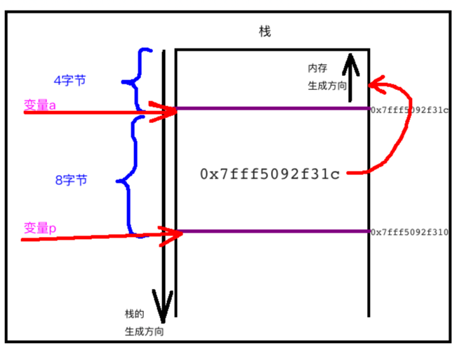
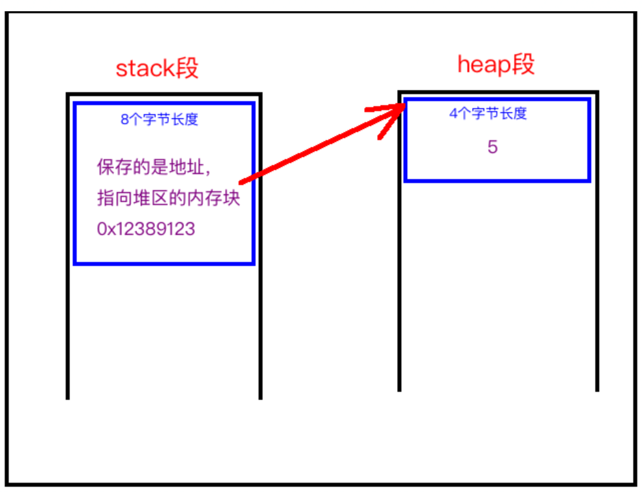
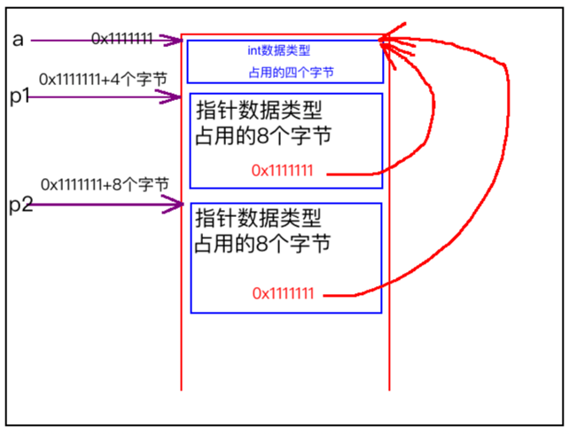

[TOC]


## 1. 不管 ==多少级== 指针变量, 都占用 ==固定== 字节数长度

### 1、32位, 指针变量 都占用 ==32位(4字节)==

```c
#include <stdio.h>
#include <stdlib.h>

typedef struct Context
{
  int     arg1;
  char    *arg2;
  float   arg3;
  void    *arg4;
}Context;

int main()
{
  // 一级指针变量
  printf("sizeof(int*)            = %d\n", sizeof(int*));
  printf("sizeof(char*)           = %d\n", sizeof(char*));
  printf("sizeof(float*)          = %d\n", sizeof(float*));
  printf("sizeof(double*)         = %d\n", sizeof(double*));
  printf("sizeof(struct Context*) = %d\n", sizeof(struct Context*));
  printf("sizeof(void*)           = %d\n", sizeof(void*));

  // 二级指针变量
  printf("sizeof(int**)           = %d\n", sizeof(int**));
  printf("sizeof(char**)          = %d\n", sizeof(char**));
  printf("sizeof(float**)         = %d\n", sizeof(float**));
  printf("sizeof(double**)        = %d\n", sizeof(double**));
  printf("sizeof(struct Context**)= %d\n", sizeof(struct Context**));

  // 三级指针变量
  printf("sizeof(int***)          = %d\n", sizeof(int***));
  printf("sizeof(char***)         = %d\n", sizeof(char***));
  printf("sizeof(float***)        = %d\n", sizeof(float***));
  printf("sizeof(double***)       = %d\n", sizeof(double***));
  printf("struct Context***)      = %d\n", sizeof(struct Context***));

  // n级指针变量
  printf("sizeof(struct Context************************) = %d\n", sizeof(struct Context************************));
}
```

```
->  gcc main.c
->  ./a.out
sizeof(int*)            = 4
sizeof(char*)           = 4
sizeof(float*)          = 4
sizeof(double*)         = 4
sizeof(struct Context*) = 4
sizeof(void*)           = 4
sizeof(int**)           = 4
sizeof(char**)          = 4
sizeof(float**)         = 4
sizeof(double**)        = 4
sizeof(struct Context**)= 4
sizeof(int***)          = 4
sizeof(char***)         = 4
sizeof(float***)        = 4
sizeof(double***)       = 4
struct Context***)      = 4
sizeof(struct Context************************) = 4
->
```

- **指针** 也会占用内存长度
- 但是不管 **多少级(挂多少个`*`)** 指针变量，始终都是一个 **指针变量**
- 而只要是 **指针变量** 都占用同样的 **4个字节**

### 2、64位, 指针变量 都占用 ==64位(8字节)==

```c
#include <stdio.h>
#include <stdlib.h>

typedef struct Context
{
  int     arg1;
  char    *arg2;
  float   arg3;
  void    *arg4;
}Context;

int main()
{
  // 一级指针变量
  printf("sizeof(int*)            = %lu\n", sizeof(int*));
  printf("sizeof(char*)           = %lu\n", sizeof(char*));
  printf("sizeof(float*)          = %lu\n", sizeof(float*));
  printf("sizeof(double*)         = %lu\n", sizeof(double*));
  printf("sizeof(struct Context*) = %lu\n", sizeof(struct Context*));
  printf("sizeof(void*)           = %lu\n", sizeof(void*));

  // 二级指针变量
  printf("sizeof(int**)           = %lu\n", sizeof(int**));
  printf("sizeof(char**)          = %lu\n", sizeof(char**));
  printf("sizeof(float**)         = %lu\n", sizeof(float**));
  printf("sizeof(double**)        = %lu\n", sizeof(double**));
  printf("sizeof(struct Context**)= %lu\n", sizeof(struct Context**));

  // 三级指针变量
  printf("sizeof(int***)          = %lu\n", sizeof(int***));
  printf("sizeof(char***)         = %lu\n", sizeof(char***));
  printf("sizeof(float***)        = %lu\n", sizeof(float***));
  printf("sizeof(double***)       = %lu\n", sizeof(double***));
  printf("struct Context***)      = %lu\n", sizeof(struct Context***));

  // n级指针变量
  printf("sizeof(struct Context************************) = %lu\n", sizeof(struct Context************************));
}
```

```
->  gcc main.c
->  ./a.out
sizeof(int*)            = 8
sizeof(char*)           = 8
sizeof(float*)          = 8
sizeof(double*)         = 8
sizeof(struct Context*) = 8
sizeof(void*)           = 8
sizeof(int**)           = 8
sizeof(char**)          = 8
sizeof(float**)         = 8
sizeof(double**)        = 8
sizeof(struct Context**)= 8
sizeof(int***)          = 8
sizeof(char***)         = 8
sizeof(float***)        = 8
sizeof(double***)       = 8
struct Context***)      = 8
sizeof(struct Context************************) = 8
->
```

同上只不过在 **64位** 环境下，指针类型固定占用 **8** 个字节.


## 2. `int* p;` 中的 `p` 与 `*p`

### p : ==指针== 类型的 ==变量==

- 1、指针变量，也就是一种【变量】
- 2、【变量】就是关联一块长度为8字节的内存块的**别名**
- 3、在局部函数栈帧内分配的指针变量，**都有自己的内存块**

```c++
#include <stdio.h>

int main()
{
  // 1. 基本数据类型的变量
  char a;
  int b;
  float c;
  long d;
  double e;

  // 2. 指针类型的变量
  char* p1;
  int* p2;
  float* p3;
  long** p4;
  double*** p5;

  // 3. 打印局部栈帧上普通变量的内存地址
  printf("&a = %p\n", &a);
  printf("&b = %p\n", &b);
  printf("&c = %p\n", &c);
  printf("&d = %p\n", &d);
  printf("&e = %p\n", &e);

  // 4. 打印局部栈帧上指针变量的内存地址
  printf("&p1 = %p\n", &p1);
  printf("&p2 = %p\n", &p2);
  printf("&p3 = %p\n", &p3);
  printf("&p4 = %p\n", &p4);
  printf("&p5 = %p\n", &p5);
}
```

```
->  make
gcc main.c
./a.out
&a = 0x7fff58ffe8ff
&b = 0x7fff58ffe8f8
&c = 0x7fff58ffe8f4
&d = 0x7fff58ffe8e8
&e = 0x7fff58ffe8e0
&p1 = 0x7fff58ffe8d8
&p2 = 0x7fff58ffe8d0
&p3 = 0x7fff58ffe8c8
&p4 = 0x7fff58ffe8c0
&p5 = 0x7fff58ffe8b8
->
```

内存地址都是局部栈帧上相邻的内存地址。

### `*p` : 变量的 ==值==

- 1、指针变量关联的局部栈帧内8字节的内存块中，存储的是一个 **内存地址**
- 2、通过该地址，可以快速定位到 **一块内存** , 从而修改 **内存块** 中的数据

```c
#include <stdio.h>

int main()
{
  //1. 局部栈帧内存
  int a = 5;
  printf("a = %d, &a = %p\n", a, &a);

  //2. 局部栈帧内存，其内存块中的值是一个内存地址
  int *p1 = &a;
  int *p2 = &a;
  int *p3 = &a;

  //3.
  printf("*p1 = %d, p1 = %p, &p1 = %p\n", *p1, p1, &p1);
  printf("*p2 = %d, p2 = %p, &p2 = %p\n", *p2, p2, &p2);
  printf("*p3 = %d, p3 = %p, &p3 = %p\n", *p3, p3, &p3);
}
```

```
->  make
gcc main.c
./a.out
a = 5, &a = 0x7fff5ee148fc
*p1 = 5, p1 = 0x7fff5ee148fc, &p1 = 0x7fff5ee148f0
*p2 = 5, p2 = 0x7fff5ee148fc, &p2 = 0x7fff5ee148e8
*p3 = 5, p3 = 0x7fff5ee148fc, &p3 = 0x7fff5ee148e0
->
```

- 1) p1、p2、p3 的 **值(地址值)** 都是 **0xbf88b31c** 同一个地址值

- 2) 而因为 p1、p2、p3 自己本身就是一个 **变量**, 同样需要分配一块内存, 所以 p1、p2、p3 都有 **自己的** 内存地址

```
- &p1 = 0xbf88b3**20**
- &p2 = 0xbf88b3**24**
- &p3 = 0xbf88b3**28**
```


## 3. `int* p = &a;` 内存模型

```c
int main() {
	int a = 99;
  int* p = &a;
}
```





## 4. `int* p = malloc(...);` 内存模型

```c
int main(int argc, const char * argv[]) 
{
  //1.  栈上分配指针变量的内存
  int *p;

  //2. 指针变量，指向堆区内存
  p = (int*)malloc(sizeof(int));	

  //3. 通过指针变量找到堆区内存地址，修改内存中的数据
  *p = 5;
}
```




## 5. ==指针变量== 赋值 VS ==普通变量== 赋值

```c++
#include <stdio.h>

int main()
{
  int a = 5;

  // 1. 普通变量: 赋值的是【数值】
  {
    int p = a;
  }

  // 2. 指针变量: 赋值的是【内存地址值】
  {
    int *p = &a;
  }
}
```


## 6. 指针变量的 ==赋值== 等价于 ==增加== 内存块的 ==指向==

```c
void demo()
{
  // 1. 一块内存，占用4个字节
  int a = 5;
  
  //2. 指向一，占用8个字节，值为上面4字节内存起始地址
  int *p1 = &a;
  
  //3. 指向二，占用8个字节，值为上面4字节内存起始地址
  int *p2 = p1;
}

int main()
{
  return 80;
}
```



- (1) p1、p2分别在栈上分配8个字节的长度内存
- (2) p1、p2对应的8个字节的长度内存中中，存储的都是 `变量a对应的内存块的地址`
- (3) 但是 p1 与 p2 占用的是 两个不同的内存块


## 7. ==指针== 变量 与 ==普通== 变量 ==定义顺序==

### 1. 不推荐

```c
#include <stdio.h>

int main()
{
  // 1. 定义指针变量
  int* p;

  // 2. 定义实例变量
  int age = 10;

  // 3. 再通过指针变量访问实例变量
  p = &age;
  printf("%d\n", *p);  
}
```

局部变量的内存块 **入栈** 顺序：

- 1、先让**指针变量p**的内存块局部栈帧上压栈分配
- 2、再让**实例变量age**的内存块局部栈帧上压栈分配​
- 3、此时**实例变量age**的内存块处于**栈顶**

局部变量的内存块 **出栈** 顺序：

- 1、先出栈栈顶**实例变量age**的内存块
- 2、再出栈**指针变量p**的内存块

可能会出现的问题:

- 如果 **实例变量age** 的内存块出完栈，
- 但此时执行通过 **指针变量p** 读写 **实例变量age** 的内存块，可能就会有问题
- 因为此时 **实例变量age** 的内存块可能已经被释放掉
- 不过目前大部分的 **编译器** 会自动做这个优化

### 2. 推荐: ==指针== 变量 ==越晚== 定义越好

```c
#include <stdio.h>

int main()
{
  // 1. 定义实例变量 => 栈底
  int age = 10;

  // 2. 定义指针变量 => 栈顶
  int* p;

  // 3. 再通过指针变量访问实例变量
  p = &age;
  printf("%d\n", *p);  
}
```

指针变量 **越晚** 定义越好.

