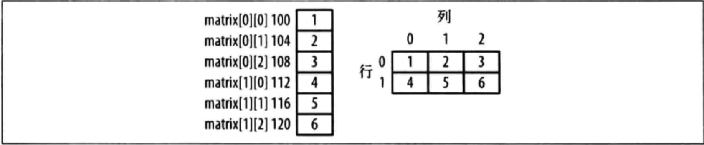
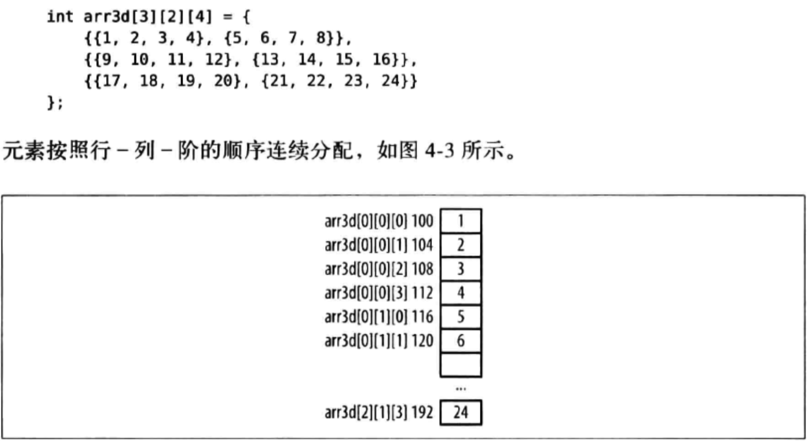

[TOC]


## 1. 一维数组

### 1. 一大块 ==连续的== 小内存块


### 2. 通过 ==下标== 访问数组元素 `arr[i]`

```c
#include <stdio.h>

int main()
{
  int arr[5] = {1,2,3,4,5};

  // 访问数组元素
  {
    // 下标
    printf("arr[3] = %d\n", arr[3]);

    // 地址
    printf("arr[3] = %d\n", *(arr + 3));
  }

  // 修改数组元素
  {
    // 下标
    arr[3] = 10;
    printf("arr[3] = %d\n", arr[3]);

    // 地址
    *(arr + 3) = 11;
    printf("arr[3] = %d\n", *(arr + 3));
  }
}
```

```
->  make
gcc main.c
./a.out
arr[3] = 4
arr[3] = 4
arr[3] = 10
arr[3] = 11
->
```

### 3. 数组 ==越界== 访问错误

```c
#include <stdio.h>
int main()
{
  int arr[10], i; // => 可以看做 int arr[11] => arr[0 ~ 10];

  for(i=1; i<=10; i++) // arr[10] 其实就是 `变量i` 对应的内存地址
    arr[i] = 0; // arr[10]=0 其实就是 i=0
}
```

- 1）代码层面来看，结果就是【死循环】
- 2）但是【不同的编译器】的内存组织方式不同，有的编译器直接就【崩溃】


## 2. 二维数组

### 1. 物理存储结构与逻辑结构



- 左侧 => **物理** 存储结构 => 硬件存储器
- 右侧 => **逻辑** 结构 => 给【编译器】看，由【编译器】翻译为【物理存储结构】寻址方式

### 2. 按照【逻辑结构】访问数组元素: ==n行、m列==

```c
#include <stdio.h>
#include <stdlib.h>

int main()
{
  int arr[2][3] = {
    {1,2,3},
    {4,5,6},
  };

  printf("arr[1][2] = %d\n", arr[1][2]);
}
```

```
➜  main gcc main.c
➜  main ./a.out
arr[1][2] = 6
➜  main
```

### 3. 按照【物理存储结构】访问数组元素: ==起始地址 + offset 偏移量==

```c
#include <stdio.h>
#include <stdlib.h>

int main()
{
  int arr[2][3] = {
    {1,2,3},
    {4,5,6},
  };

  // 方式1：仍然按照逻辑结构
  // => arr: 第一行的内存地址
  // => arr+1: 第二行的内存地址
  // => *(arr+1): 第二行第一列的内存地址
  // => *(arr+1)+2: 第二行第二列的内存地址
  // => *(*(arr+1)+2): 第二行第二列的内存地址对应的数据
  printf("arr[1][2] = %d\n", *(*(arr+1)+2));

  // 方式2：纯物理存储结构
  // => arr[0]: 连续内存卡的第一个元素
  // => &arr[0]: 连续内存卡的第一个元素的【内存地址】
  // => (int*)&arr[0]: 接收【内存地址】的指针变量的【步长】修改为【sizeof(int*)】个字节数
  // => p+5: 从 &arr[0] 的位置，往后走5个位置，每一个位置向后跳动【sizeof(int*)】个字节数
  int* p = (int*)&arr[0];
  printf("arr[1][2] = %d\n", *(p+5));
}
```

```
 ~/Desktop/main  make
gcc main.c
./a.out
arr[1][2] = 6
arr[1][2] = 6
```

## 3. ==三维== 数组



- **编译器** : n 行 - m 列 - j 阶
- **硬件存储器** : 起始地址 + offset 偏移量


## 4. ==sizeof(数组名)== : 计算的是 数组 ==内存总大小==

### 1. `void* arr[n]`

```c
#include <stdio.h>
#include <string.h>

int main()
{
	int *p1;
	int *p2[5];

	printf("sizeof(p1) = %d\n", sizeof(p1));
	printf("sizeof(p2) = %d\n", sizeof(p2));
}
```

```
->  gcc main.c
->  ./a.out
sizeof(p1) = 4
sizeof(p2) = 20
->
```

- **数组名** 在使用 **sizeof()** 运算时，不当做 **指针变量** 来运算，
- 而是计算 **数组** 占用的 **内存总大小** = `sizeof(指针) * 数组元素个数`

### 2. `void** arr[n][m]`

```c
#include <stdio.h>
#include <string.h>

int main()
{
	char** str1;
	char** str2[2][3];

	printf("sizeof(str1) = %d\n", sizeof(str1));
	printf("sizeof(str2) = %d\n", sizeof(str2));
}
```

```
->  gcc main.c
->  ./a.out
sizeof(str1) = 4
sizeof(str2) = 24
->
```


## 5. 数组 形式

### 1. stack 一维【值】数组

#### 1. 基本数据类型

```c
#include <stdio.h>
#include <stdlib.h>

int main()
{
  int arr[] = {1,2,3,4,5,6};
  int* p = arr;
    
  printf("arr[0] = %d\n", *(p+0));
  printf("arr[1] = %d\n", *(p+1));
  printf("arr[5] = %d\n", *(p+5));
}
```

```
➜  main gcc main.c
➜  main ./a.out
arr[0] = 1
arr[1] = 2
arr[5] = 6
➜  main
```

#### 2. 自定义数据类型

```c
#include <stdio.h>
#include <stdlib.h>
#include <string.h>

struct Person {
  char *name;
  int age;
};

int main()
{
  //1. 栈上创建数组，数组元素也是【栈上】创建
  struct Person arr[3] = {
    {"name1", 19}, // 值
    {"name2", 20},  
    {"name3", 21}
  };
  
  //2. 遍历数组1
  {
    // 头指针指向数组第一个元素
    // => p++ 跳动 sizeof(struct Person) 个字节
    struct Person *p = arr;
    for (int i = 0; i < 3; i++, p++) 
      printf("name = %s, age = %d\n", p->name, p->age);
  }
}
```

```
->  make
gcc main.c
./a.out
name = name1, age = 19
name = name2, age = 20
name = name3, age = 21
->
```

### 2. stack 一维【字符串】数组 

#### yes

```c
#include <stdio.h>
#include <stdlib.h>

int main()
{
  char* arr[] = {
    "1\0",
    "22\0",
    "333\0",
    "4444\0",
    "55555\0",
    "666666\0",
  };
  char** p = arr;

  printf("arr[0] = %s\n", *(p+0));
  printf("arr[1] = %s\n", *(p+1));
  printf("arr[5] = %s\n", *(p+5));
}
```

```
➜  main gcc main.c
➜  main ./a.out
arr[0] = 1
arr[1] = 22
arr[5] = 666666
➜  main
```

#### yes

```c
#include <stdio.h>
#include <stdlib.h>

int main(int argc, char const *argv[])
{
  for(int i=0; i<argc ; ++i)
    printf("argv[%d] = %s\n", i, argv[i]);
}
```

```
➜  main gcc main.c
➜  main ./a.out 1 2 hello world haha 4 5 6
argv[0] = ./a.out
argv[1] = 1
argv[2] = 2
argv[3] = hello
argv[4] = world
argv[5] = haha
argv[6] = 4
argv[7] = 5
argv[8] = 6
➜  main
```

#### no

```c
#include <stdio.h>
#include <stdlib.h>

int main(int argc, char const *argv[])
{
  char* arr[] = {
    "1\0",
    "22\0",
    "333\0",
    "4444\0",
    "55555\0",
    "666666\0",
  };

  char** p = arr;

  printf("&arr[5] = %p\n", p+5);
  printf("&arr[6] = %p\n", p+6); // 数组访问已经越界，但是地址不为空，可能是未使用的系统内存

  // 崩溃1
#if 0
  for(; p!=NULL ; ++p)
    printf("%s\n", *p);
#endif

  // 崩溃2
#if 0
  char** p = argv;
  for(; p!=NULL ; ++p)
    printf("%s\n", *p);
#endif
}
```

```
➜  main gcc main.c
➜  main ./a.out
&arr[5] = 0x7fff55308868
&arr[6] = 0x7fff55308870
➜  main
```

- 即使数组越界，但是指针指向的内存仍然是存在的
- 如果内存是系统未分配的内存，则会导致程序崩溃

### 3. heap 一维【值】数组

```c
#include <stdio.h>
#include <stdlib.h>

struct person
{
  int age;
};

int main()
{
  // T* ptr = (T*)malloc(sizeof(T) * n);
  struct person* ptr = (struct person*)malloc(sizeof(struct person) * 3);

  int i;
  for(i = 0; i<3; i++)
  {
    ptr[i].age = 100 + i;
  }

  free(ptr);
}
```

### 4. heap 一维【内存地址】数组

#### eg

```c
#include <stdio.h>
#include <stdlib.h>

struct person
{
  int age;
};

int main()
{
  // T** ptr = (T*)malloc(sizeof(T*) * n);
  // T*** ptr = (T*)malloc(sizeof(T**) * n);
  struct person** ptr = (struct person**)malloc(sizeof(struct person*) * 3);

  int i;
  for(i = 0; i<3; i++)
  {
    ptr[i] = (struct person*)malloc(sizeof(struct person));
    ptr[i]->age = 100 + i;
  }

  for(i = 0; i<3; i++)
  {
    free(ptr[i]);
  }
  free(ptr);
}
```

#### 1. 栈上 指针数组 `arr[i]` 指向【栈区】内存地址

```c
#include <stdio.h>
#include <stdlib.h>
#include <string.h>

struct Person {
  char *name;
  int age;
};

int main()
{
  // 1. 栈上的局部内存
  struct Person p1 = {"name1", 19};
  struct Person p2 = {"name2", 20};
  struct Person p3 = {"name3", 21};
  

  //2. 栈上创建数组，数组元素也是【栈上】创建
  // > ptrs[i] => struct Person* 内存地址的类型
  // > ptrs => &ptrs[0]
  struct Person* ptrs[3] = {
    &p1, // 内存地址
    &p2,
    &p3
  };
  
  printf("ptrs+1 跳动字节数 = %ld\n",  (char*)(ptrs+1) - (char*)(ptrs));
  printf("&ptrs[0]+1 跳动字节数 = %ld\n",  (char*)(&ptrs[0]+1) - (char*)(&ptrs[0]));

  //3. 下标的方式遍历ptrs[i]数组
  {
    for (int i = 0; i < 3; i++)
    {
      printf("name = %s, age = %d\n", ptrs[i]->name, ptrs[i]->age);
    }
  }

  printf("----------------------\n");

  //4. 地址的方式遍历ptrs[i]数组
  {
    /**
     * 一位【值】数组遍历：
     * int arr[10];
     * => int* p = arr; // 一级指针
     * => p++ 跳动 sizeof(int) 字节数
     * 
     * 一位【内存地址】数组遍历：
     * int* arr[10];
     * => int** p = arr; // 二级指针
     * => p++ 跳动 sizeof(int*) 字节数
     */
    struct Person** p = ptrs;
    struct Person* tmp;
    for (int i = 0; i < 3; i++)
    {
      tmp = *p;
      printf("name = %s, age = %d\n", tmp->name, tmp->age);
      p++; //挪动到ptrs[i]数组的下一个元素
    }
  }
}
```

```
->  make
gcc main.c
./a.out
ptrs+1 跳动字节数 = 8
&ptrs[0]+1 跳动字节数 = 8
name = name1, age = 19
name = name2, age = 20
name = name3, age = 21
----------------------
name = name1, age = 19
name = name2, age = 20
name = name3, age = 21
->
```

#### 2. 栈上 指针数组 `arr[i]` 指向【堆区】内存地址

```c
#include <stdio.h>
#include <stdlib.h>
#include <string.h>

struct Person {
  char *name;
  int age;
};

int main()
{
  //1. 栈上分配【指针】数组连续内存
  struct Person* ptrs[3] = {(void*)0};

  //2. 给ptrs[i]指针变量分配【堆上】内存
  for (int i = 0; i < 3; i++)
  {
    //堆区开辟 struct Person 长度的内存
    struct Person *p = (struct Person *)malloc(sizeof(struct Person));
    p->age = 19 + i;
    p->name = (char*)malloc(sizeof(char) * 20);
    sprintf(p->name, "name_%d", i);

    // 记录堆区分配的struct Person长度的内存地址
    ptrs[i] = p;
  }

  //3. 下标的方式遍历ptrs[i]内存地址的数组
  {
    for (int i = 0; i < 3; i++) 
    {
      printf("name = %s, age = %d\n", ptrs[i]->name, ptrs[i]->age);
    }
  }
  printf("----------------------\n");

  //4. 地址的方式遍历ptrs[i]内存地址的数组
  {
    struct Person* tmp;
    for (int i = 0; i < 3; i++) 
    {
      tmp = *(ptrs + i);
      printf("name = %s, age = %d\n", tmp->name, tmp->age);
    }
  } 

  // 5. 释放内存
  {
    for (int i = 0; i < 3; i++) 
    { 
      // 下标的方式
      // free(ptrs[i]);

      // 地址的方式
      free(*(ptrs + i));
    }
  }
}
```

```
->  make
gcc main.c
./a.out
name = name_0, age = 19
name = name_1, age = 20
name = name_2, age = 21
----------------------
name = name_0, age = 19
name = name_1, age = 20
name = name_2, age = 21
->
```

#### 3. 栈上【指针变量】指向 堆区数组 `arr[i]` 指向【堆区】内存地址

```c
#include <stdio.h>
#include <stdlib.h>
#include <string.h>

struct Person {
  char *name;
  int age;
};

int main()
{
  //1.堆区分数组指针的内存
  // => 分配三个【struct Person *】指针变量的长度内存 
  // => ptrs[i] ==> struct Person *
  struct Person **ptrs = (struct Person **)malloc(sizeof(struct Person *) * 3);

  //2. 给 ptrs[i] 指针变量分配【堆上】内存
  for (int i = 0; i < 3; i++)
  {
    //堆区开辟 struct Person 长度的内存
    struct Person *p = (struct Person *)malloc(sizeof(struct Person));
    printf("=> %p\n", p);
    p->age = 19 + i;
    p->name = (char*)malloc(sizeof(char) * 20);
    sprintf(p->name, "name_%d", i);

    // 记录堆区分配的 struct Person 长度的内存地址
    // ptrs[i] = p; // 数组的方式
    *(ptrs + i) = p; // ptrs+i 跳动 i*sizeof(void*) 字节数
	}

  //3. 遍历 ptrs[i] 内存地址的数组
  {
    for (int i = 0; i < 3; i++) 
    {
      printf("[%p]：name = %s, age = %d\n", ptrs[i], ptrs[i]->name, ptrs[i]->age);
    }

    for (int i = 0; i < 3; i++) 
    {
      struct Person* tmp = *(ptrs + i);
      printf("[%p]：name = %s, age = %d\n", tmp, tmp->name, tmp->age);
    }
  } 

  // 4. 释放内存
  {
    for (int i = 0; i < 3; i++) 
    {
      // 下标的方式
      // free(ptrs[i]);
      // ptrs[i] = (void*)0;

      // 地址的方式
      free(*(ptrs + i));
      *(ptrs + i) = (void*)0;
    }

    free(ptrs);
    ptrs = (void*)0;
  }
}
```

```
->  make
gcc main.c
./a.out
=> 0x7fa9a0c00030
=> 0x7fa9a0c00020
=> 0x7fa9a0c031d0
[0x7fa9a0c00030]：name = name_0, age = 19
[0x7fa9a0c00020]：name = name_1, age = 20
[0x7fa9a0c031d0]：name = name_2, age = 21
[0x7fa9a0c00030]：name = name_0, age = 19
[0x7fa9a0c00020]：name = name_1, age = 20
[0x7fa9a0c031d0]：name = name_2, age = 21
->
```

基本上与上例相同，只是 **指针数组** 的内存分配在 **堆区**。

### 5. 变长 数组（GNU GCC编译器特性）

```c
#include <stdio.h>
#include <stdlib.h>
#include <string.h>

void create_arr(int n)
{
	//1. 数组长度由传入的【形参 n】来决定，注意【不能直接】对数组【初始化】
	int arr[n];
	
	//2. 必须在定义之后，然后才能初始化
	for (int i = 0; i < n; ++i)
		arr[i] = i;
}

int main(int argc, const char * argv[])
{ 
	/**
	 *  定义形式一、函数内定义
	 */
  int n = 5;
  int arr[n];//不能直接初始化
  for (int i = 0; i < n; ++i)
    arr[i] = i;

 /**
	*  定义形式二、函数形参定义
	*/
	create_arr(5);
}
```

### 6.【函数指针】的数组

```c
#include <stdio.h>
#include <stdlib.h>
#include <string.h>

int func1(int a, int b)
{
  return a + b;
}

int func2(int a, int b)
{
  return a - b;
}

int main(int argc, const char * argv[])
{
  // 函数指针 的 数组
  int (*arr[2])(int, int) = {
    func1,
    func2
  };

  printf("arr[0](2, 1) = %d\n", arr[0](2, 1));
  printf("arr[1](2, 1) = %d\n", arr[1](2, 1));
}
```

```
arr[0](2, 1) = 3
arr[1](2, 1) = 1
```


## 6. `int arr[n];` 解析

### 1. ==数组名 arr== 是一个 常量指针

数组定义完毕之后，**数组名(指针变量)** 就是 **只读** 的指针变量，**无法** 再修改 **数组名(指针变量)**

```c
#include <stdio.h>
#include <stdlib.h>
#include <string.h>

int main(int argc, const char * argv[])
{    
  int arr[10];
  int brr[10];

	/**
	 *	error: array type 'int [10]' is not assignable
	 */
  arr = brr;
}
```

```
->  gcc main.c
main.c: In function ‘main’:
main.c:14:6: error: assignment to expression with array type
  arr = brr; //error: array type 'int [10]' is not assignable
      ^
->
```

小结 **int arr[5];** 中的 **arr** 的含义

- 是一个 **只读** 的变量
- 为了保证能够通过这个指针变量找到 **整个数组的内存块** , 在不需要的时候进行 **废弃**

### 2. `int arr[10]` 所有的 指针 操作

```c
- (1) arr
- (2) &arr
- (3) arr + 1
- (4) &arr + 1
- (5) &arr[i]
```

### 3. arr , &arr , `&arr[0]` 三者

#### 1. ==值== 都是一样

```c
#include <stdio.h>

int main() 
{    
  int arr[10];

  printf("sizeof(int) = %ld\n", sizeof(int));
  printf("sizeof(arr) = %ld\n", sizeof(arr));

  printf("arr = %p\n", arr);
  printf("&arr[0] = %p\n", &arr);
  printf("&arr = %p\n", &arr);
}
```

```
->  make
gcc main.c
./a.out
sizeof(int) = 4
sizeof(arr) = 40
arr = 0x7fff5f00e920
&arr[0] = 0x7fff5f00e920
&arr = 0x7fff5f00e920
->
```

#### 2.  指针 ==步长== 不一样

```c
#include <stdio.h>

int main() 
{    
  int arr[10];

  printf("sizeof(int) =\t%ld\n", sizeof(int));
  printf("sizeof(arr) =\t%ld\n", sizeof(arr));

  printf("step(arr+1) => %ld\n", (char*)(arr+1) - (char*)arr);
  printf("step(&arr[0]+1) => %ld\n", (char*)(&arr[0]+1) - (char*)(&arr[0]));
  printf("step(&arr+1) => %ld\n", (char*)(&arr+1) - (char*)&arr);
}
```

```
->  make
gcc main.c
./a.out
sizeof(int) =	4
sizeof(arr) =	40
step(arr+1) => 4
step(&arr[0]+1) => 4
step(&arr+1) => 40
->
```

- **arr** 与 **&arr[0]** 一样, 都是跳动 **sizeof(`int`)** 字节数
- 但是 **&arr** 跳动 **sizeof(`arr`)** 字节数

#### 3. arr 等价 `&arr[0]`

```
arr = &arr[0];
```

- 1）arr 实际上就是 数组 内存 **起始地址**
- 2）所以 arr 也就是 **`&arr[0]`**

#### 4. arr 对比 &arr 

- 1) 都是 **指针**
- 2) **值** 虽然是一样的, 但是 **步长** 不同
- 3) **arr** 步长为 sizeof(**int**) => 数组中的 **元素** 的长度
- 4) **&arr** 步长为 sizeof(**arr**) => **整个数组** 的长度

### 4. arr , `&arr[0]` , `&arr[1]`

```c
#include <stdio.h>
#include <stdlib.h>
#include <string.h>

int main(int argc, const char * argv[])
{
  // 1. 分配 40 字节, 长度的数组
  int arr[10] = {1,2,3,4,5,6,7,8,9,10};

  // 2.
  printf("sizeof(int) = %ld\n", sizeof(int));
  printf("sizeof(arr) = %ld\n", sizeof(arr));

  // 3. int* => char* => 步长为1个字节
  char* p0 = (char*)(&arr[0]);
  char* p1 = (char*)(&arr[1]);
  char* p2 = (char*)(&arr[2]);

  // 4.
  printf("arr = %p\n", arr);
  printf("p0 = %p\n", p0);
  printf("p1 = %p\n", p1);
  printf("p2 = %p\n", p2);
  printf("p1 - p0 = %ld\n", p1 - p0);
  printf("p2 - p1 = %ld\n", p2 - p1);
}
```

```
->  make
gcc main.c
./a.out
sizeof(int) = 4
sizeof(arr) = 40
arr = 0x7fff5c0dd920
p0 = 0x7fff5c0dd920
p1 = 0x7fff5c0dd924
p2 = 0x7fff5c0dd928
p1 - p0 = 4
p2 - p1 = 4
->
```

- **&arr[0]** 就是 **a[0] **的内存地址
- **a[0]** 是数组 **第一个元素** 所在的内存地址，并不是 **整个数组内存块** 的起始地址
- **&arr[i]** 就是 **a[i]** 的内存地址

### 5. arr[负数下标]

```c
#include <stdio.h>
int main()
{
  int arr[] = {1,2,3,4,5,6};
  int* p = arr;
  
  // 移动p的位置，指向&arr[3]
  p += 3;
  
  // 打印p前面的位置元素值
  printf("p[-1] = %d\n", p[-1]);
  printf("p[-2] = %d\n", p[-2]);
  printf("p[-3] = %d\n", p[-3]);
  
  // 通过指针打印
  printf("*(p-1) = %d\n", *(p-1));
  printf("*(p-2) = %d\n", *(p-2));
  printf("*(p-3) = %d\n", *(p-3));
}
```

```
->  gcc main.c
->  ./a.out
p[-1] = 3
p[-2] = 2
p[-3] = 1
*(p-1) = 3
*(p-2) = 2
*(p-3) = 1
->
```

### 6. arr+1 与 arr

```c
#include <stdio.h>
#include <stdlib.h>
#include <string.h>

int main(int argc, const char * argv[])
{
	//1. 分配 40 字节, 长度的数组
	int arr[10] = {1,2,3,4,5,6,7,8,9,10};

	//2.
	printf("sizeof(int) = %d\n", sizeof(int));
	printf("sizeof(arr) = %d\n", sizeof(arr));

	//3.
	char* p0 = (char*)arr;
	char* p1 = (char*)(arr+1);
	char* p2 = (char*)(arr+2);

	printf("p0 = %p\n", p0);
	printf("p1 = %p\n", p1);
	printf("p2 = %p\n", p2);
	printf("p1 - p0 = %d\n", p1-p0);
	printf("p2 - p1 = %d\n", p2-p1);
}
```

```
->  gcc main.c
->  ./a.out
sizeof(int) = 4
sizeof(arr) = 40
p0 = 0xbf97b204
p1 = 0xbf97b208
p2 = 0xbf97b20c
p1 - p0 = 4
p2 - p1 = 4
->
```

- arr + 1, 是在 arr 的地址上 **+4 字节**
- arr + 1, 指向了数组中 `arr[1]` 的内存地址
- arr + **i**, **arr + `i * sizeof(arr[i])`**

### 7. `&arr` + 1 与 &arr

```c
#include <stdio.h>
#include <stdlib.h>
#include <string.h>

int main(int argc, const char * argv[])
{
	//1. 分配 40字节长度的数组
	int arr[10] = {1,2,3,4,5,6,7,8,9,10};

	//2.
	printf("sizeof(int) = %d\n", sizeof(int));
	printf("sizeof(arr) = %d\n", sizeof(arr));

	//3.
	char* p0 = (char*)(&arr);
	char* p1 = (char*)(&arr + 1);
	char* p2 = (char*)(&arr + 2);

	printf("p0 = %p\n", p0);
	printf("p1 = %p\n", p1);
	printf("p2 = %p\n", p2);
	printf("p1 - p0 = %d\n", p1-p0);
	printf("p2 - p1 = %d\n", p2-p1);
}
```

```
->  gcc main.c
->  ./a.out
sizeof(int) = 4
sizeof(arr) = 40
p0 = 0xbfdcfe34
p1 = 0xbfdcfe5c
p2 = 0xbfdcfe84
p1 - p0 = 40
p2 - p1 = 40
->
```

- 1) 也都是 **指针变量**
- 2) **&arr** 指向的是 **整个数组** 的起始地址
- 3) **&arr + 1** 向后跳动 **整个数组 sizeof(arr)** 的长度, 而不是 **`sizeof(arr[i])`** 的长度


### 8. &arr 指针步长 转换

```c
#include <stdio.h>
int main()
{
  int a[5]={1,2,3,4,5};
    
  // -1）&a 指针步长 = sizeof(a)
  // -2）&a + 1 直接跳过 sizeof(a) 的字节数
  // -3）(int *)(&a+1) 将 &a + 1 转换为 int* 类型指针，则步长变为4字节
  // -4）p - 1 则往前走4字节，所以就是a[4]数组最后一个元素的内存地址
  int *p = (int *)(&a+1); 
  printf("%d",*(p-1));
}
```

```
➜  main gcc main.c                                                                                                                           ➜  main ./a.out
5
```


## 7. `int arr[n][m]` 中 arr , arr+1 , &arr , &arr+1 

```c
#include <stdio.h>

int main()
{
  // 总共占用 4*10*10 = 400 byte（字节）
  int arr[10][10] = {0};
  
  printf("1. (arr+1) - arr = %ld\n",           (char*)(arr+1)       - (char*)arr          );
  printf("2. (arr[1]+1) - arr[1] = %ld\n",     (char*)(arr[1]+1)    - (char*)(arr[1])     );
  printf("3. &arr[1][3] - &arr[1][2] = %ld\n", (char*)(&arr[1][3])  - (char*)(&arr[1][2]) );
  printf("4. (&arr+1) - arr = %ld\n",          (char*)(&arr+1)      - (char*)arr          );
}
```

```
1. (arr+1) - arr = 40
2. (arr[1]+1) - arr[1] = 4
3. &arr[1][3] - &arr[1][2] = 4
4. (&arr+1) - arr = 400
```

可以得到:

- 1) **(arr + 1) - arr** = **40** 字节 => **arr** 跳动 **1行** 的内存大小
- 2) **(arr[1]+1) - arr[1]** = **4** 字节 => `arr[i]` 跳动 **sizeof(arr[i][j])** 字节
- 3) **&arr[1][3] - &arr[1][2]** = **4** 字节 => `arr[i][j]` 跳动 **sizeof(arr[i][j])** 字节
- 4) **(&arr+1) - arr** = **400** 字节 => `&arr` 跳动 **sizeof(arr)** 整个 **二维数组** 的长度


## 8. ==一维 数组名== 当做函数形参时, 退化为 ==一级 指针变量==

### 1. func(`T arr[]`); 编译报警告

```c
#include <stdio.h>
#include <stdlib.h>

void func1(int arr[]) 
{
  printf("func1(): %lu\n", sizeof(arr));
}

int main(int argc, const char * argv[])
{    
  int arr1[10] = {1, 2, 3, 4, 5};
  printf("main(): sizeof(arr1) = %lu\n", sizeof(arr1));

  func1(arr1);
}
```

gcc 编译会报警告

```c
->  gcc main.c
main.c:6:33: warning: sizeof on array function parameter will return size of 'int *' instead of 'int []'
      [-Wsizeof-array-argument]
        printf("func1(): %lu\n", sizeof(arr));
                                       ^
main.c:4:16: note: declared here
void func1(int arr[])
               ^
1 warning generated.
```

- 编译时只是报 **警告** 提示说使用 **`int *`** 代替 **`int []`** 
- 但还是 **编译通过** , 可以运行

```
->  ./a.out
main(): sizeof(arr1) = 40
func1(): 8

```

- 虽然在 main() 中调用 func1() 传入的数组，占用 **40** 个字节
- 但是最终在 func1() 中，形参 **int arr[]** 实际上只占用 **8** 个字节
- 64 位系统下，**指针类型** 的变量就是占用 **8个字节**
- 所以说 func1(`int arr[]`) 虽然参数使用的是 `int arr[]` **数组** 形式, 但最终仍然被 **编译器** 优化为 **`int *` 指针**

### 2. func(`T* arr`); 编译器推荐形式，但是丢失 ==数组长度==

```c
#include <stdio.h>

// int arr[] => int* arr
void func1(int* arr)
{
  printf("func1(): %lu\n", sizeof(arr));
}

int main(int argc, const char * argv[])
{
  int arr1[10] = {1, 2, 3, 4, 5};
  printf("main(): sizeof(arr1) = %lu\n", sizeof(arr1));

  func1(arr1);
}
```

直接编译通过

```
->  make
gcc main.c
->  ./a.out
main(): sizeof(arr1) = 40
func1(): 8
->
```

### 3. 退化为 ==指针== 后, 就需要额外传入 ==数组长度==

```c
#include <stdio.h>

// => int arr[] => int* arr
// => 增加一个额外的参数，接收数组的长度
void func(int* arr, int len)
{
  int i = 0;
  for (; i < len; i++)
  {
    printf("%d, ", *arr++);
  }
  printf("\n");
}

int main(int argc, const char * argv[])
{
  int arr[10] = {1, 2, 3, 4, 5};
  func(arr, 5);
}
```

```
->  make
gcc main.c
->  ./a.out
1, 2, 3, 4, 5,
->

```

### 4. 为何要将 ==数组== 退化为 ==指针== ?

- 在 main() 中确实是一个 **数组** , 占用大片连续内存
- 在 func1() 中，形参变量 arr 实际上只占用 **8字节** , 只是指向 **数组** 的 **起始地址**
- 而不用也像 main() 中在 **栈帧上** 分配同样大小的 连续内存
- 这样做就是为了 **节约** 栈帧上的 内存分配

### 5. 数组做函数形参时，退化成指针变量的公式

| 数组形参                       | gcc编译器建议替换成对应的指针类型      |
| :----------------------------- | :------------------------------------- |
| `func1(int arr[])`        | `func1(int *arr, int len)`        |
| `func2(char arr[])`       | `func1(char *arr, int len)`       |
| `func3(char arr[10][10])` | `func1(char (*arr)[10], int len)` |

- 因为 **数组** 退化为了 **指针变量**
- **指针变量** 无法记录 **数组** 的 **长度**
- 所以需要 **额外增加一个参数** , 来告诉 **数组的长度** , 否则会访问 **内存越界**


## 9. 栈上分配 二维数组

### 1. func(int (*p)[3], int row) 

#### 1. 代码示例

```c
#include <stdio.h>
#include <stdlib.h>

/**
 * @param p
 * => p是一个指针变量，是使用括号强调为 * 
 * => p指向二维数组的【第一行】
 * => p可以理解为 int (*)[3] p = a; （注意：只是理解，语法错误的）
 *
 * @param col 
 * => 因为传入的【指向行】的内存地址，并没有传递【有多少行】
 * => 所以需要额外传递【有多少行】						
 */
void func(int (*p)[3], int row)
{  
  for (int i = 0; i < row; i++)
  {
    for (int j = 0; j < 3; j++)
    {
      // *p => &arr[i][0]
      // *p+1  => &arr[i][1]
      // *p+2  => &arr[i][2]
      printf("[%d][%d] = %d, ", i, j, *(*p + j));
    }
    
    p++; // 指向下一行
    printf("\n");
  }  
}

int main() 
{    
  int arr[3][3] = {{1,2,3}, {4,5,6}, {7,8,9}};
  func(arr, 3);
}
```

```
➜  main make
gcc main.c
./a.out
[0][0] = 1, [0][1] = 2, [0][2] = 3,
[1][0] = 4, [1][1] = 5, [1][2] = 6,
[2][0] = 7, [2][1] = 8, [2][2] = 9,
➜  main
```

#### 2. 对于指针变量 `p` 的指向示意图

- (1) 指针变量p 指向`每一行`所在内存的`起始地址`
- (2) 对应的定义原型为：`int (*p)[3] = a;`，就指向一个数组的指针变量
- (3) 指针变量p 的步长是`sizeof(a[i])`，即一行的内存长度

#### 3. 对于指针变量 `*p` 的指向示意图

- (1) `*p` 也是一个指针变量
- (2) `*p` 指向的某一行的`第一列`元素
- (3) `*p + i` 指向的某一行的`第i列`元素

### 2. func(int* p, int row, int col) 

```c
#include <stdio.h>
#include <stdlib.h>

void func(int* p, int row, int col)
{  
  for (int i = 0; i < row; i++)
  {
    for (int j = 0; j < col; j++)
    {
      /**
       * p => int** => 步长为 sizeof(int*) => 4字节（32位）、8字节（64位）
       * (int*)p => 步长为 sizeof(int) => 4字节 => &arr[0][0]
       */
      printf("[%d][%d] = %d, ", i, j, *(p + i*col + j));
    }
    printf("\n");
  }  
}

int main() 
{    
  int arr[3][3] = {{1,2,3}, {4,5,6}, {7,8,9}};

  // 1. 解出指针指向的内存
  func(*arr, 3, 3);

  printf("-----------------------------\n");

  // 2. 直接转换指针的步长
  func((int*)arr, 3, 3); 
}
```

```
➜  main make
gcc main.c
./a.out
[0][0] = 1, [0][1] = 2, [0][2] = 3,
[1][0] = 4, [1][1] = 5, [1][2] = 6,
[2][0] = 7, [2][1] = 8, [2][2] = 9,
-----------------------------
[0][0] = 1, [0][1] = 2, [0][2] = 3,
[1][0] = 4, [1][1] = 5, [1][2] = 6,
[2][0] = 7, [2][1] = 8, [2][2] = 9,
➜  main
```

### 3. func(int** p, int row, int col)

```c
#include <stdio.h>
#include <stdlib.h>

void func(int** p, int row, int col)
{  
  for (int i = 0; i < row; i++)
  {
    for (int j = 0; j < col; j++)
    {
      /**
       * p => int** => 步长为 sizeof(int*) => 4字节（32位）、8字节（64位）
       * (int*)p => 步长为 sizeof(int) => 4字节 => &arr[0][0]
       */
      printf("[%d][%d] = %d, ", i, j, *((int*)p + i*col + j));
    }
    printf("\n");
  }  
}

int main() 
{    
  int arr[3][3] = {{1,2,3}, {4,5,6}, {7,8,9}};
  func((int**)arr, 3, 3);
}
```

```
➜  main make
gcc main.c
./a.out
[0][0] = 1, [0][1] = 2, [0][2] = 3,
[1][0] = 4, [1][1] = 5, [1][2] = 6,
[2][0] = 7, [2][1] = 8, [2][2] = 9,
➜  main

```

### 4. 测试如上指针变量的步长 

```c
#include <stdio.h>
#include <stdlib.h>

int main() 
{    
  int arr[3][3] = {{1,2,3}, {4,5,6}, {7,8,9}};

  int* p1 = *arr; //1. 
  int* p2 = (int*)arr; //2.
  int (*p3)[3] = arr; //3.
  int** p4 = (int**)arr; //4.

  printf("sizeof(p1) = %ld\n", sizeof(p1));
  printf("sizeof(p2) = %ld\n", sizeof(p2));
  printf("sizeof(p3) = %ld\n", sizeof(p3));
  printf("sizeof(p4) = %ld\n", sizeof(p4));
  printf("------------------------------\n");

  printf("(p1+1) - p1 = %ld\n", (char*)(p1+1) - (char*)p1);
  printf("(p2+1) - p2 = %ld\n", (char*)(p2+1) - (char*)p2);
  printf("(p3+1) - p3 = %ld\n", (char*)(p3+1) - (char*)p3);
  printf("(p4+1) - p4 = %ld\n", (char*)(p4+1) - (char*)p4);
}
```

```
➜  main make
gcc main.c
./a.out
sizeof(p1) = 8
sizeof(p2) = 8
sizeof(p3) = 8
sizeof(p4) = 8
------------------------------
(p1+1) - p1 = 4
(p2+1) - p2 = 4
(p3+1) - p3 = 12
(p4+1) - p4 = 8
➜  main
```

- 1）p1、p2 步长 => 4字节 => **sizeof(int)**
- 2）p3 步长 => 12字节 =>  **sizeof(int) * 3**
- 3）p4 步长 => 8字节（64位Maxosx系统）=> **sizeof(void*)** => 指针类型占用的长度

### 5. 步长总结 

| 二维数组名传递方式              | 形参指针变量的步长 | 步长描述                                 | C代码描述          |
| ------------------------------- | ------------------ | ---------------------------------------- | ------------------ |
| func(int (*p)[3], int row)      | sizeof(int) * 3    | 二维数组的中**某一行**全部占用的内存长度 | `&arr[i]`          |
| func(int* p, int row, int col)  | sizeof(int)        | 二维数组的中**某一个**具体元素内存长度   | `&arr[i][j]`       |
| func(int** p, int row, int col) | sizeof(int*)       | 指针类型占用的内存长度                   | 就是一个内存地址值 |

## 10. 堆区分配 二维数组

### 1. 完全不连续内存

```c
#include <stdio.h>
#include <stdlib.h>

void func(int** p, int row, int col) 
{ 
  int i,j;
  for (i=0; i<row; i++)
  {
    for (j=0; j<col; j++)
      printf("%d, ", *(*(p + i) + j));
    printf("\n");
  }
}

int main()
{	
  // 1. 堆区分配存储【4行首地址】的数组内存
  int** arr = malloc(sizeof(int*) * 4);

  // 2. 继续给【每一行】分配指向的内存
  for (int i=0; i<4; i++)
    arr[i] = malloc(sizeof(int) * 4); // 每一行指向4个int内存

  // 2.
  for (int i=0; i<4; i++)
    for (int j=0; j<4; j++)
      *(*(arr + i) + j) = (i+1)*(j+1);

  // 3.
  func(arr, 4, 4);

  // 4. 
  for (int i=0; i<4; i++)
    free(arr[i]);

  // 5.
  free(arr);
}
```

```
➜  main make
gcc main.c
./a.out
1, 2, 3, 4,
2, 4, 6, 8,
3, 6, 9, 12,
4, 8, 12, 16,
➜  main
```

可以看到对于 `int**p;` 这个二级指针，直接可以当做 `二维数组名` 使用。

### 2. 堆区分配一维连续指针数组

```c
#include <stdio.h>
#include <stdlib.h>

void func(int** p, int row, int col) 
{ 
  int i,j;
  for (i=0; i<row; i++)
  {
    for (j=0; j<col; j++)
      printf("%d, ", *(*(p + i) + j));
    printf("\n");
  }
}

int main()
{	
  // 1. 堆区分配存储【4行首地址】的数组内存
  int** arr = malloc(sizeof(int*) * 4);

  // 2. 堆区分配所有数组元素的存储的内存
  int* mem = malloc(sizeof(int) * 16);

  // 2. 设置【每一行】的起始地址
  for (int i=0; i<4; i++)
    arr[i] = mem + (i*4);

  // 3.
  for (int i=0; i<4; i++)
    for (int j=0; j<4; j++)
      *(*(arr + i) + j) = (i+1)*(j+1);

  // 4.
  func(arr, 4, 4);

  // 5.
  free(mem);

  // 6. 
  free(arr);
}
```

```
➜  main make
gcc main.c
./a.out
1, 2, 3, 4,
2, 4, 6, 8,
3, 6, 9, 12,
4, 8, 12, 16,
➜  main
```

一个结合 struct 的示例:

```c
#include <stdio.h>
#include <stdlib.h>
#include <string.h>

struct person
{
  int age;
  char **favors; // char* arr[10]
};

int main()
{   
  //1.
  struct person per;
  per.age = 19;

  //2.【重要】首先在堆区分配二维数组内存，并让成员指针变量favors指向
  {
    //2.1【堆区分配1】存储每一行的起始地址
    per.favors = (char**)malloc(sizeof(char*) * 10);

    //2.2【堆区分配2】存储所有数组元素的内存
    char* tmp = (char*)malloc(sizeof(char) * 10 * 64);

    // 2.3【设置每一行的起始地址】
    for (int i = 0; i < 10; ++i)
      per.favors[i] = tmp + i * 64;
  }

  //3.
  for (int i = 0; i < 10; ++i)
    sprintf(per.favors[i], "favor_%d", i + 19);
  for (int i = 0; i < 10; ++i)
    printf("favor = %s\n", per.favors[i]);

  // 4.
  free(per.favors[0]);

  // 5.
  free(per.favors);
}
```

```
➜  main make
gcc main.c
./a.out
favor = favor_19
favor = favor_20
favor = favor_21
favor = favor_22
favor = favor_23
favor = favor_24
favor = favor_25
favor = favor_26
favor = favor_27
favor = favor_28
➜  main
```

但仍然存在不连续的 **指针数组内存**。

### 3. 完全连续内存

```c
#include <stdio.h>
#include <stdlib.h>

void func(int* p, int row, int col) 
{ 
  int i,j;
  for (i=0; i<row; i++)
  {
    for (j=0; j<col; j++)
      printf("%d, ", *(p + i*col + j));
    printf("\n");
  }
}

int main()
{	
  // 1.
  int* arr = malloc(sizeof(int) * 16);

  // 2.
  int i, j;
  for (i=0; i<4; i++)
    for (j=0; j<4; j++)
      *(arr + i*4 + j) = (i+1)*(j+1);

  // 3.
  func(arr, 4, 4);

  // 4. 
  free(arr);
}
```

```
➜  main make
gcc main.c
./a.out
1, 2, 3, 4,
2, 4, 6, 8,
3, 6, 9, 12,
4, 8, 12, 16,
➜  main
```


## 11. 数组 动态扩容

- 1) **重新分配** 堆区的更长的数组
- 2) 将当前数组元素，全部 **拷贝** 到新分配的堆区数组内存
- 3) **释放** 掉之前的数组堆区内存
