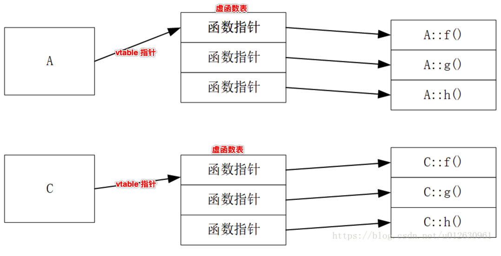
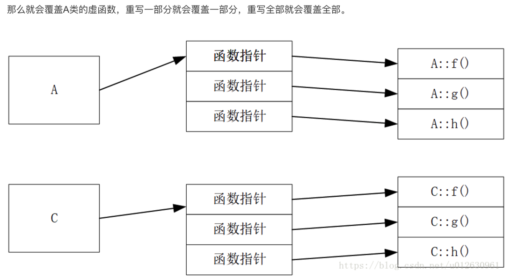
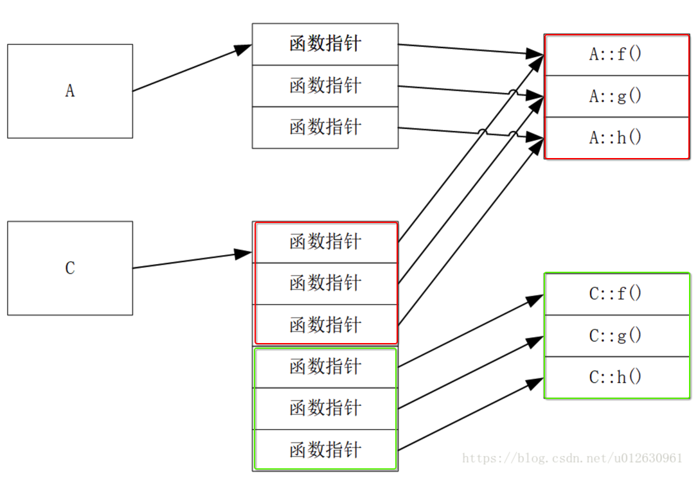

[TOC]


## 1. 多态 实现1 : <包含父类 struct 实例> + <地址重叠> + <类型强转>

### 1. 父类

```c
struct person 
{
	// 1.1 成员变量
	int age;
	char name[64];

	// 1.2 成员函数指针
	int (*getAge)(struct person* this);
	void (*setAge)(struct person* this, int age);
	char* (*getName)(struct person* this);
	void (*setName)(struct person* this, char* name);
	void (*print_age)(struct person* this);
	void (*print_name)(struct person* this);
};

/**
 *	所有的继承struct person的其他子类struct的实例，
 *	都可以通过类型强转后，调用此函数
 */
void debug_person(struct person* person)
{
	printf("person.name = %s\n", person->name);
}

///////////////// 函数指针指向的具体函数////////////////////
int getAge(struct person* this)
{
	return this->age;
}

void setAge(struct person* this, int age)
{
	this->age = age;
}

char* getName(struct person* this)
{
	return this->name;
}
void setName(struct person* this, char* name)
{
	strcpy(this->name, name);
}

void print_age(struct person* this)
{
	printf("age = %d\n", this->age);
}

void print_name(struct person* this)
{
	printf("name = %s\n", this->name);
}
```

### 2. 子类1 : 包含一个父类 ==struct 实例== 作为成员变量，并且【地址重叠】

```c
struct man 
{
	// 包含父类对象
	struct person person;

	// 子类对象成员
	int height;
};
```

### 3. 子类2 : 包含一个父类 ==struct 实例== 作为成员变量，并且【地址重叠】

```c
struct women 
{
	// 包含父类对象
	struct person person;

	// 子类对象成员
	int weight;
};
```

### 4. 因为【子类】与【父类】 struct 实例的【内存地址】【重叠】, 所以可以【相互转化】

```c
int main()
{
	//1. 创建对象
	struct man* m1 = (struct man*)malloc(sizeof(struct man));
	struct women* w1 = (struct women*)malloc(sizeof(struct women));

	//2. 对象1的成员函数指针初始化
	(m1->person).getAge = getAge;
	(m1->person).setAge = setAge;
	(m1->person).getName = getName;
	(m1->person).setName = setName;
	(m1->person).print_age = print_age;
	(m1->person).print_name = print_name;

	// 3. 对象2的成员函数指针初始化
	(w1->person).getAge = getAge;
	(w1->person).setAge = setAge;
	(w1->person).getName = getName;
	(w1->person).setName = setName;
	(w1->person).print_age = print_age;
	(w1->person).print_name = print_name;

	//3. 对象成员赋值
	{
		// 对父类对象成员赋值
		(m1->person).setAge(&(m1->person), 19);
		(m1->person).setName(&(m1->person), "man 001");

		// 对自己成员赋值
		m1->height=199;
	}
	{
		// 对父类对象成员赋值
		(w1->person).setAge(&(w1->person), 19);
		(w1->person).setName(&(w1->person), "women 001");

		// 对自己成员赋值
		w1->weight=110;
	}

	// 4. 
	debug_person(&(m1->person)); /* struct man ==> struct person */
	debug_person(&(w1->person)); /* struct women ==> struct person */
}
```

```
->  gcc oop.c
->  ./a.out
person.name = man 001
person.name = women 001
->
```


## 2. 多态 实现2: C++ 虚函数 ==表== vtable

### 1. 父类A 

```c++
class A1
{
public:
  A1(int _a1 = 1) : a1(_a1) { }
  virtual void f() { cout << "A1::f" << endl; }
  virtual void g() { cout << "A1::g" << endl; }
  virtual void h() { cout << "A1::h" << endl; }
  ~A1() {}
private:
  int a1;
};
```

### 2. 子类C ==没有重写== 父类A 中的 virtual 虚函数

```c++
class C : public A1
{
public:
  C(int _a1 = 1, int _c = 4) :A1(_a1), c(_c) { }
private:
  int c;
};
```



### 3. 子类C ==全部重写== 父类A 中的 virtual 虚函数

```c++
class C : public A1
{
public:
  C(int _a1 = 1, int _c = 4) :A1(_a1), c(_c) { }
  virtual void f() { cout << "C::f" << endl; }
  virtual void g() { cout << "C::g" << endl; }
  virtual void h() { cout << "C::h" << endl; }
private:
  int c;
};
```



### 4. 子类 ==重写== 的 virtual 方法的函数指针, 排在 ==父类== virtual 方法函数指针的 ==后面==




