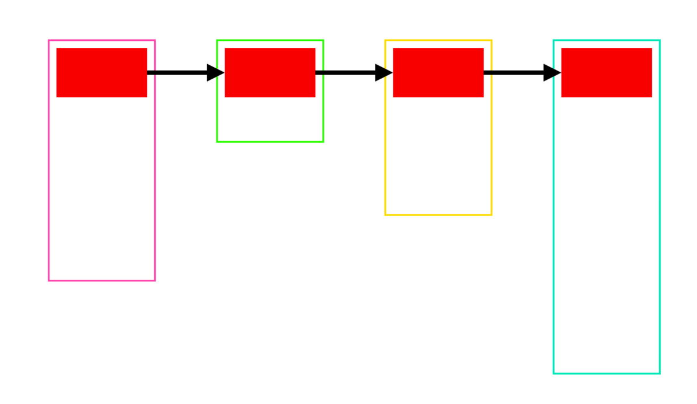

[TOC]


## 1. 计算 struct 成员变量的 ==偏移量==

> struct 成员的【偏移量】在编译后【不再改变】

### 1. 计算公式

```
【struct 实例】起始地址 +【成员 offset】=【成员】起始地址
```

- 1)【成员 offset】 = 【成员】起始地址 - 【struct 实例】起始地址
- 2)【成员 offset】 = **(【成员】起始地址 - n)** - **(【struct 实例】起始地址 - n)**
- 3) 其中的 **n** 就是 【struct 实例】起始地址 
- 4)【成员 offset】 = **offset** - **0**

### 2. 计算方式1: ==成员变量==起始地址 - ==struct实例==起始地址

```c
#include <stdio.h>
#include <stdlib.h>
#include <string.h>

struct person
{
  int age;
  char name[64];
  float score;
};

int main(int argc, const char * argv[])
{
  //1.
  printf("sizeof(struct person) = %ld\n", sizeof(struct person));

  //2.
  struct person *per = (struct person *)malloc(sizeof(struct person));
  
  //3.
  int64_t offset_age      = (int64_t)&(per->age) - (int64_t)per;
  int64_t offset_name     = (int64_t)&(per->name) - (int64_t)per;
  int64_t offset_score    = (int64_t)&(per->score) - (int64_t)per;
  
  //4.
  printf("offset_age = %lld\n",   offset_age);
  printf("offset_name = %lld\n",  offset_name);
  printf("offset_score = %lld", offset_score);

  return 0;
}
```

```
sizeof(struct person) = 72
offset_age = 0
offset_name = 4
offset_score = 68
```

### 3. 计算方式2: ==offset== - ==地址0==

#### 1. 通过【地址 0】获取 struct 成员 偏移量

```c
#include <stdio.h>
#include <stdlib.h>
#include <string.h>

struct person
{
  int age;        // offset=0
  char name[64];  // offset=4
  float score;    // offset=68
};

int main(int argc, const char * argv[])
{
  // 1.
  printf("sizeof(struct person) = %d\n", sizeof(struct person));

  // 2.
  struct person* zero = (struct person*)0;

  // 3.
  void* p1 = &(zero->age);
  void* p2 = zero->name; // 数组名就是内存地址
  void* p3 = &(zero->score);

  // 4.
  printf("p1 = %p\n", p1);
  printf("p2 = %p\n", p2);
  printf("p3 = %p\n", p3);
}
```

```
->  gcc main.c
->  ./a.out
sizeof(struct person) = 72
p1 = (nil)
p2 = 0x4
p3 = 0x44
->
```

#### 2. 对如上测试代码 抽取

```c
#include <stdio.h>
#include <stdlib.h>
#include <string.h>

struct person
{
  int age;
  char name[64];
  float score;
};

int main(int argc, const char * argv[])
{
  // 1.
  printf("sizeof(struct person) = %d\n", sizeof(struct person));

  /**
   * 2. 根据【地址0】求出成员变量的偏移量
   *
   * - (1) (struct person *)0 => 将 地址0 转换为 struct person 类型（改变指针的步长）
   * - (2) ((struct person *)0)->age => 在 地址0 基础上, 按照 struct person 类型的 `内存长度` 读取内部成员变量
   * - (3) &(((struct person *)0)->age) => 继续获取到成员变量的 `起始地址`
   * - (4) (int)(&(((struct person *)0)->age)) => 地址值 转成 数值 (int)
   * - (5) (int64_t)(&(((struct person *)0)->age)) => 地址值 转成 数值 (int64_t)
   */
  int offset_age      = (int)(&(((struct person *)0)->age));
  int offset_name     = (int)(&(((struct person *)0)->name));
  int offset_score    = (int)(&(((struct person *)0)->score));

  // 3.
  printf("offset_age = %d\n",   offset_age);
  printf("offset_name = %d\n",  offset_name);
  printf("offset_score = %d\n", offset_score);
}
```

```
->  gcc main.c
->  ./a.out
sizeof(struct person) = 72
offset_age = 0
offset_name = 4
offset_score = 68
->
```

注意上面的 **偏移量**，都是以 **字节** 为单位.


## 2. linux 内核代码中, 提供获取 ==offset== 宏定义

### 1. offset 宏定义

```c
#define offsetof(TYPE, MEMBER) (size_t)(&(((TYPE *)0)->MEMBER))
```

### 2. 稍加调整

```c
#define OFFSET_OF_MEMBER(STRUCT_TYPE, memmber) \
(size_t)( \
  &( \
    ((STRUCT_TYPE*)0)->memmber \
  ) \
)
```

根据 **地址0** 即可得到 **成员** 相对 struct 起始位置的 **偏移量**

### 3. 使用示例

```c
#include <stdio.h>

#define OFFSET_OF_MEMBER(STRUCT_TYPE, memmber) \
  (size_t)(&(((STRUCT_TYPE*)0)->memmber))

struct person
{
  long pid;
  char name[64];
  int age;
};

int main()
{
  printf("sizeof(struct person) = %d\n", sizeof(struct person));
  printf("OFFSET_OF_MEMBER(struct person, pid) = %d\n",  OFFSET_OF_MEMBER(struct person, pid));
  printf("OFFSET_OF_MEMBER(struct person, age) = %d\n",  OFFSET_OF_MEMBER(struct person, age));
  printf("OFFSET_OF_MEMBER(struct person, name) = %d\n", OFFSET_OF_MEMBER(struct person, name));
}
```

```
->  gcc main.c
->  ./a.out
sizeof(struct person) = 72
OFFSET_OF_MEMBER(struct person, pid) = 0
OFFSET_OF_MEMBER(struct person, age) = 68
OFFSET_OF_MEMBER(struct person, name) = 4
->
```


## 3. ANSI C 标准库, ==stddef.h== 提供宏定义 ==offsetof==

```c
#include <stdio.h>
#include <stddef.h>

struct person
{
  long pid;
  char name[64];
  int age;
};

int main()
{
  printf("sizeof(struct person) = %d\n", sizeof(struct person));
  printf("offsetof(struct person, pid) = %d\n",  offsetof(struct person, pid));
  printf("offsetof(struct person, age) = %d\n",  offsetof(struct person, age));
  printf("offsetof(struct person, name) = %d\n", offsetof(struct person, name));
}
```

```
->  gcc main.c
->  ./a.out
sizeof(struct person) = 72
offsetof(struct person, pid) = 0
offsetof(struct person, age) = 68
offsetof(struct person, name) = 4
->
```


## 4. 根据 struct 实例的【成员】反求【struct 实例】的 ==起始地址==

### 1. 计算公式

```
【struct 实例】的起始地址 = 成员的【起始地址】 - 成员的【偏移量】
```

### 2. 代码实现

```c
#include <stdio.h>
#include <stdlib.h>

struct person
{
  int age;
  char name[64];
  float score;
};

int main(int argc, const char * argv[])
{   
  //1.
  printf("sizeof(struct person) = %ld\n", sizeof(struct person));

  //2.
  struct person per;
  printf("person对象地址 = %p\n", &per);
  
  /**
   *	3. struct对象起始地址 = 成员内存地址 - 成员的偏移量
    *	
    *	- (1) 获取成员的内存地址 ==> &(per.age)
    *	- (2) 将成员内存地址转换成 char*，即改变指针变量的【步长】为1个字节
    *		  ```c
    *		  (char*)(&(per.age))
    *		  ```
    *	- (3) 获取成员的偏移量 ==> (int64_t)(&(((struct person *)0)->age))
    *	- (4) 成员内存地址 - 成员的偏移量
    *		 ```c
    *     (char*)(&(per.age)) - (int64_t)(&(((struct person *)0)->age));
    *     步长为1地址值         - n个步长1
    *		 ```
    */
  printf("1. %p\n", (char*)(&(per.age))   - (int64_t)(&(((struct person *)0)->age)));
  printf("2. %p\n", (char*)(per.name)     - (int64_t)(&(((struct person *)0)->name)));
  printf("3. %p\n", (char*)(&(per.score)) - (int64_t)(&(((struct person *)0)->score)));
}
```

```
sizeof(struct person) = 72
person对象地址 = 0x7fff512209a0
1. 0x7fff512209a0
2. 0x7fff512209a0
3. 0x7fff512209a0
```

### 3. linux 内核链表 中的 ==container_of== 宏定义

```c
#include <stdio.h>

/**
 * 求【成员变量】的【偏移量】
 */
#define offsetof(TYPE, MEMBER) (size_t)(&(((TYPE *)0)->MEMBER))

/**
 *  求【struct 实例】的【起始地址】
 *  - 1) 调用上面的 offsetof(TYPE, MEMBER) 宏定义, 先求出【成员变量】的【偏移量】
 *  - 2) 再根据【成员变量】的【偏移量】, 反求【struct 实例】的内存【起始地址】
 * 
 * 注意: 使用了 container_of 宏定义中, 使用了 typeof() 这个属性, 是 GNU GCC 编译器 中提供特性，在其他的编译器中可能会报错.
 */
#define container_of(ptr, type, member) ({                \
  const typeof( ((type *)0)->member ) *__mptr = (ptr);    \
  (type *)( (char *)__mptr - offsetof(type,member) );     \
})

struct person
{
  int age;
  char name[64];
  float score;
};

int main()
{
  struct person per;
  printf("%p\n", container_of(&(per.age), struct person, age));
  printf("%p\n", &per);
}
```

```
->  gcc demo.c
->  ./a.out
0x7fff5a69bdf0
0x7fff5a69bdf0
->
```


## 5. 解析 container_of 宏定义 实现

### 1. 先看 ==具体类型== 计算 struct 实例的 起始地址

```c
struct person per;
struct person* p = \
  (struct person*)((char*)(&(per.age)) - (int64_t)(&(((struct person *)0)->age)));
```

计算过程中, 涉及到的 **变量** :

- 1) **struct person** => 结构体的【类型】
- 2) ~~**per** => 结构体的【实例】~~ 但是这个就是要求的
- 3) **age** => 结构体的【成员变量】
- 4) **per.age** => 结构体的【成员变量】起始地址

### 2. 抽象出 宏定义的 接口

```c
struct person per;
struct person* p = my_container_of(
  struct person,  // 结构体的【类型】
  age,            // 结构体的【成员变量】
  &(per.age)      // 结构体的【成员变量】起始地址
);
```

### 3. 宏定义 接口定义

```c
/**
 *	@param struct_def 结构体【类型定义】
 *	@param member 结构体【成员】
 *	@param 结构体 实例的【成员变量】的【内存地址】
 *
 *  @return 结构体实例的内存起始地址
 */
my_container_of(struct_def, member, member_ptr) \
  .....
  .....
```

### 4. 不能使用 `do{...}while(0)` 进行包裹【带有返回值】的代码

- 因为 **宏定义** 最终需要有一个 **返回值**
- 返回结构体的内存起始地址
- 所以不能使用 **do{}while(0)** 进行包裹

```c
// 报错
char* p = do {
  return (char *)("adwdaw");
}while(0);
```

### 5. 应使用 `({ 表达式1; 表达式2; ... })` 包裹【带有返回值】的代码

```c
#include <stdio.h>

int main()
{
  //1. 只包裹1个表达式
  char* p1 = ({(char *)("adwdaw");});
  int age = ({5;});
  
  //2. 包裹多个表达式
  char* p2 = ({
    (char *)("11111");
    (char *)("22222");
    (char *)("33333"); // 只会将【最后一个表达式】的值, 作为【返回值】赋值给外界的变量
  });

  printf("%s\n", p1);
  printf("%d\n", age);
  printf("%s\n", p2);
}
```

```c
->  gcc demo.c
demo.c:8:3: warning: expression result unused [-Wunused-value]
                (char *)("11111");
                ^       ~~~~~~~~~
demo.c:9:3: warning: expression result unused [-Wunused-value]
                (char *)("22222");
                ^       ~~~~~~~~~
2 warnings generated.
->  ./a.out
adwdaw
5
33333
->
```

### 6. my_container_of(struct_def, member, member_ptr) 具体实现

```c
#include <stdio.h>

/* 1、求成员变量的偏移量 */
#define offset_of_member(STRUCT_TYPE, memmber) \
(size_t)(&(((STRUCT_TYPE*)0)->memmber))

/* 2、根据成员的偏移量，反求结构体实例的起始内存地址 */
# define my_container_of(STRUCT_TYPE, member, member_ptr) ({\
(STRUCT_TYPE*)((char*)member_ptr - offset_of_member(STRUCT_TYPE, member));})

struct person
{
  int age;
  char name[64];
  float score;
};

int main()
{
  struct person per;
  printf("%p\n", CONTAINER(struct person, age, &(per.age)));
  printf("%p\n", &per);
}
```

```
->  gcc demo.c
->  ./a.out
0x7fff560c7df0
0x7fff560c7df0
->
```


## 6. 实现 C 通用数据结构

### 1. 核心是 分离 ==通用数据结构 node== 与 ==业务 node==



- 1) **外部** struct : 不同的【业务】类型的 struct
  - 1) struct Person
  - 2) struct Dog
  - 3) struct Monkey

- 2) **内部** struct : 唯一的【通用】类型的 struct

### 2. 通用 单链表 节点 struct

```c
/**
 * 【数据结构】通用单链表(链表、头结点、链表节点)
 */
struct linklistnode
{
  struct linklistnode* prev;
  struct linklistnode* next;
};
```

### 3. 针对 通用链表 节点的 API

```c
/*插入链表节点*/
int insert(struct linklistnode* root, struct linklistnode* node, int idx); 

/*删除链表节点*/
int del(struct linklistnode* root, struct linklistnode* node); 
```

### 4.【业务 struct】包含【链表节点 struct】【对象】

#### 1. 将【链表节点-对象】放在【业务节点struct】任意成员变量的位置

```c
/**
 *【业务结构】包含(继承)通用单链表结构，来具备单链表的数据结构
 */
struct Person
{ 
  // 业务节点的自己成员列表定义
  int age;

  /** 
   *	继承单链表的能力
   *	- 在第一个成员位置，包含通用单链表节点结构体的【一个对象】(注意：并不是【指针变量】)
   *	- 让【业务结构体实例】与【链表节点结构体实例】的内存起始地址重叠
   *	- 这样这两种类型的内存地址，可以随意的进行转换
   *	- 不再需要通过如上的各种偏移量计算来得到业务结构体实例的内存起始地址
   */
  struct linklistnode header;

  /**
   * 业务节点的自己成员列表定义
   */
  char name[64];
  int vip;
};
```

- 这样的灵活度较大
- 但是就需要借助 **container_of** 宏定义, 动态计算得到 **struct 实例的** 起始地址

#### 2. 避免计算成员的偏移量, 固定放在【第一个】成员位置

```c
/**
 *【业务结构】包含(继承)通用单链表结构，来具备单链表的数据结构
 */
struct Person
{
  /** 
   *	1、继承单链表的能力
   *	- 在第一个成员位置，包含通用单链表节点结构体的【一个对象】(注意：并不是【指针变量】)
   *	- 让【业务结构体实例】与【链表节点结构体实例】的内存起始地址重叠
   *	- 这样这两种类型的内存地址，可以随意的进行转换
   *	- 不再需要通过如上的各种偏移量计算来得到业务结构体实例的内存起始地址
   */
  struct linklistnode header;
  
  // 2、业务节点的自己成员列表定义
  int age;
  char name[64];
  int vip;
};
```

### 5. 可随意对【单链表节点】与【业务节点】两种类型的【内存地址】转换

```c
//1. 
struct Person* person = (struct Person*)malloc(sizeof(struct Person));

//2. 【业务节点】 ==> 【数据结构节点】
struct LinkNode* node = (struct LinkNode*)person;

//3. 【数据结构节点】 ==> 【业务节点】
find_person = (struct Person*)node;
```

因为【数据结构节点】与【业务节点】的 **内存起始地址** 是 **重合** 在一起的。

### 6.【业务节点】依靠【内部】的【链表节点】组织成对应的数据结构

```c
int main(int argc, const char * argv[])
{
  //1.
  struct man m1;
  struct man m2;
  struct man m3;

  //2.
  m1.pid = 1;
  strcpy(m1.name, "man 01");
  m2.pid = 2;
  strcpy(m2.name, "man 02");
  m3.pid = 3;
  strcpy(m3.name, "man 03");

  //3. 将所有的【业务节点】组织为【单链表】数据结构
  insert(NULL, &m1, 0); 
  insert(&m1, &m2, 1); 
  insert(&m1, &m3, 2); 

  //4. 单链表形式访问三个对象
  struct linklistnode* tmp = &(m1.header);
  while(tmp)
  {	
    /**
     *  内存地址转换为实际数据类型
     *	linklistnode ==> man 
     */
    struct man* m = (struct man*)tmp;
    printf("pid = %d, name = %s\n", m->pid, m->name);
    tmp = tmp->next;
  }
}
```

