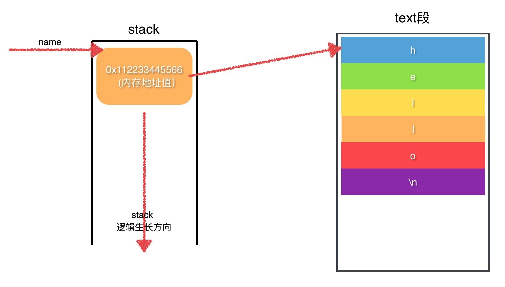

[TOC]


## 1、C代码 - 变量名 == 汇编代码 - 符号

### 2. 变量名是一块内存块的入口

- 1、并不是对 **变量** 进行读写
- 2、而是先通过 **变量** 找到相关联的 **内存块**
- 3、再对 **内存块** 进行读写

```c
int main()
{
  /** 
   * => 在main()所在局部栈帧上分配4字节的内存块，
   * => 4字节的内存块中存储数据值5
   * => 最终4字节的内存块，由变量a来关联
   * => 变量a最终作为一个【符号】，因为局部栈帧符号，所以只有在【程序运行时】才会分配内存
   */
  int a = 5;

   /**
    *	=> 【变量b】但仍然是一个【变量】，不同的是一个【指针类型】的变量,
    * => 【变量b】存储的不是【字符串 Hello World!】, 而是一个【内存地址值】,
    * => 【内存地址值】指向【text段】中的【一块内存块】,
    * => 最终【字符串 Hello World!】存储在【text段】中的【一块内存块】中
    */
  char* b = "Hello World!";
}
```

### 3.【直接】修改变量关联的内存块中数据

```c
int main()
{
  int a;
  a = 10;
}
```

### 4.【间接】修改变量关联的内存块中数据

```c
int main()
{
  // 1. 分配4字节内存
  int a;

  // 2. 获取变量标记的内存块的起始地址
  int *b = &a;

  // 3. 通过找到的内存块起始地址，对内存块进行数据的读写
  *b = 10;
}
```


## 2、C语言 定义 ==变量== 来关联 ==一块内存==

### 1. 左值与右值

- 1、左值（lvalue） => **内存地址** 
  - 指向内存位置的表达式被称为左值（lvalue）表达式。
  - 左值可以出现在赋值号的左边或右边。

- 2、右值（rvalue）=> **数据内容** 
  - 术语右值（rvalue）指的是存储在内存中某些地址的数值。
  - 右值是不能对其进行赋值的表达式
  - 右值可以出现在赋值号的右边，但不能出现在赋值号的左边。

```c
int g1 = 20; // 20只能当做右值(临时值)
int g2 = g1; // g1既可以当左值，也可以当右值
```

- g 是变量，指向一个栈内存块，所以既可以当**左值**，也可以当**右值**
- 20 是一个具体的数据值，只能当**左值**

### 2. C语言中定义 ==变量==，来关联一块==内存==

```c
#include <stdio.h>
int main()
{
  char* name = "hello";
  printf("%s\n", name);
}
```




## 3、汇编语言 定义 ==符号(symbol)== 来关联 ==一块内存==

- 1、在汇编中首先创建一个 **符号**
- 2、然后在让 **符号** 来关联 **一块内存**

```asm
.section .data

# => 定义了一个符号name
# => 字符串"hello\0"存储在某一个内存块中
# => 符号name就指向分配的内存块的起始地址
name:
	.string "hello\0"
	len=.-name

.section .text
.globl _start
_start:
	pushl $name # 通过【符号 name】找到【字符串"hello\0"】的【内存地址】
	call printf
	movl $1, %eax
	int $0x80
```

- 1、汇编代码中的 **符号 symbol** 就是C代码中的 **变量**
- 2、汇编中主要有三种类型的符号：
  - 1）变量类型 Object
  - 2）函数类型 Func
  - 3）分段类型 Section
- 3、通过 **变量** 能够很方便的 **定位** 到某一个 **内存单元**
- 4、最终存储数据的是变量指向的 **内存单元**


## 4、==符号== 存储在哪


| 符号类型 | 存储地点 |
| -------- | -------- |
| 全局变量 | 符号表   |
| 函数名   | 符号表   |
| 局部变量 | 代码段   |

- 1、除了 **局部变量** 类型的 **符号**，都是存放在 **符号表** 中
- 2、**符号表** 记录每一个 **符号** 关联的内存 **存放在哪里**
  - 1）data 段
  - 2）bss 段
  - 3）text 段


## 5、==全局符号== 关联的 ==内存== 存储在哪

### 1. main.c

```c
int var1; // 未初始化的全局变量1
static int var2; // 未初始化的全局变量2
static int var3 = 19; // 已初始化的全局变量

int main()
{	
	int var4; // 局部栈帧上变量(auto自动添加)
	int var5 = 19;// 同上
	static int var6;// 局部区域内的静态变量
	static int var7 = 19;// 同上
	register int var8 =20;// 寄存器变量
}
```

### 2. 查看 elf 格式 a.out 文件所有的 section

> readelf -S

```
➜  gcc readelf -S a.out
There are 31 section headers, starting at offset 0x1a48:

Section Headers:
  [Nr] Name              Type             Address           Offset
       Size              EntSize          Flags  Link  Info  Align
  [ 0]                   NULL             0000000000000000  00000000
       0000000000000000  0000000000000000           0     0     0
  [ 1] .interp           PROGBITS         0000000000400238  00000238
       000000000000001c  0000000000000000   A       0     0     1
  [ 2] .note.ABI-tag     NOTE             0000000000400254  00000254
       0000000000000020  0000000000000000   A       0     0     4
  [ 3] .note.gnu.build-i NOTE             0000000000400274  00000274
       0000000000000024  0000000000000000   A       0     0     4
  [ 4] .gnu.hash         GNU_HASH         0000000000400298  00000298
       000000000000001c  0000000000000000   A       5     0     8
  [ 5] .dynsym           DYNSYM           00000000004002b8  000002b8
       0000000000000048  0000000000000018   A       6     1     8
  [ 6] .dynstr           STRTAB           0000000000400300  00000300
       0000000000000038  0000000000000000   A       0     0     1
  [ 7] .gnu.version      VERSYM           0000000000400338  00000338
       0000000000000006  0000000000000002   A       5     0     2
  [ 8] .gnu.version_r    VERNEED          0000000000400340  00000340
       0000000000000020  0000000000000000   A       6     1     8
  [ 9] .rela.dyn         RELA             0000000000400360  00000360
       0000000000000018  0000000000000018   A       5     0     8
  [10] .rela.plt         RELA             0000000000400378  00000378
       0000000000000018  0000000000000018  AI       5    24     8
  [11] .init             PROGBITS         0000000000400390  00000390
       000000000000001a  0000000000000000  AX       0     0     4
  [12] .plt              PROGBITS         00000000004003b0  000003b0
       0000000000000020  0000000000000010  AX       0     0     16
  [13] .plt.got          PROGBITS         00000000004003d0  000003d0
       0000000000000008  0000000000000000  AX       0     0     8
  [14] .text             PROGBITS         00000000004003e0  000003e0
       0000000000000182  0000000000000000  AX       0     0     16
  [15] .fini             PROGBITS         0000000000400564  00000564
       0000000000000009  0000000000000000  AX       0     0     4
  [16] .rodata           PROGBITS         0000000000400570  00000570
       0000000000000004  0000000000000004  AM       0     0     4
  [17] .eh_frame_hdr     PROGBITS         0000000000400574  00000574
       0000000000000034  0000000000000000   A       0     0     4
  [18] .eh_frame         PROGBITS         00000000004005a8  000005a8
       00000000000000f4  0000000000000000   A       0     0     8
  [19] .init_array       INIT_ARRAY       0000000000600e10  00000e10
       0000000000000008  0000000000000000  WA       0     0     8
  [20] .fini_array       FINI_ARRAY       0000000000600e18  00000e18
       0000000000000008  0000000000000000  WA       0     0     8
  [21] .jcr              PROGBITS         0000000000600e20  00000e20
       0000000000000008  0000000000000000  WA       0     0     8
  [22] .dynamic          DYNAMIC          0000000000600e28  00000e28
       00000000000001d0  0000000000000010  WA       6     0     8
  [23] .got              PROGBITS         0000000000600ff8  00000ff8
       0000000000000008  0000000000000008  WA       0     0     8
  [24] .got.plt          PROGBITS         0000000000601000  00001000
       0000000000000020  0000000000000008  WA       0     0     8
  [25] .data             PROGBITS         0000000000601020  00001020
       0000000000000018  0000000000000000  WA       0     0     8
  [26] .bss              NOBITS           0000000000601038  00001038
       0000000000000010  0000000000000000  WA       0     0     4
  [27] .comment          PROGBITS         0000000000000000  00001038
       0000000000000034  0000000000000001  MS       0     0     1
  [28] .shstrtab         STRTAB           0000000000000000  0000193c
       000000000000010c  0000000000000000           0     0     1
  [29] .symtab           SYMTAB           0000000000000000  00001070
       00000000000006a8  0000000000000018          30    51     8
  [30] .strtab           STRTAB           0000000000000000  00001718
       0000000000000224  0000000000000000           0     0     1
➜  gcc
```

### 3. 查看符号表中记录【符号关联内存】的存储地点

- 1、`readelf -s a.out` 查看符号表
- 2、`readelf -s a.out | grep 变量名` 过滤查看某一个变量的的符号表信息

```
➜  gcc readelf -s a.out | grep var
  38: 000000000060103c     4 OBJECT  LOCAL  DEFAULT   26 var2
  39: 0000000000601030     4 OBJECT  LOCAL  DEFAULT   25 var3
  40: 0000000000601034     4 OBJECT  LOCAL  DEFAULT   25 var7.1838
  41: 0000000000601040     4 OBJECT  LOCAL  DEFAULT   26 var6.1837
  63: 0000000000601044     4 OBJECT  GLOBAL DEFAULT   26 var1
➜  gcc
```

- 1、内存分配在 **[26] .bss** 段中的变量
  - var1 
  - var2
  - var6
  - 结论：未初始化的全局变量，在 **bss段** 分配存储内存

- 2、存储在 **[25] .data** 段中的变量
  - var3 
  - var7
  - 结论：已初始化的全局变量，在 **data段** 分配存储内存

- 3、没有找到符号的 **var4、var5** 这两个符号
  - 这两个是 **局部栈帧** 上的变量
  - 结论：局部变量，只有在 **运行时 - 栈帧分配局部内存**

### 4. 总结

#### 1. 已初始化 => data 段

```c
char* name = "hello"; // 已经初始化的全局变量

int main()
{}
```

#### 2. 未初始化 => bss 段

```c
char* name; // 未初始化的全局变量

int main()
{}
```

#### 3. 等价于【汇编语言】中 `data、bss 段` 中 `全局符号`

```asm
.section .data
name:
	.string "hello\0"
	len=.-name
```

- 1、在data段定义符号
- 2、在data段分配一块内存，存储字符串 "hello\0"
- 3、符号name来关联这一块内存


