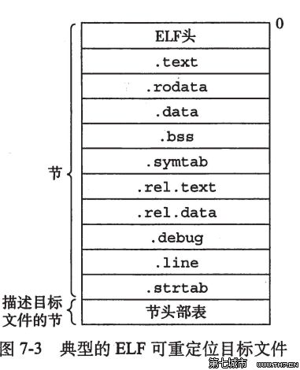
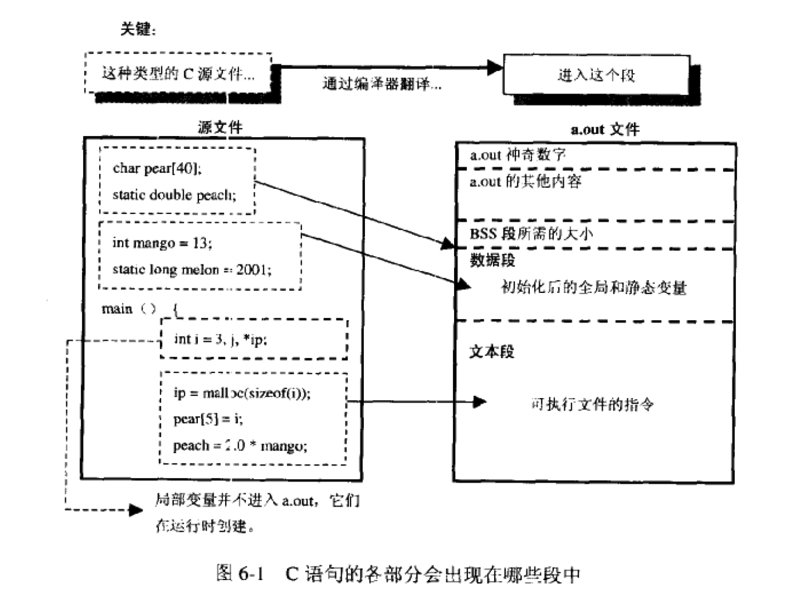
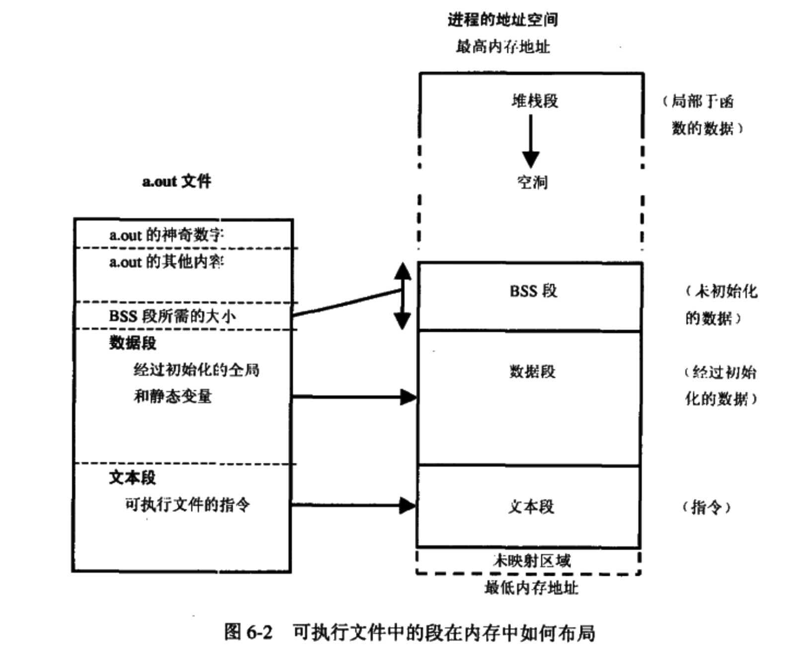
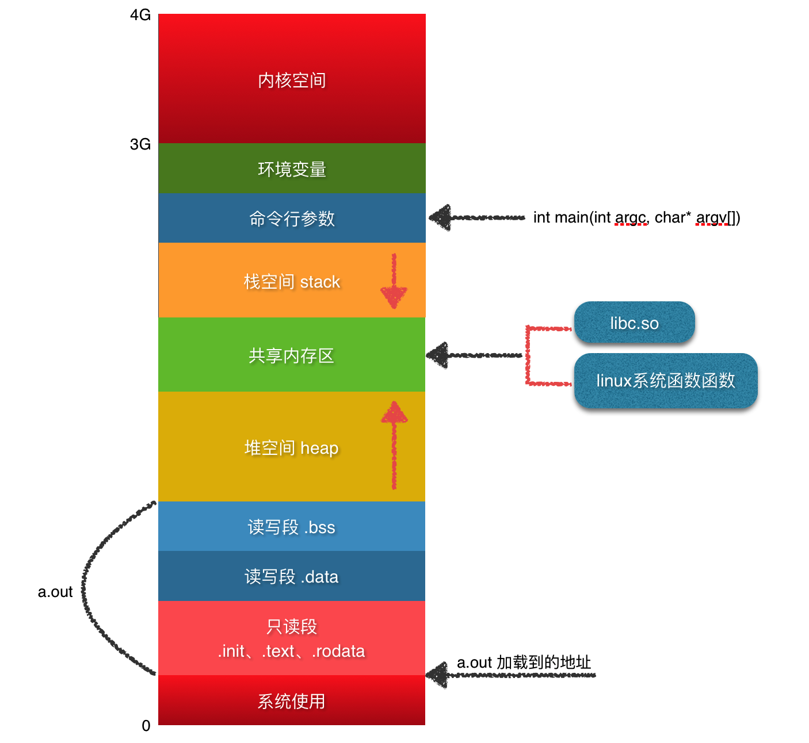
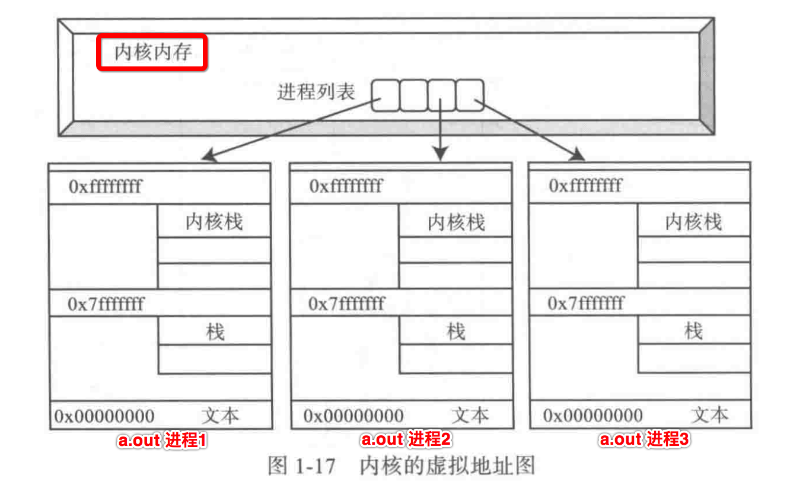
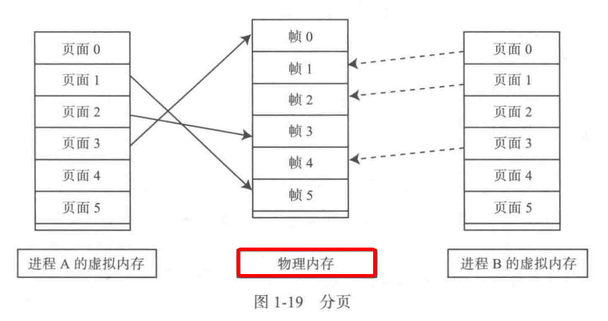

[TOC]


## 1、数据总线 与 地址总线

在很久以前 【数据】总线的宽度**小于**【地址】总线的宽度 。

比如在0806的CPU架构下：

- (1) 【数据】总线的宽度为**16位**
- (2) 【地址】总线的宽度为**20位**

那么一个**20位的地址**就无法**一次**通过**16**位的数据总线进程传递完成。


## 2、内存地址 ==合成==

这个时候 **地址合成** 的思想就出来了：

> 让一个20位的数值，通过`2个16位`的数值合成得到。

比如存在一个**20位**的地址，ABCDEH（一个十六进制位==>4个二进制位），换算为`两个16位`数值相加的过程

```
ABCDE = ABCD0 + 0000E
      = (ABCD * 16) + 000E
```

这样一来，就将**ABCDE**这5个**十六**进制数，拆开为2个**4位的十六进制**进行计算的公式了。

```
20位地址值 = 前4位十六进制地址值 * 16 + 000最后一位十六进制地址值
          = 段地址值（前4位） * 16 + 偏移地址（最后一位）
          = 段地址 * 16 + 段内偏移量
```

这就推到出了**段地址 * 16 + 段内偏移量**公式，可以表示计算机内存中的任何的一个段地址值。


## 3、==段式内存== 仍然被使用

现在的计算机硬件，基本上都是**【数据】总线的宽度** 等于 **【地址】总线的宽度**，但是这种**段式内存管理**的方式仍然继续使用。

比如在内存调试时，看到的内存地址是这样的:

```
/* 段地址:偏移地址 */
ABCD:000E
```

那么在寻找某一个内存地址单元`ABCD:000E`时，是通过如下两个步骤：

- (1) 首先指定**ABCD**这个**段**
- (2) 然后这个**段内偏移量**为**000E**的内存单元格子


## 4、elf 文件的 ==分段==

### 1. elf 可执行文件的 分段



| 名称   | 存储内容                                  |
| ------ | ----------------------------------------- |
| bss 段  | 未初始化或初值为0的全局变量和静态局部变量 |
| data 段 | 已初始化且初值非0的全局变量和静态局部变量 |
| text 段 | 可执行代码、字符串字面值、只读变量        |
| stack 栈 | 局部变量、函数参数、返回地址等            |
| heap 堆 | 动态分配的内存                            |

- 1、每一个linux elf可执行文件在加载到内存运行时，都会分配这样一个**虚拟的进程内存空间**
- 2、但实际上每一个程序进程，并不会真正的拥有这么大的内存空间
- 3、而是所有的程序进程，共享同一个**物理存储器**
- 4、对于【进程】：如上所有段的数据，**都不共享**的
- 5、对于【线程】：
	- **共享**：text段、data段
	- **私有**：stack栈

### 2. elf 文件的 ==编译== 阶段



- 1、text
- 2、data
- 3、bss

### 3. elf 文件的 ==运行== 阶段



- 1、stack
- 2、heap
- 3、共享映射内存区

### 4. 运行期 比 编译期 多出2个段

- 1、Stack 栈段 => 函数内分配的内存
- 2、Heap 堆段 => malloc()分配的内存


## 5、elf 可执行文件，加载到内存时，会分配独立的 ==进程虚拟空间==




## 6、==内核== 管理所有的 进程虚拟内存空间




## 7、多个进程虚拟内存空间, ==共享== 同一块 ==物理内存== 



- 1）物理存储器按照**页**的大小分配
- 2）当A进程执行时，将其代码段、数据段数据的某一个页，加载到**物理内存**中的某一个页
- 3）当**物理内存**满了时，淘汰掉最久未被使用的页


