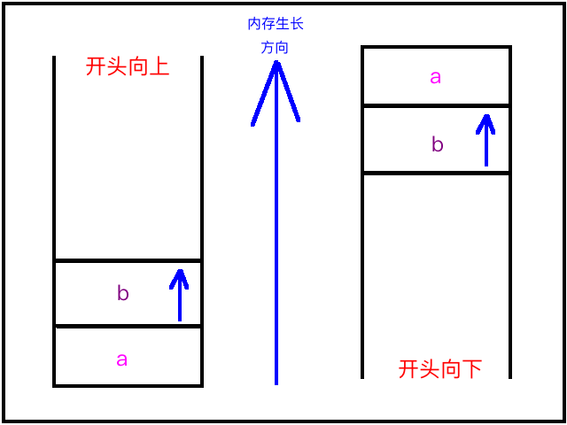

[TOC]


## 1、测试【栈】开口 方向

```c
#include <stdlib.h>
#include <stdio.h>

int main(int argv, char* argr[])
{
	// 1. 先入栈
	int a;

	// 2. 再入栈
	int b;
	
	// 3. 打印a与b的地址谁比较大，就可以得到栈的开口方向了
	// 注意：内存的生长方向是唯一的，从小到大
	if (&a < &b)
		printf("%s\n", "开口向下");
	else 
		printf("%s\n", "开口向上");
}
```

- 1、变化的是：栈的开口方向（逻辑）
- 2、不变的是：内存的生长方向（物理）
- 3、比较 a 与 b 的地址：
  - 1）a的地址 > b的地址，开口向下
  - 2）a的地址 < b的地址，开口向上

不管系统分配的栈结构到底开口向上还是向下，但是栈内存储的局部内存空间总是`向上（只会保持一个方向）`




## 2、`ulimit -a` 查看当前操作系统 ==栈== 默认的 ==最大== 大小

```
bogon:~ xiongzenghui$ ulimit -a
core file size          (blocks, -c) 0
data seg size           (kbytes, -d) unlimited
file size               (blocks, -f) unlimited
max locked memory       (kbytes, -l) unlimited
max memory size         (kbytes, -m) unlimited
open files                      (-n) 4864
pipe size            (512 bytes, -p) 1
stack size              (kbytes, -s) 8192
cpu time               (seconds, -t) unlimited
max user processes              (-u) 709
virtual memory          (kbytes, -v) unlimited

```

从上面可以看到`stack size (kbytes, -s) 8192`

- 8192 kbytes
- 8192 字节
- 8 M

所以默认情况下, 大多数操作系统的默认的 **栈大小** 容量为 **8M**


## 3、栈越界 (stack overflow)

```c
#include <stdlib.h>
#include <stdio.h>

int main() {	

	//总共 10000000000 * 4 字节，明显超过 栈的最大限制 8192字节
	int a[10000000000] = {0};

	return 1;
}
```

程序运行后报错如下

```
bogon:Desktop xiongzenghui$ gcc demo.c
bogon:Desktop xiongzenghui$ ./a.out
Segmentation fault: 11
```

提示：段错误 11。

- 1、因为一下子需要 `栈` 分配 `10000000000 * 4 个字节`，
- 2、超出了 `栈` 最大的容量 `8192字节`
- 3、所以就造成了 `栈的越界`


## 4、堆越界 (heap overflow)

尝试在 `堆` 区分配 `100000000000000 * 4 个字节` 空间，是否能成功？

```c
#include <stdlib.h>
#include <stdio.h>

int main() {	

	int *p = (int *)malloc(sizeof(int) * 100000000000000);
	if (p == NULL)
	{
		printf("%s\n", "分配失败");
	}

	return 1;
}
```

输出

```
bogon:Desktop xiongzenghui$ gcc demo.c
bogon:Desktop xiongzenghui$ ./a.out
a.out(13365,0x7fff79496000) malloc: *** mach_vm_map(size=400000000000000) failed (error code=3)
*** error: can't allocate region
*** set a breakpoint in malloc_error_break to debug
分配失败
```

- 1、当分配 `100000000000000 * 4 字节` 时就会报错了，
- 2、堆区也是存在【最大分配内存长度】的
- 3、只是比【栈】的容量大一些


