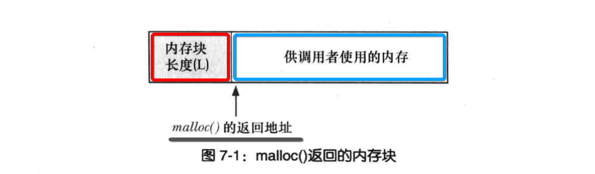
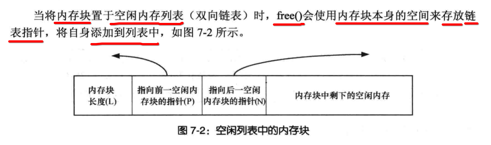
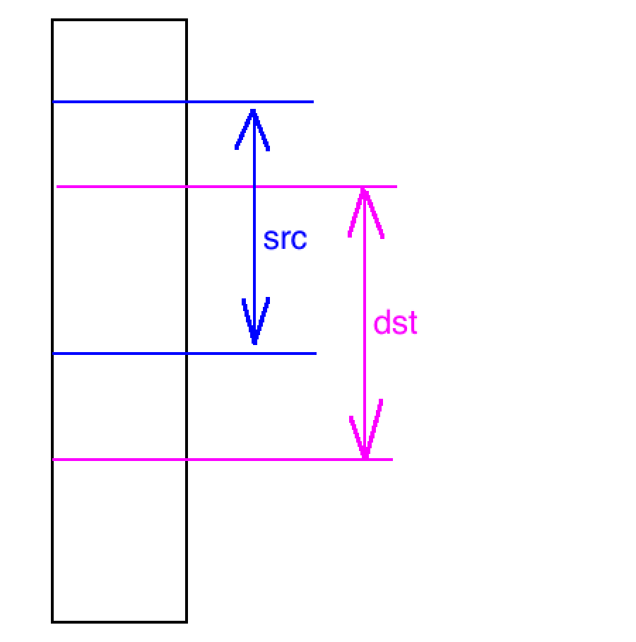
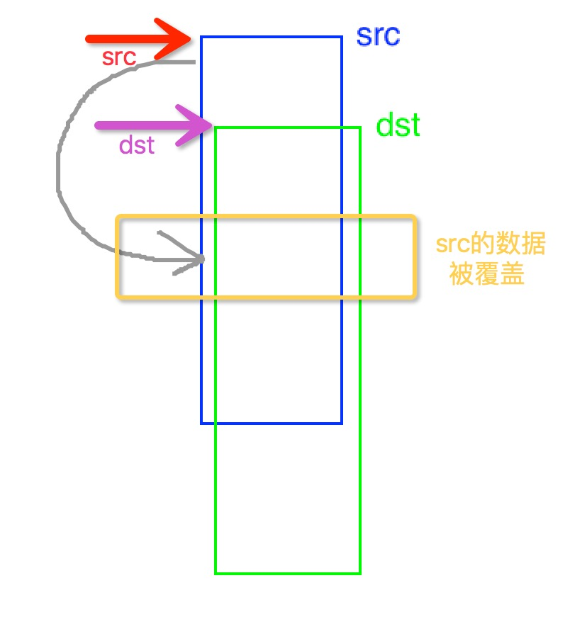
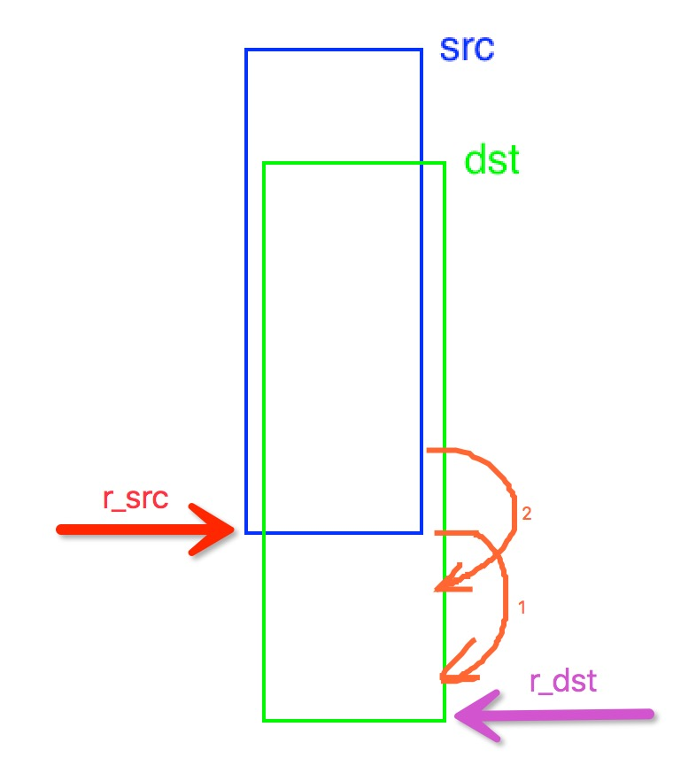
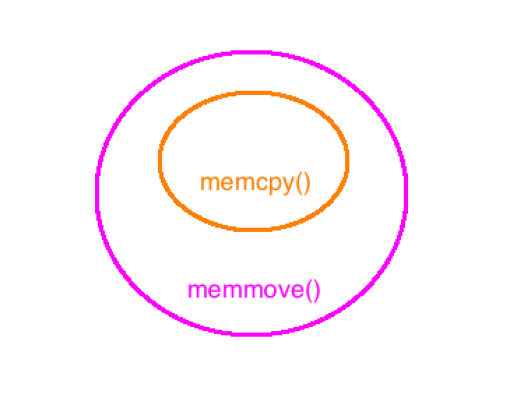

[TOC]


## 1、malloc() 返回的 ==内存结构== 



- 1、红色部分内存：是malloc() **额外** 附加的一段内存，**记录** 这块内存的 **长度**
- 2、蓝色部分内存：提供给调用者使用的内存空间
- 3、类似 **内存共享#起始地址不重叠** 的情况


## 2、malloc(字节数)

```c
#include <stdio.h>
#include <stdlib.h>

int main()
{
  #define count 10

  /**
   * malloc(总长度)
   */
  int* p1 = (int*)malloc(sizeof(int) * count);

  int i;
  for(i=0; i<count; i++)
    printf("%d ", p1[i]);
  printf("\n");

  free(p1);

  #undef count
}
```


## 3、malloc() 变种

### 1. calloc(count, length)

```c
#include <stdio.h>
#include <stdlib.h>

int main()
{
  #define count 10

  /**
   * calloc(分配多少个, 每一个的内存长度)
   */
  int* p2 = (int*)calloc(count, sizeof(int*));

  for(i=0; i<count; i++)
    printf("%d ", p2[i]);
  printf("\n");

  free(p2);

  #undef count
}
```

### 2. realloc(source, re-length)

```c
#include <stdio.h>
#include <stdlib.h>
#include <string.h>

int main()
{
  char *str;

  // 1. 最初的内存分配
  str = (char *)malloc(15 * sizeof(char));
  strcpy(str, "runoob");
  printf("String = %s,  Address = %p\n", str, str);
  
  // 2. 重新分配内存
  for(size_t i = 0; i < 5; i++)
  {
    str = (char *) realloc(str, 25); // 重新分配25个字节大小的内存
    strcat(str, ".com"); // 末尾拼接字符
    printf("String = %s,  addr = %p\n", str, str);
  }

  // 3. 释放掉重新分配的内存
  free(str);
}
```

```
➜  main make
gcc main.c
./a.out
String = runoob,  Address = 0x7f938b403160
String = runoob.com,  addr = 0x7f938b403160
String = runoob.com.com,  addr = 0x7f938b403160
String = runoob.com.com.com,  addr = 0x7f938b403160
String = runoob.com.com.com.com,  addr = 0x7f938b403160
String = runoob.com.com.com.com.com,  addr = 0x7f938b403160
➜  main
```

- 1、realloc() 返回的内存地址的 **起始地址**【没有发生变化】
- 2、只是改变了内存的 **长度** （链表串联其他的空闲内存块）


## 4、free()



- 1、每一个内存块，都存在一个 **双向链表节点** 存储额外的信息
- 2、被 free() 释放的内存块
  - 1）**并不是被删除**
  - 2）而是被添加到 **空闲内存链表** 中


## 5、==清零== 内存块

### 1. memset() 使用 ==0== 填充内存

```c
// memset(内存其实地址, 填充的数值, 填充的长度)
void *memset(void *s, int c, size_t n);
```

注意：

- 1、虽然 memset() 第二个参数是 **int**
- 2、但是 memset() 是按照 **ascii码** 进行填充
- 3、通常清零则传入 **0**
- 4、**0** 在 8、16、10 三种进制下都表示 **nul（空）**
  - octal（8进制）：000 nul
  - hexadecimal（16进制）：0x00 nul
  - decimal（10进制）：0 nul

```c
#include <stdlib.h>
#include <stdio.h>
#include <string.h>

int main() 
{	
  int  arr1[5] = {0};
  int  arr2[5] = {0};
  int  arr3[5] = {0};

  memset(arr1, 1, sizeof(int) * 5);
  memset(arr2, 1, sizeof(int) * 5);
  memset(arr3, 0, sizeof(int) * 5);

  for (int i = 0; i < 5; ++i)
  {
    printf("%d ", arr1[i]);
  }
  printf("\n");

  for (int i = 0; i < 5; ++i)
  {
    printf("%c ", arr2[i]);
  }
  printf("\n");

  for (int i = 0; i < 5; ++i)
  {
    printf("%d ", arr3[i]);
  }
  printf("\n");
  for (int i = 0; i < 5; ++i)
  {
    printf("%c ", arr3[i]);
  }
  printf("\n");

  return 0;
}
```

输出

```
16843009 16843009 16843009 16843009 16843009
（空行）
0 0 0 0 0
（空行）
```

### 2. ascii 码表中 `0` 所代表的东西

```
1. 000（八进制） nul
2. 00 （十六进制）nul
3. 0 （十进制）nul
```

三种进制下的0，都是代表 **null** 即什么都没有。

- (1) 按照`%d`格式打印，什么都没有
- (2) 按照`%c`格式打印，就是一个 **字符 '0'**

### 3. memset() 填充的 ==长度==

```c
#include <stdlib.h>
#include <stdio.h>
#include <string.h>

int main()
{
  int  arr1[10] = {1,2,3,4,5,6,7,8,9,10};
  char arr2[] = "ghghghghghghghghghghgh";

  memset(arr1, 0, sizeof(int) * 5);
  memset(arr2, '*', sizeof(char) * 5);

  for (int i = 0; i < 10; ++i)
  {
    printf("%d ", arr1[i]);
  }
  printf("\n");

  printf("%s\n", arr2);

  return 0;
}
```

运行输出

```
0 0 0 0 0 6 7 8 9 10
*****hghghghghghghghgh
```

可以看到两个数组，前5个位置都被重新赋值了。

### 4. bezero()

```c
#include <strings.h>
void bzero(void *s, size_t n);
```

```c
#include <stdio.h>
#include <strings.h>
int main()
{
  char buf[1024];
  bezero(buf, 1024); // 直接清零
}
```


## 6、strcpy()、strncpy() 只用于拷贝 ==char== 类型

```c
#include <stdlib.h>
#include <stdio.h>
#include <string.h>

int main(int argc, const char * argv[])
{
  //1. src
  char str1[15] = "Hello\0world"; //注意：字符串中包含\0结束符

  //2. dst
  char str2[15];
  char str3[15];

  //3. strncpy拷贝字符数组
  strncpy(str2, str1, sizeof(str1)); // 遇到\0拷贝结束
  printf("str2 = %s, strlen(str2) = %lu\n", str2, strlen(str2)); 
  printf("str2 + strlen(str1) + 1 = %s\n", str2 + strlen(str1)); 
}
```

```
➜  main make
gcc main.c
./a.out  hello
str2 = Hello, strlen(str2) = 5
str2 + strlen(str1) + 1 =
➜  main
```

strncpy() 当拷贝到 **'\0'** 时，就会 **停止** 拷贝


## 7、memcpy() 只关心拷贝 ==多少字节== , 而不关心 ==数据类型==

```c
#include <stdlib.h>
#include <stdio.h>
#include <string.h>

int main(int argc, const char * argv[])
{
  // 1. src
  char str1[15] = "Hello\0world"; //注意：字符串中包含 '\0' 结束符

  // 2. dst
  char str2[15];
  char str3[15];

  // 3. memcpy拷贝字符数组
  memcpy(str3, str1, sizeof(str1)); // 拷贝整个内存长度

  // 4、
  printf("str3 = %s, strlen(str3) = %lu\n", str3, strlen(str3));
  printf("str3 + strlen(str1) + 1 = %s\n", str3 + strlen(str1) + 1);
}
```

```
➜  main make
gcc main.c
./a.out  hello
str3 = Hello, strlen(str3) = 5
str3 + strlen(str1) + 1 = world
➜  main
```

memcpy() 会将全部的内容 **全部进行拷贝**。


## 8、strcmp()、strncmp() 比较 ==字符串==

### 1. strcmp(str1, str2)

```c
#include <string.h>
#include <stdio.h>

void cmpare(const char* lhs, const char* rhs)
{
  int rc = strcmp(lhs, rhs);

  if(rc == 0)
    printf("[%s] equals [%s]\n", lhs, rhs);
  else if(rc < 0)
    printf("[%s] precedes [%s]\n", lhs, rhs);
  else if(rc > 0)
    printf("[%s] follows [%s]\n", lhs, rhs);

}
int main(void)
{
  const char* string = "Hello World!";

  cmpare(string, "Hello!");
  cmpare(string, "Hello");
  cmpare(string, "Hello there");
  cmpare("Hello, everybody!" + 12, "Hello, somebody!" + 11);
}
```

### 2. strncmp(str1, str2, length) 

```c
#include <string.h>
#include <stdio.h>
 
void demo(const char* lhs, const char* rhs, int sz)
{
  int rc = strncmp(lhs, rhs, sz);

  if(rc == 0)
    printf("First %d chars of [%s] equal [%s]\n", sz, lhs, rhs);
  else if(rc < 0)
    printf("First %d chars of [%s] precede [%s]\n", sz, lhs, rhs);
  else if(rc > 0)
    printf("First %d chars of [%s] follow [%s]\n", sz, lhs, rhs);
}
int main(void)
{
  const char* string = "Hello World!";
  demo(string, "Hello!", 5);
  demo(string, "Hello", 10);
  demo(string, "Hello there", 10);
  demo("Hello, everybody!" + 12, "Hello, somebody!" + 11, 5);
}
```


## 9、memcmp() 比较 ==任意内存== 中的数据

比较两个内存块中 **数据** 的大小

```c
#include <stdlib.h>
#include <stdio.h>
#include <string.h>

int main(int argc, const char * argv[])
{    
  //1. 三块内存
  char arr1[15] = "Hello";//末尾小写o
  char arr2[15] = "Hello";//同上
  char arr3[15] = "HellO";//末尾大写o

  //2.
  printf("arr1 = %p\n", arr1);
  printf("arr2 = %p\n", arr2);
  printf("arr3 = %p\n", arr3);

  //3.
  int ret1 = memcmp(arr1, arr2, sizeof(char) * 5);
  int ret2 = memcmp(arr2, arr3, sizeof(char) * 5);
  int ret3 = memcmp(arr3, arr2, sizeof(char) * 5);

  //4.
  printf("ret1 = %d\n", ret1);
  printf("ret2 = %d\n", ret2);
  printf("ret3 = %d\n", ret3);
}
```

```
arr1 = 0x7fff51342989
arr2 = 0x7fff5134297a
arr3 = 0x7fff5134296b
ret1 = 0
ret2 = 32
ret3 = -32
```

比较结果:

- (1) 内容相等，则返回 0
- (2) 如果A内容大于B内容，则返回 A内容**ascii码**值 - B内容**ascii码**值 = **正数**
- (3) 如果A内容小于B内容，则返回 A内容**ascii码**值 - B内容**ascii码**值 = **负数**


## 10、memcpy() 与 memmove()

### 1.src 与 dst 没有重叠

```c
#include <stdlib.h>
#include <stdio.h>
#include <string.h>

int main(int argc, const char * argv[]) 
{
  // 1. src
  char* src = (char*)malloc(sizeof(char) * 15 + 1);
  memset(src, 0, strlen(src));
  strcpy(src, "abcdefghijk");

  // 2. dst
  char* dst = (char*)malloc(sizeof(char) * 15 + 1);
  memset(dst, 0, strlen(dst));

  // 3. 
  memcpy(dst, src, strlen(src));

  // 4.
  printf("src[%p] = %s\n", src, src);
  printf("dst[%p] = %s\n", dst, dst);
}
```

```
➜  main make
gcc main.c
./a.out  hello
src[0x7fa6d0c00260] = abcdefghijk
dst[0x7fa6d0c00020] = abcdefghijk
➜  main
```

- 此时 memcpy() 或 memmove() 使用【没有区别】。

### 2. src 与 dst 有重叠 && src > dst


```c
#include <string.h>  
#include <stdio.h>  
  
int main()  
{  
  int i = 0;  
  int arr[10];  

  for(i=0; i < 10; i++)  
  {
    arr[i] = i; 
    printf("%d ",arr[i]);  
  }
  printf("\n");   
  
  // src > dst
  memcpy(
    arr,          // dst = arr
    &arr[4],      // src = arr+4
    sizeof(int)*6 // 拷贝长度为6个int
  ); 
  
  for(i = 0; i < 10; i++)  
    printf("%d ",arr[i]);  
  printf("\n");  
}
```

```
➜  main make
gcc main.c
./a.out  hello
0 1 2 3 4 5 6 7 8 9
4 5 6 7 8 9 6 7 8 9
➜  main
```

- 1）src内存块与dst内存块，虽然有【有重叠】
- 2）但是【src】在【dst】的【后面】
- 3）从src开始逐个字节拷贝到dst时，不会产生【数据覆盖】的问题

### 3. src 与 dst 有重叠 && src < dst



```c
#include <string.h>  
#include <stdio.h>  
  
int main()  
{  
  int i = 0;  
  int arr[10];  

  for(i=0; i < 10; i++)  
  {
    arr[i] = i; 
    printf("%d ",arr[i]);  
  }
  printf("\n");   
  
  // src < dst
  memcpy(
    &arr[4],        // dst = arr+4
    arr,            // src = arr
    sizeof(int)*6   // 拷贝长度为6个int
  );
  
  for(i = 0; i < 10; i++)  
    printf("%d ",arr[i]);  
  printf("\n");  
}
```

```
➜  main make
gcc main.c
./a.out  hello
0 1 2 3 4 5 6 7 8 9
0 1 2 3 0 1 2 3 0 1
➜  main
```

- 1、最后两位并不是 **4、5**

- 2、因为在拷贝arr[0]、arr[1]时
  - 已经把arr[4]、arr[5]给【覆盖】掉了
  - arr[4]、arr[5]被覆盖为了 **0、1**

- 3、所以最终arr末尾两位被拷贝为 **0、1**，而不是最开始的 **4、5**

### 4. ~~堆区数据 memcpy() 的差别~~（不太确定） 

#### 1. char数组

```c
#include <stdlib.h>
#include <stdio.h>
#include <string.h>

int main(int argc, const char * argv[]) 
{
  // 1.
#if defined(HEAP)
  char* p = (char*)malloc(sizeof(char) * 20);
  memset(p, 0, 20);
  strcpy(p, "0123456789");
#else
  char p[20] = {"0123456789"};
#endif
  printf("%s\n", p);

  if ((p + 4) < p)
    printf("dst < src\n");
  else 
    printf("dst > src\n"); 

  // 2. 
  memcpy(
    p+4,  // dst
    p,    // src
    6
  );
  printf("%s\n", p);

  // 3.
#if defined(HEAP)
  free(p);
#endif
}
```

使用**栈上**的内存，使用memcpy()会产生覆盖：

```
➜  main gcc main.c
➜  main ./a.out
0123456789
dst > src
0123012301
➜  main
```

但是使用**堆上**的内存，使用memcpy()却【不会】产生覆盖：

```
➜  main gcc main.c -DHEAP
➜  main ./a.out
0123456789
dst > src
0123012345
➜  main
```

- 居然是正常的
- 可能是因为堆区的数据【非连续】

#### 2. int数组 

```c
#include <string.h>
#include <stdlib.h>
#include <stdio.h>
  
int main()  
{  
  int i = 0;  

#if defined(HEAP)
  int* arr = (int*)malloc(sizeof(int) * 10);
#else
  int arr[10];
#endif
  for(i=0; i < 10; i++)  
  {
    arr[i] = i; 
    printf("%d ", arr[i]);  
  }
  printf("\n");  

  if (&arr[4] < arr)
    printf("dst < src\n");
  else 
    printf("dst > src\n"); 
  
  // src < dst
  memcpy(
    &arr[4],  // dst = arr+4
    arr,      // src = arr
    sizeof(int) * 6
  );
  
  for(i = 0; i < 10; i++)  
    printf("%d ", arr[i]);  
  printf("\n");  

#if defined(HEAP)
  free(arr);
#endif
}
```

使用**栈区**的内存，memcpy() 会【产生】数据覆盖：

```
➜  main gcc main.c
➜  main ./a.out
0 1 2 3 4 5 6 7 8 9
dst > src
0 1 2 3 0 1 2 3 0 1
➜  main
```

使用**堆区**的内存，memcpy() 【不会】产生数据覆盖：

```
➜  main gcc main.c -DHEAP
➜  main ./a.out
0 1 2 3 4 5 6 7 8 9
dst > src
0 1 2 3 0 1 2 3 4 5
➜  main
```

### 5. memmove() 

#### 1. 当存在 src起始地址 < dst起始地址


#### 2. 解决执行 memcpy(src, dst, n) 时会产生【数据覆盖】的问题



```c
#include <string.h>  
#include <stdio.h>  
  
int main()  
{  
  int i = 0;  
  int arr[10];  

  for(i=0; i < 10; i++)  
  {
    arr[i] = i; 
    printf("%d ",arr[i]);  
  }
  printf("\n");   
  
  // src < dst
  memmove(
    &arr[4],        // dst = arr+4
    arr,            // src = arr
    sizeof(int)*6   // 拷贝长度为6个int
  );
  
  for(i = 0; i < 10; i++)  
    printf("%d ",arr[i]);  
  printf("\n");  
}
```

```
➜  main make
gcc main.c
./a.out  hello
0 1 2 3 4 5 6 7 8 9
0 1 2 3 0 1 2 3 4 5
➜  main
```

最后两位值为**4、5**，说明没有被覆盖。

### 6. memcpy() 源码实现

```c
#include <string.h>
#include <stdlib.h>
#include <stdio.h>

/**
 * 就是简单逐字节进行数据拷贝 =>【*dst++ = *src++】
 */
void* mymemcpy(
  void* dest, 
  const void* src, 
  size_t n
)
{
  // 1、步长为【1字节】的指针变量
  char *d = dest;
  const char* s = src; // const修饰的是【*s】，即不允许修改s指向的【内存中的数据】
  
  // 2、步长为【4字节】的指针变量
  int *di;
  const int *si;

  /**
   * 3、数据的长度 =【len取余4的余数】+【4的倍数】
   * - 3.1）【char*】步长为【1字节】拷贝【len取余4的余数】的0~3个字节
   * - 3.2）【int*】步长为【4字节】拷贝【4的倍数】的剩下所有字节
   */

  // 3.1 开头【不能被4整除】的字节数，使用【char*】步长为1个字节的指针进行拷贝
  int r = n % 4;
  while (r--)
    *d++ = *s++; // 步长为【1字节】进行字节拷贝

  // 3.2【剩下字节数都是4的整数倍】，使用【int*】步长为4个字节的指针 进行拷贝
  di = (int *)d;
  si = (const int*)s;
  n /= 4;
  while (n--)
    *di++ = *si++; // 步长为【4字节】进行字节拷贝

  return dest;
}

int main()  
{  
  int i = 0;  

#if defined(HEAP)
  int* arr = (int*)malloc(sizeof(int) * 10);
#else
  int arr[10];
#endif
  for(i=0; i < 10; i++)  
  {
    arr[i] = i; 
    printf("%d ",arr[i]);  
  }
  printf("\n");

  if (&arr[4] < arr)
    printf("dst < src\n");
  else 
    printf("dst > src\n");
  
  // src < dst
  mymemcpy(
    (void*)&arr[4], // dst = arr+4
    arr, // src = arr
    sizeof(int)*6
  );
  
  for(i = 0; i < 10; i++)  
    printf("%d ",arr[i]);  
  printf("\n");  

#if defined(HEAP)
  free(arr);
#endif
}
```

```
➜  main gcc main.c
➜  main ./a.out
0 1 2 3 4 5 6 7 8 9
dst > src
0 1 2 3 0 1 2 3 0 1
➜  main
```

````
➜  main gcc main.c -DHEAP
➜  main ./a.out
0 1 2 3 4 5 6 7 8 9
dst > src
0 1 2 3 0 1 2 3 0 1
➜  main
````

- glibc库中的堆区数据是没问题的
- 说明glibc库的memcpy()对堆区的数据拷贝时，做了额外的处理的

### 7. memmove() 源码实现 

#### 1. 解决数据覆盖思路

从src与dst的【从后往前】逐字节进行拷贝，则不会导致src中的数据被覆盖丢失。



#### 2. 具体代码实现

```c
#include <string.h>
#include <stdlib.h>
#include <stdio.h>

#if 0
void* mymemcpy(void *dest, const void *src, size_t n)
{
  char *d = dest;
  const char *s = src;
  int *di;
  const int *si;

  int r = n % 4;
  while (r--)
    *d++ = *s++;

  di = (int *)d;
  si = (const int*)s;
  n /= 4;
  while (n--)
    *di++ = *si++;

  return dest;
}
#endif

/**
 * memmove() 考虑dst与src是否存在内存的重叠，分情况进行拷贝：
 * 1）src与dst【没有重叠】时，直接使用【memcpy()】进行数据拷贝
 * 2）src与dst【有重叠】时，则使用【逆向】数据拷贝，防止数据被覆盖
 */
void* mymemmove(
  void* dst, 
  const void* src, 
  size_t n
)
{  
  char* s_dst;  
  char* s_src;  
  s_dst = (char*)dst;  
  s_src = (char*)src;

  // 1、如果dst与src有内存重叠，且【src < dst】时
  // 满足如下条件时，就不能直接调用memcpy()进行拷贝
  // - 1）src < dst
  // - 2）(src + n) > dst
  // 必须从【后】往【前】进行拷贝，才不会导致数据的覆盖丢失
  if((s_src < s_dst) && ((s_src + n) > s_dst))
  {
    // 1.1 让【src、dst】都【往后】移动到【最后一个】字节内存地址
    // => 这里可能会内存越界访问
    s_dst = s_dst + n - 1;
    s_src = s_src + n - 1;

    // 1.2 从【后】往【前】开始拷贝，就不会产生前面的数据被覆盖的问题
    while(n--)
      *s_dst-- = *s_src--;

    return dst;  
  }

  // 2、dst与src没有内存重叠，就直接走 memcpy() 的逻辑
#if 0
  return mymemcpy(dst, src, n);
#else
  return memcpy(dst, src, n);
#endif
}  

int main()  
{  
  int i = 0;  

#if defined(HEAP)
  int* arr = (int*)malloc(sizeof(int) * 10);
#else
  int arr[10];
#endif
  for(i=0; i < 10; i++)  
  {
    arr[i] = i; 
    printf("%d ",arr[i]);  
  }
  printf("\n");

  if (&arr[4] < arr)
    printf("dst < src\n");
  else 
    printf("dst > src\n");
  
  // src < dst
  mymemmove(
    (void*)&arr[4], // dst = arr+4
    arr, // src = arr
    sizeof(int)*6
  );
  
  for(i = 0; i < 10; i++)  
    printf("%d ",arr[i]);  
  printf("\n");  

#if defined(HEAP)
  free(arr);
#endif
}
```

```
➜  main gcc main.c
➜  main ./a.out
0 1 2 3 4 5 6 7 8 9
dst > src
0 1 2 3 0 1 2 3 4 5
➜  main
```

```
➜  main gcc main.c -DHEAP
➜  main ./a.out
0 1 2 3 4 5 6 7 8 9
dst > src
0 1 2 3 0 1 2 3 4 5
➜  main
```

### 8. memmove() 包含 memcpy() 



- 1）当src与dst指向的内存有【重叠】时，且【src < dst】，则使用【逆序拷贝】字符
- 2）其他情况都按照【strcpy()】的拷贝方式

### 9. 数据拷贝时，src 与 dst 不同关系时的拷贝方式

| 序号 | src 与 dst 的关系 | memcpy() 拷贝是否正确 | memmove() 拷贝是否正确 |
|:----|:----------------|:----------------|:----------------|
| 1 | src 与 dst 毫无重叠 | yes | yes |
| 2 | src 与 dst 重叠，且 src > dst | yes | yes |
| 3 | src 与 dst 重叠，且 src < dst | **no** | yes |

结论：**memmove()** 在任何时刻，都能正确完成数据的拷贝。


