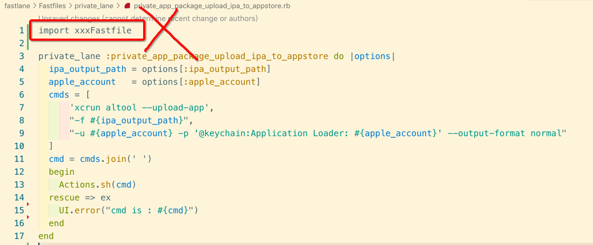
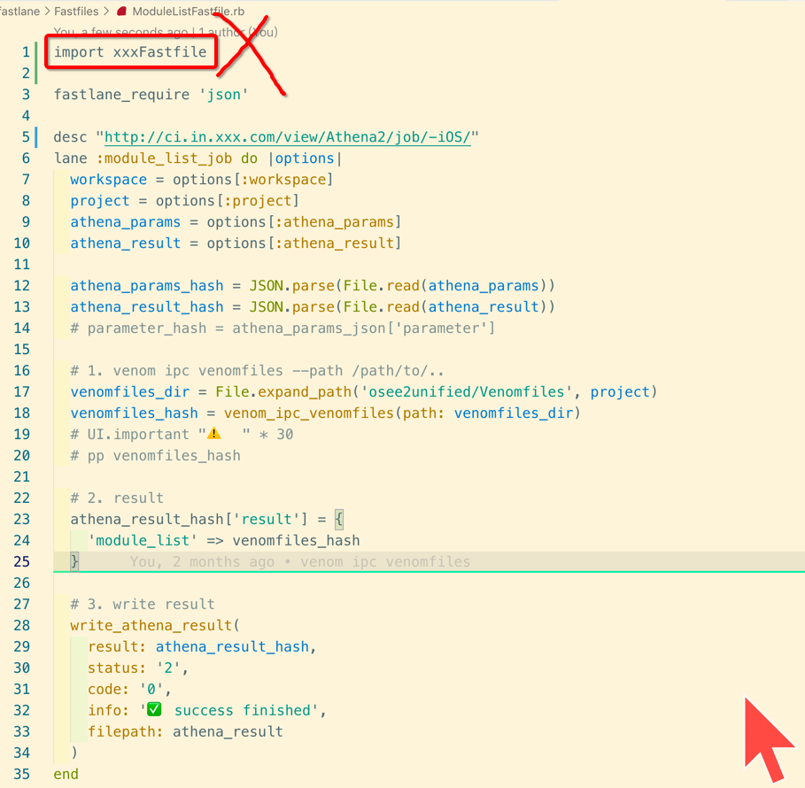

[TOC]


## 1. 不可分割、可被 import 的 lane

### 1. 单独存放在 private_lane 目录


### 2. 单独的 XxxFastfile 封装, 某一个 功能实现

```ruby
# private_app_package_upload_ipa_to_appstore.rb
private_lane :private_app_package_upload_ipa_to_appstore do |options|
  ipa_output_path = options[:ipa_output_path]
  apple_account   = options[:apple_account]
  cmds = [
      'xcrun altool --upload-app',
      "-f #{ipa_output_path}",
      "-u #{apple_account} -p '@keychain:Application Loader: #{apple_account}' --output-format normal"
  ]
  cmd = cmds.join(' ')
  begin
    Actions.sh(cmd)
  rescue => ex
    UI.error("cmd is : #{cmd}")
  end
end
```

### 3. 不要使用 import 来导入其他的 Fastfile



这样会造成后续这个 Fastfile **被其他 Fastfile import** 造成 **命名冲突**


## 2. 可分割、不可被 import 的 lane

### 1. 统一目录存放 Fastfile (组装 N个 action/plugin)

通常这种 Fastfile 文件代码比较多，lane 也比较多，会调用 private lane 的 Fastfile


### 2. 比如某个 Fastfile 

```ruby
# ModuleListFastfile.rb

fastlane_require 'json'

desc "http://ci.in.xxx.com/view/Athena2/job/-iOS/"
lane :module_list_job do |options|
  workspace = options[:workspace]
  project = options[:project]
  athena_params = options[:athena_params]
  athena_result = options[:athena_result]

  athena_params_hash = JSON.parse(File.read(athena_params))
  athena_result_hash = JSON.parse(File.read(athena_result))
  # parameter_hash = athena_params_json['parameter']

  # 1. venom ipc venomfiles --path /path/to/..
  venomfiles_dir = File.expand_path('xx/Venomfiles', project)
  venomfiles_hash = venom_ipc_venomfiles(path: venomfiles_dir)
  # UI.important "⚠️  " * 30
  # pp venomfiles_hash

  # 2. result
  athena_result_hash['result'] = {
    'module_list' => venomfiles_hash
  }

  # 3. write result
  write_athena_result(
    result: athena_result_hash,
    status: '2',
    code: '0',
    info: '✅ success finished',
    filepath: athena_result
  )
end
```

### 4. 也不要使用 **import** 去导入其他的 Fastfile, 保持 **独立**



### 5. 直接调用 private lane Fastfile 中定义的 private lane

```ruby
# GeneralAppPackagingFastfile.rb

require 'xcodeproj'

fastlane_require 'pp'
fastlane_require 'fileutils'
fastlane_require 'base64'
fastlane_require 'yaml'
fastlane_require 'json'

lane :general_app_packaging do |options|
  ................................

  # 获取二进制文件名称
  product_name = private_get_product_name_in_project(
    xcodeproj: xcodeproj_file
  )

  # 获取应用展示名称
  display_name = private_get_display_name_in_project(
    xcodeproj: xcodeproj_file
  )

  ................................
end
```


## 3.  import Fastfile 分目录

### 1. 目录结构

```
╰─○ tree
.
└── fastlane
    ├── Fastfile
    └── Fastfiles
        ├── request
        │   ├── login.rb
        │   ├── logout.rb
        │   └── regist.rb
        ├── request.rb
        ├── tools
        │   ├── add.rb
        │   ├── mul.rb
        │   └── sub.rb
        └── tools.rb
```

### 2. fastlane/Fastfile (顶层)

```ruby
default_platform(:ios)

# 1、导入 不可分割 private lane 所在的 Fastfile 文件
import 'Fastfiles/PrivateLaneFastfile.rb'

# 2、导入 可分割 public lane 所在的 Fastfile 文件
import 'Fastfiles/ModuleLaneFastfile.rb'
```

### 3. fastlane/Fastfiles/PrivateLaneFastfile.rb

```ruby
Dir[File.expand_path('private_lane/*.rb', __dir__)].each { |f| import f }
```

### 4. fastlane/Fastfiles/ModuleLaneFastfile.rb

```
Dir[File.expand_path('module_lane/*.rb', __dir__)].each { |f| import f }
```


