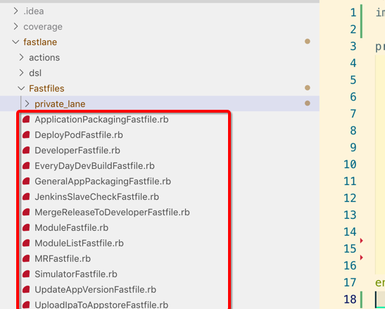

[TOC]


## 1. 重用 Fastfile ???

- 比如我在 **ProjectA/fastlane/Fastfile** 写了一堆用于实现打包上传的脚本 (调用了一大堆 action/plugin)

- 但是另外一个 **ProjectB** iOS 项目也需要这份脚本代码完成同样的功能

- 比较挫的办法，将 **ProjectA/fastlane/Fastfile** 拷贝到 `ProjectB/` 目录下，再修修改改

虽然可行，但肯定有比这个好的办法 ...


## 2. ==import 其他项目== 中的 Fastfile

### 1. import ==local== Fastfile

```ruby
# 切记: 文件名 就是【GeneralFastfile】而不是【GeneralFastfile.rb】
import "../GeneralFastfile"

# 这句没事别写，一开始我也不知道，跟着这样写，后来这个 lane 死活不调用
# 这样写之后，表示【重写】"../GeneralFastfile" 文件中的 lane
# 这样写的效果就是【不再调用】"../GeneralFastfile" 文件中的 lane
override_lane :from_general do
  # ...
end
```

### 2. import ==remote== Fastfile

#### 1. import from git

```ruby
import_from_git(url: 'https://github.com/fastlane/fastlane')

....
```

#### 2. import from git + branch

```ruby
# or
import_from_git(
  url: 'git@github.com:MyAwesomeRepo/MyAwesomeFastlaneStandardSetup.git',
  path: 'fastlane/Fastfile'
)

lane :new_main_lane do
  # 直接调用 MyAwesomeFastlaneStandardSetup 中定义的 lane
end
```


#### 3. fastlane action import_from_git 更多参数

```
+---------+-----------------------------------+---------+-------------------+
|                          import_from_git Options                          |
+---------+-----------------------------------+---------+-------------------+
| Key     | Description                       | Env Var | Default           |
+---------+-----------------------------------+---------+-------------------+
| url     | The URL of the repository to      |         |                   |
|         | import the Fastfile from          |         |                   |
| branch  | The branch or tag to check-out    |         | HEAD              |
|         | on the repository                 |         |                   |
| path    | The path of the Fastfile in the   |         | fastlane/Fastfile |
|         | repository                        |         |                   |
| version | The version to checkout on the    |         |                   |
|         | respository. Optimistic match     |         |                   |
|         | operator or multiple conditions   |         |                   |
|         | can be used to select the latest  |         |                   |
|         | version within constraints        |         |                   |
+---------+-----------------------------------+---------+-------------------+
```

https://docs.fastlane.tools/actions/import_from_git/

#### 4. import from git + branch + version

```ruby
import_from_git(
  url: "git@github.com:fastlane/fastlane.git", # The URL of the repository to import the Fastfile from.
  branch: "HEAD", # The branch to checkout on the repository
  path: "fastlane/Fastfile", # The path of the Fastfile in the repository
  version: "~> 1.0.0" # The version to checkout on the repository. Optimistic match operator can be used to select the latest version within constraints.
)
```

```ruby
import_from_git(
  url: "git@github.com:fastlane/fastlane.git", # The URL of the repository to import the Fastfile from.
  branch: "HEAD", # The branch to checkout on the repository
  path: "fastlane/Fastfile", # The path of the Fastfile in the repository
  version: [">= 1.1.0", "< 2.0.0"] # The version to checkout on the repository. Multiple conditions can be used to select the latest version within constraints.
)
```

基本差不多，只是参数更齐全一点，版本号区间.


## 3. fastlane 导入 ==remote git repo== 中的 Fastfile

### 1. 在本地 iOS App 项目根目录下 fastlane init

```
 ~/Desktop/app   master ●  fastlane init
[✔] 🚀
[✔] Looking for iOS and Android projects in current directory...
[23:37:46]: Created new folder './fastlane'.
[23:37:46]: Detected an iOS/macOS project in the current directory: 'app.xcworkspace'
[23:37:46]: -----------------------------
[23:37:46]: --- Welcome to fastlane 🚀 ---
[23:37:46]: -----------------------------
[23:37:46]: fastlane can help you with all kinds of automation for your mobile app
[23:37:46]: We recommend automating one task first, and then gradually automating more over time
[23:37:46]: What would you like to use fastlane for?
1. 📸  Automate screenshots
2. 👩‍✈️  Automate beta distribution to TestFlight
3. 🚀  Automate App Store distribution
4. 🛠  Manual setup - manually setup your project to automate your tasks
?  4
[23:37:48]: ------------------------------------------------------------
[23:37:48]: --- Setting up fastlane so you can manually configure it ---
[23:37:48]: ------------------------------------------------------------
......................
......................
......................
```

### 2. 编写 app/fastlane/Fastfile 调用 ==remote git repo== 中的 Fastfile 中的 lane

app/fastlane/Fastfile 文件内容:

```ruby
# 仅仅只是 import remote git repo 中的 Fastile 中定义的 lane
# 我们本地的这个 Fastfile 中并【没有】定义任何的 lane
import_from_git(
  url: "git@xxxx.com:xiongzenghui/ios_fastlane.git",
  branch: "master",
  path: "fastlane/Fastfile",
  # version: "~> 1.0.0" # 由于我的 ios_fastlane git 仓库并没有 tag，所以不使用
)
```

### 3. fastlane 直接调用【远程 git 仓库】内的 Fastfile 中定义的 lane

#### 1. fastlane lan1

```
 ~/Desktop/app   master ●  fastlane lan1
[✔] 🚀
...............................................
[23:41:20]: ------------------------------
[23:41:20]: --- Step: default_platform ---
[23:41:20]: ------------------------------
[23:41:20]: ------------------------------
[23:41:20]: --- Step: default_platform ---
[23:41:20]: ------------------------------
[23:41:20]: Driving the lane 'ios lan1' 🚀
[23:41:20]: lan1

+------+------------------+-------------+
|           fastlane summary            |
+------+------------------+-------------+
| Step | Action           | Time (in s) |
+------+------------------+-------------+
| 1    | default_platform | 0           |
| 2    | import_from_git  | 0           |
| 3    | default_platform | 0           |
+------+------------------+-------------+

[23:41:20]: fastlane.tools finished successfully 🎉
```

#### 2. fastlane lan2

```
 ~/Desktop/app   master ●  fastlane lan2
[✔] 🚀
...............................................
[23:42:04]: ------------------------------
[23:42:04]: --- Step: default_platform ---
[23:42:04]: ------------------------------
[23:42:04]: ------------------------------
[23:42:04]: --- Step: default_platform ---
[23:42:04]: ------------------------------
[23:42:04]: Driving the lane 'ios lan2' 🚀
[23:42:04]: lan2

+------+------------------+-------------+
|           fastlane summary            |
+------+------------------+-------------+
| Step | Action           | Time (in s) |
+------+------------------+-------------+
| 1    | default_platform | 0           |
| 2    | import_from_git  | 0           |
| 3    | default_platform | 0           |
+------+------------------+-------------+

[23:42:04]: fastlane.tools finished successfully 🎉
```


## 4. action 只能被【当前 fastlane 项目】中的 Fastfile 调用

Add this to the top of your **Fastfile** :

```ruby
# 1、
actions_path '../custom_actions_folder/'

# 2、定义你的各种 lane、ruby 方法、调用上面导入进来的 action
# .......
```

所以应该尽量使用 **plugin** 形式 **替代 action**


## 5. 导入 Fastfile 时, 出现【同名 lane】导致冲突

### 1. FastlaneDemo 项目结构

```
 ~/Desktop/FastlaneDemo   master ●  tree
.
├── Fastfiles
│   ├── OneFastfile
│   └── TwoFastfile
├── Gemfile
├── Gemfile.lock
├── README.en.md
├── README.md
└── fastlane
    ├── Appfile
    ├── Fastfile
    ├── README.md
    └── report.xml

2 directories, 10 files
```

### 2. FastlaneDemo/fastlane/Fastfile

```ruby
import '../Fastfiles/OneFastfile'
import '../Fastfiles/TwoFastfile'

lane :test do
end
```

### 3. FastlaneDemo/Fastfiles/OneFastfile

```ruby
lane :haha do
end
```

### 4. FastlaneDemo/Fastfiles/TwoFastfile

```ruby
lane :haha do
end
```

### 4. exec FastlaneDemo/fastlane/Fastfile

```
 ~/Desktop/FastlaneDemo   master ●  bundle exec fastlane test
[✔] 🚀

[!] Lane 'haha' was defined multiple times!
```

**报错** 提示定义了 **同名 lane**


## 6. 上例使用 ==private_lane== 也仍然报错【冲突】

### 1. FastlaneDemo/Fastfiles/OneFastfile

```ruby
private_lane :haha do
end
```

### 2. FastlaneDemo/Fastfiles/TwoFastfile

```ruby
private_lane :haha do
end
```

### 3. exec FastlaneDemo/fastlane/Fastfile

```
 ~/Desktop/FastlaneDemo   master ●  bundle exec fastlane test
[✔] 🚀

[!] Lane 'haha' was defined multiple times!
```

仍然还是 **报错** 提示定义了 **同名 lane**


## 7. lane 封装技巧

### 1. 不可分割、可被 import 的 lane

#### 1. 存放 private_lane 目录


#### 2. 单独的 XxxFastfile 封装某一个 private lane 功能实现

```ruby
# private_app_package_upload_ipa_to_appstore.rb
private_lane :private_app_package_upload_ipa_to_appstore do |options|
  ipa_output_path = options[:ipa_output_path]
  apple_account   = options[:apple_account]
  cmds = [
      'xcrun altool --upload-app',
      "-f #{ipa_output_path}",
      "-u #{apple_account} -p '@keychain:Application Loader: #{apple_account}' --output-format normal"
  ]
  cmd = cmds.join(' ')
  begin
    Actions.sh(cmd)
  rescue => ex
    UI.error("cmd is : #{cmd}")
  end
end
```

#### 3. 不要使用 import 来导入其他的 Fastfile


这样会造成后续这个 Fastfile **被其他 Fastfile import** 造成 **命名冲突**

### 2. 可分割、不可被 import 的 lane

#### 1. 统一目录存放 Fastfile

通常这种 Fastfile 文件代码比较多，lane 也比较多，会调用 private lane 的 Fastfile



#### 2. 比如某个 Fastfile 

```ruby
# ModuleListFastfile.rb

fastlane_require 'json'

desc "http://ci.in.xxx.com/view/Athena2/job/-iOS/"
lane :module_list_job do |options|
  workspace = options[:workspace]
  project = options[:project]
  athena_params = options[:athena_params]
  athena_result = options[:athena_result]

  athena_params_hash = JSON.parse(File.read(athena_params))
  athena_result_hash = JSON.parse(File.read(athena_result))
  # parameter_hash = athena_params_json['parameter']

  # 1. venom ipc venomfiles --path /path/to/..
  venomfiles_dir = File.expand_path('xx/Venomfiles', project)
  venomfiles_hash = venom_ipc_venomfiles(path: venomfiles_dir)
  # UI.important "⚠️  " * 30
  # pp venomfiles_hash

  # 2. result
  athena_result_hash['result'] = {
    'module_list' => venomfiles_hash
  }

  # 3. write result
  write_athena_result(
    result: athena_result_hash,
    status: '2',
    code: '0',
    info: '✅ success finished',
    filepath: athena_result
  )
end
```

#### 4. 也不要使用 **import** 去导入其他的 Fastfile, 保持 **独立**


#### 5. 直接调用 private lane Fastfile 中定义的 private lane

```ruby
# GeneralAppPackagingFastfile.rb

require 'xcodeproj'

fastlane_require 'pp'
fastlane_require 'fileutils'
fastlane_require 'base64'
fastlane_require 'yaml'
fastlane_require 'json'

lane :general_app_packaging do |options|
  ................................

  # 获取二进制文件名称
  product_name = private_get_product_name_in_project(
    xcodeproj: xcodeproj_file
  )

  # 获取应用展示名称
  display_name = private_get_display_name_in_project(
    xcodeproj: xcodeproj_file
  )

  ................................
end
```

### 3. 顶层 Fastfile 统一 import 所有 Fastfile

```ruby
# fastlane/Fastfile

default_platform(:ios)

# 1、导入 不可分割 private lane 所在的 Fastfile 文件
import 'Fastfiles/private_lane/private_get_product_name_in_project.rb'
import 'Fastfiles/private_lane/private_get_display_name_in_project.rb'
import 'Fastfiles/private_lane/private_app_package_build_project.rb'
import 'Fastfiles/private_lane/private_app_package_upload_ipa_to_updown.rb'
import 'Fastfiles/private_lane/private_app_package_upload_dsym_to_updown.rb'
import 'Fastfiles/private_lane/private_app_package_deploy_ipa_to_updown.rb'
import 'Fastfiles/private_lane/private_app_package_upload_dsym_to_bugly.rb'
import 'Fastfiles/private_lane/private_app_package_upload_ipa_to_appstore.rb'
import 'Fastfiles/private_lane/private_app_package_notify_appcloud.rb'

# 2、导入 可分割 public lane 所在的 Fastfile 文件
import 'Fastfiles/ModuleFastfile.rb'
import 'Fastfiles/MRFastfile.rb'
import 'Fastfiles/DeveloperFastfile.rb'
import 'Fastfiles/SimulatorFastfile.rb'
import 'Fastfiles/EveryDayDevBuildFastfile.rb'
import 'Fastfiles/UpdateAppVersionFastfile.rb'
import 'Fastfiles/ApplicationPackagingFastfile.rb'
import 'Fastfiles/UploadIpaToAppstoreFastfile.rb'
import 'Fastfiles/MergeReleaseToDeveloperFastfile.rb'
import 'Fastfiles/JenkinsSlaveCheckFastfile.rb'
import 'Fastfiles/ModuleListFastfile.rb'
import 'Fastfiles/DeployPodFastfile.rb'
import 'Fastfiles/GeneralAppPackagingFastfile.rb'
```


## 8. 如果 Fastfile 会被 ==重用==, 需要注意的地方

### 1. Fastfile 中, 不能使用 ==require_relative== 相对引用其他 rb 文件

#### 1. remote fastlane 项目

```
 ~/Desktop/MyFastfiles   master  tree
.
├── Gemfile
├── Gemfile.lock
├── README.en.md
├── README.md
└── fastlane
    ├── Appfile
    ├── Fastfile
    ├── README.md
    ├── report.xml
    └── tool.rb

1 directory, 9 files
```

#### 2. remote fastlane 项目/fastlane/Fastfile

```ruby
require_relative 'tool'

lane :haha do
  log
end
```

#### 3. remote fastlane 项目/fastlane/tool.rb

```ruby
def log
  puts '🎉' * 50
end
```

#### 4. local fastlane 项目

```
 ~/Desktop/FastlaneDemo   master ●  tree
.
├── Gemfile
├── Gemfile.lock
├── README.en.md
├── README.md
└── fastlane
    ├── Appfile
    ├── Fastfile
    ├── README.md
    └── report.xml

1 directory, 8 files
```

#### 5. local fastlane 项目/fastlane/tool.rb

```ruby
import_from_git(
  url: 'git@gitee.com:garywade/MyFastfiles.git',
  path: 'fastlane/Fastfile'
)

lane :test do
end
```

#### 6. exec local fastlane 项目/fastlane/Fastfile

```
 ~/Desktop/FastlaneDemo   master ●  bundle exec fastlane test
[✔] 🚀
[01:20:15]: -----------------------------
[01:20:15]: --- Step: import_from_git ---
[01:20:15]: -----------------------------
[01:20:15]: Cloning remote git repo...
[01:20:15]: $ git clone git@gitee.com:garywade/MyFastfiles.git /var/folders/kt/z8c9rz0s5nj68j_d_1bj0y7h0000gn/T/fl_clone20190821-66684-11n7slw/MyFastfiles.git --depth 1 -n
[01:20:15]: ▸ Cloning into '/var/folders/kt/z8c9rz0s5nj68j_d_1bj0y7h0000gn/T/fl_clone20190821-66684-11n7slw/MyFastfiles.git'...
[01:20:16]: $ cd /var/folders/kt/z8c9rz0s5nj68j_d_1bj0y7h0000gn/T/fl_clone20190821-66684-11n7slw/MyFastfiles.git && git checkout HEAD fastlane/Fastfile
[01:20:16]: $ cd /var/folders/kt/z8c9rz0s5nj68j_d_1bj0y7h0000gn/T/fl_clone20190821-66684-11n7slw/MyFastfiles.git && git checkout HEAD fastlane/actions
[01:20:16]: ▸ error: pathspec 'fastlane/actions' did not match any file(s) known to git
bundler: failed to load command: fastlane (/Users/xiongzenghui/.rvm/gems/ruby-2.4.1/bin/fastlane)
LoadError: cannot load such file -- /var/folders/kt/z8c9rz0s5nj68j_d_1bj0y7h0000gn/T/fl_clone20190821-66684-11n7slw/MyFastfiles.git/fastlane/tool
  ../../../../../var/folders/kt/z8c9rz0s5nj68j_d_1bj0y7h0000gn/T/fl_clone20190821-66684-11n7slw/MyFastfiles.git/fastlane/Fastfile:1:in `require_relative'
  ../../../../../var/folders/kt/z8c9rz0s5nj68j_d_1bj0y7h0000gn/T/fl_clone20190821-66684-11n7slw/MyFastfiles.git/fastlane/Fastfile:1:in `parsing_binding'
..........................................................................................
..........................................................................................
..........................................................................................
```

核心提示: **cannot load such file -- /var/folders/kt/z8c9rz0s5nj68j_d_1bj0y7h0000gn/T/fl_clone20190821-66684-11n7slw/MyFastfiles.git/fastlane/tool**

将 **remote**中的 fastlane 项目 **Fastfile** 中的 **require_relative** 相对导入 xx.rb 代码去掉即可.

### 2. remote Fastfile 中引用 plugin

#### 1. remote fastlane 项目/fastlane/Fastfile

```ruby
lane :my_load_json do |options|
  load_json(json_path: options[:filepath])
end
```

#### 2. remote fastlane 项目/fastlane/Pluginfile

```ruby
gem 'fastlane-plugin-load_json'
```

#### 3. local fastlane 项目/fastlane/Fastfile 

```ruby
import_from_git(
  url: 'git@gitee.com:garywade/MyFastfiles.git',
  path: 'fastlane/Fastfile'
)

lane :test do
  UI.success my_load_json(filepath: '/Users/xiongzenghui/Desktop/FastlaneDemo/test.json')
end
```

#### 4. exec local fastlane 项目/fastlane/Fastfile (不安装 remote Fastfile 依赖的 plugin)

```
 ~/Desktop/FastlaneDemo   master ●  bundle exec fastlane test
[✔] 🚀
[01:41:31]: It seems like you wanted to load some plugins, however they couldn't be loaded
[01:41:31]: Please follow the troubleshooting guide: https://docs.fastlane.tools/plugins/plugins-troubleshooting/
[01:41:32]: -----------------------------
[01:41:32]: --- Step: import_from_git ---
[01:41:32]: -----------------------------
[01:41:32]: Cloning remote git repo...
[01:41:32]: $ git clone git@gitee.com:garywade/MyFastfiles.git /var/folders/kt/z8c9rz0s5nj68j_d_1bj0y7h0000gn/T/fl_clone20190821-69782-80afc2/MyFastfiles.git --depth 1 -n
[01:41:32]: ▸ Cloning into '/var/folders/kt/z8c9rz0s5nj68j_d_1bj0y7h0000gn/T/fl_clone20190821-69782-80afc2/MyFastfiles.git'...
[01:41:32]: $ cd /var/folders/kt/z8c9rz0s5nj68j_d_1bj0y7h0000gn/T/fl_clone20190821-69782-80afc2/MyFastfiles.git && git checkout HEAD fastlane/Fastfile
[01:41:32]: $ cd /var/folders/kt/z8c9rz0s5nj68j_d_1bj0y7h0000gn/T/fl_clone20190821-69782-80afc2/MyFastfiles.git && git checkout HEAD fastlane/actions
[01:41:32]: ▸ error: pathspec 'fastlane/actions' did not match any file(s) known to git
[01:41:32]: Driving the lane 'test' 🚀
[01:41:32]: -----------------------------------------
[01:41:32]: --- Step: Switch to my_load_json lane ---
[01:41:32]: -----------------------------------------
[01:41:32]: Cruising over to lane 'my_load_json' 🚖
+---------------+------+
|     Lane Context     |
+---------------+------+
| PLATFORM_NAME |      |
| LANE_NAME     | test |
+---------------+------+
[01:41:32]: Could not find action, lane or variable 'load_json'. Check out the documentation for more details: https://docs.fastlane.tools/actions

+------+-----------------------------+-------------+
|                 fastlane summary                 |
+------+-----------------------------+-------------+
| Step | Action                      | Time (in s) |
+------+-----------------------------+-------------+
| 1    | import_from_git             | 0           |
| 2    | Switch to my_load_json lane | 0           |
+------+-----------------------------+-------------+

[01:41:32]: fastlane finished with errors

[!] Could not find action, lane or variable 'load_json'. Check out the documentation for more details: https://docs.fastlane.tools/actions
```

提示无法找到 **remote Fastfile** 依赖的 **load_json** 这个 **plugin**.

#### 5. local fastlane 项目, 必须安装 load_json 这个 plugin

```
 ~/Desktop/FastlaneDemo   master ●  gem install fastlane-plugin-load_json
Successfully installed fastlane-plugin-load_json-0.0.1
Parsing documentation for fastlane-plugin-load_json-0.0.1
Done installing documentation for fastlane-plugin-load_json after 0 seconds
1 gem installed
```

#### 6. local fastlane 项目/fastlane/Pluginfile

```ruby
gem 'fastlane-plugin-load_json'
```

#### 7. bundle install local fastlane 项目

```
 ~/Desktop/FastlaneDemo   master ●  bundle install
Using CFPropertyList 3.0.0
Using public_suffix 2.0.5
.............................
```

#### 8. 再次 exec local fastlane 项目/fastlane/Fastfile (已经安装 remote Fastfile 依赖的 plugin)

```
 ~/Desktop/FastlaneDemo   master ●  bundle exec fastlane test
[✔] 🚀
+---------------------------+---------+-----------+
|                  Used plugins                   |
+---------------------------+---------+-----------+
| Plugin                    | Version | Action    |
+---------------------------+---------+-----------+
| fastlane-plugin-load_json | 0.0.1   | load_json |
+---------------------------+---------+-----------+

[01:44:40]: -----------------------------
[01:44:40]: --- Step: import_from_git ---
[01:44:40]: -----------------------------
[01:44:40]: Cloning remote git repo...
[01:44:40]: $ git clone git@gitee.com:garywade/MyFastfiles.git /var/folders/kt/z8c9rz0s5nj68j_d_1bj0y7h0000gn/T/fl_clone20190821-70200-130g2at/MyFastfiles.git --depth 1 -n
[01:44:40]: ▸ Cloning into '/var/folders/kt/z8c9rz0s5nj68j_d_1bj0y7h0000gn/T/fl_clone20190821-70200-130g2at/MyFastfiles.git'...
[01:44:41]: $ cd /var/folders/kt/z8c9rz0s5nj68j_d_1bj0y7h0000gn/T/fl_clone20190821-70200-130g2at/MyFastfiles.git && git checkout HEAD fastlane/Fastfile
[01:44:41]: $ cd /var/folders/kt/z8c9rz0s5nj68j_d_1bj0y7h0000gn/T/fl_clone20190821-70200-130g2at/MyFastfiles.git && git checkout HEAD fastlane/actions
[01:44:41]: ▸ error: pathspec 'fastlane/actions' did not match any file(s) known to git
[01:44:41]: Driving the lane 'test' 🚀
[01:44:41]: -----------------------------------------
[01:44:41]: --- Step: Switch to my_load_json lane ---
[01:44:41]: -----------------------------------------
[01:44:41]: Cruising over to lane 'my_load_json' 🚖
[01:44:41]: -----------------------
[01:44:41]: --- Step: load_json ---
[01:44:41]: -----------------------
[01:44:41]: Cruising back to lane 'test' 🚘
[01:44:41]: {"name"=>"xiongzenghui", "favor"=>"basketball"}

+------+-----------------------------+-------------+
|                 fastlane summary                 |
+------+-----------------------------+-------------+
| Step | Action                      | Time (in s) |
+------+-----------------------------+-------------+
| 1    | import_from_git             | 0           |
| 2    | Switch to my_load_json lane | 0           |
| 3    | load_json                   | 0           |
+------+-----------------------------+-------------+

[01:44:41]: fastlane.tools finished successfully 🎉
```

这次就能 **成功** 调用 **remote Fastfile** 了.


## 99. Fastfile 代码封装

### 1. 如果全部堆积在 Fastfile 一个文件内, 会造成代码爆炸

> xx/fastlane/Fastfile

```ruby
def func1
  ......
end

def func2
  ......
end

......

def funcN
  ......
end

lane :entry do
  action1
  action2
  .......
  actionN

  plugin1
  plugin2
  .......
  pluginN

  func1
  func2
  .......
  funcN
end
```

很多定义在 Fastfile 文件内的 **方法** 只能通过 **拷贝** 到其他的 Fastfile 文件中使用.

### 2. fastlane 项目结构

#### 1. WORKSPACE/toolbox/ 目录

```
 ~/WORKSPACE/toolbox   master ●  ll
-rw-r--r--   1 xiongzenghui  staff   1.2K  7 11 15:06 Gemfile
-rw-r--r--   1 xiongzenghui  staff   8.1K  7 15 18:02 Gemfile.lock
-rw-r--r--   1 xiongzenghui  staff   362B  7 11 14:54 Makefile
-rw-r--r--   1 xiongzenghui  staff   1.2K  7 15 17:00 README.md
drwxr-xr-x  12 xiongzenghui  staff   384B  7 15 23:29 fastlane
```

#### 2. WORKSPACE/toolbox/fastlane/ 目录

```
 ~/WORKSPACE/toolbox/fastlane   master ●  ll
-rw-r--r--   1 xiongzenghui  staff   230B  7 11 13:05 Appfile
-rw-r--r--   1 xiongzenghui  staff   2.7K  7 15 23:55 Fastfile
drwxr-xr-x  13 xiongzenghui  staff   416B  7 15 16:26 actions
drwxr-xr-x   6 xiongzenghui  staff   192B  7 15 23:56 helper
```

#### 3. WORKSPACE/toolbox/fastlane/helper

```
 ~/WORKSPACE/toolbox/fastlane/helper   master ●  ll
total 32
-rw-r--r--  1 xiongzenghui  staff    53B  7 15 23:56 cry.rb
-rw-r--r--  1 xiongzenghui  staff    53B  7 15 23:49 eat.rb
-rw-r--r--  1 xiongzenghui  staff    53B  7 15 23:50 walk.rb
```

### 3. 使用 ==lane== 封装可重用代码

#### 1. WORKSPACE/toolbox/fastlane/helper/eat.rb

```ruby
lane :eat do
  UI.message("[lane] [eat] .......")
end
```

#### 2. WORKSPACE/toolbox/fastlane/helper/walk.rb

```ruby
lane :run do
  UI.message("[lane] [walk] .......")
end
```

#### 3. WORKSPACE/toolbox/fastlane/helper/cry.rb

```ruby
lane :cry do
  UI.message("[lane] [cry] .......")
end
```

#### 4. WORKSPACE/toolbox/fastlane/Fastfile

```ruby
import 'helper/eat.rb'
import 'helper/walk.rb'
import 'helper/cry.rb'

lane :test do
  eat
  walk
  cry
end
```

#### 5. bundle exec fastlane test

```ruby
 ~/WORKSPACE/toolbox   master ●  bundle exec fastlane test
[✔] 🚀

[00:02:43]: Driving the lane 'test' 🚀
[00:02:43]: --------------------------------
[00:02:43]: --- Step: Switch to eat lane ---
[00:02:43]: --------------------------------
[00:02:43]: Cruising over to lane 'eat' 🚖
[00:02:43]: [lane] [eat] .......
[00:02:43]: Cruising back to lane 'test' 🚘
[00:02:43]: ---------------------------------
[00:02:43]: --- Step: Switch to walk lane ---
[00:02:43]: ---------------------------------
[00:02:43]: Cruising over to lane 'walk' 🚖
[00:02:43]: [lane] [walk] .......
[00:02:43]: Cruising back to lane 'test' 🚘
[00:02:43]: --------------------------------
[00:02:43]: --- Step: Switch to cry lane ---
[00:02:43]: --------------------------------
[00:02:43]: Cruising over to lane 'cry' 🚖
[00:02:43]: [lane] [cry] .......
[00:02:43]: Cruising back to lane 'test' 🚘

+------+---------------------+-------------+
|             fastlane summary             |
+------+---------------------+-------------+
| Step | Action              | Time (in s) |
+------+---------------------+-------------+
| 1    | Switch to eat lane  | 0           |
| 2    | Switch to walk lane | 0           |
| 3    | Switch to cry lane  | 0           |
+------+---------------------+-------------+

[00:02:43]: fastlane.tools finished successfully 🎉
```

- 1) Driving the lane '**test**'
- 2) Step: Switch to **eat** lane
- 3) Step: Switch to **walk** lane
- 4) Step: Switch to **cry** lane

#### 6. ==不能使用== 这种方式

- 虽然可以在 lane 中, 直接使用 fastlane UI.message、UI.success …. 等方法.
- 但是会导致 **lane 重复定义**

```
 ~/WORKSPACE/toolbox  bundle exec fastlane test
[✔] 🚀

[15:35:00]: ------------------------------
[15:35:00]: --- Step: default_platform ---
[15:35:00]: ------------------------------

[!] Lane 'demo' was defined multiple times!
```

### 4. 使用 ==action (其他目录下)== 封装可重用代码

#### 1. WORKSPACE/toolbox/fastlane/helper/eat.rb

```ruby
module Fastlane
  module Actions
    class EatAction < Action
      def self.run(params)
        UI.message("[action] [eat] .......")
      end
    end
  end
end
```

#### 2. WORKSPACE/toolbox/fastlane/helper/walk.rb

```ruby

```

#### 3. WORKSPACE/toolbox/fastlane/helper/cry.rb

```ruby

```

#### 4. WORKSPACE/toolbox/fastlane/Fastfile

```ruby
#import 'helper/eat.rb'

#  应该使用这种方式，导入【其他目录】下的 action.rb 文件
#actions_path '../custom_actions_folder/'
actions_path 'helper/'

lane :test do
  eat
end
```

#### 5. bundle exec fastlane test

```ruby
 ~/WORKSPACE/toolbox   master ●  bundle exec fastlane test
[✔] 🚀

[00:21:05]: Driving the lane 'test' 🚀
[00:21:05]: --------------------------------
[00:21:05]: --- Step: Switch to eat lane ---
[00:21:05]: --------------------------------
[00:21:05]: Cruising over to lane 'eat' 🚖
[00:21:05]: Cruising back to lane 'test' 🚘

+------+--------------------+-------------+
|            fastlane summary             |
+------+--------------------+-------------+
| Step | Action             | Time (in s) |
+------+--------------------+-------------+
| 1    | Switch to eat lane | 0           |
+------+--------------------+-------------+

[00:21:05]: fastlane.tools finished successfully 🎉
```

#### 6. 总结

发现最终把 action 当做 **lane** 执行的.

### 5. 使用 ==Fastlane Helper== 封装可重用代码

#### 1. WORKSPACE/toolbox/fastlane/helper/eat.rb

```ruby
require 'fastlane_core/ui/ui'

module Fastlane
  UI = FastlaneCore::UI unless Fastlane.const_defined?("UI")
  module Helper
    class EatHelper
      def self.show_message
        UI.message("[helper] [eat] .......")
      end
    end
  end
end
```

#### 2. WORKSPACE/toolbox/fastlane/helper/happy.rb

```ruby
require 'fastlane_core/ui/ui'

module Fastlane
  UI = FastlaneCore::UI unless Fastlane.const_defined?("UI")
  module Helper
    class HappyHelper
      def self.show_message
        UI.message("[helper] [happy] .......")
      end
    end
  end
end
```

#### 3. WORKSPACE/toolbox/fastlane/helper/cry.rb

```ruby
require 'fastlane_core/ui/ui'

module Fastlane
  UI = FastlaneCore::UI unless Fastlane.const_defined?("UI")
  module Helper
    class CryHelper
      def self.show_message
        UI.message("[helper] [cry] .......")
      end
    end
  end
end
```

#### 4. WORKSPACE/toolbox/fastlane/Fastfile

```ruby
require_relative 'helper/eat.rb'
require_relative 'helper/happy.rb'
require_relative 'helper/cry.rb'

lane :test do
  Helper::EatHelper::show_message
  # Helper::WalkHelper::show_message
  Helper::HappyHelper::show_message
  Helper::CryHelper::show_message
end
```

#### 5. bundle exec fastlane test

```ruby
 ~/WORKSPACE/toolbox   master ●  bundle exec fastlane test
[✔] 🚀

[00:13:45]: Driving the lane 'test' 🚀
[00:13:45]: [helper] [eat] .......
[00:13:45]: [helper] [happy] .......
[00:13:45]: [helper] [cry] .......
[00:13:45]: fastlane.tools finished successfully 🎉
```

#### 6. 总结

都按照 **helper** 执行的.

### 6. 总结

- 1) 应该使用 **action (本地)** 或者 **plugin (远程)** 封装可重用的代码
- 2) action 和 plugin **路径** 问题
  - **不应该** 依赖外部 **lane** 调用时的 **相对路径**
  - 而 **应该** 由外部 **lane** 传入 **绝对路径**


## 99. 总结 ==重用 Fastfile==

### 1. 如果比较通用的 ==工具性(不可分割)== 代码

- 1) 优先考虑 **plugin**
- 2) 再次考虑 **action** (一旦使用 action 实现, 就无法再 **其他项目** 中使用)

### 2. 使用一个独立的 ==Fastfile== 组装 ==n个 action== 重用

- 1) 使用 **plugin** , 那么 **依赖方** 也需要安装 **remote Fastfile** 依赖的 **plugin** (安装 gem)
- 2) 使用 **action** , 那么 **依赖方** 不需要安装

