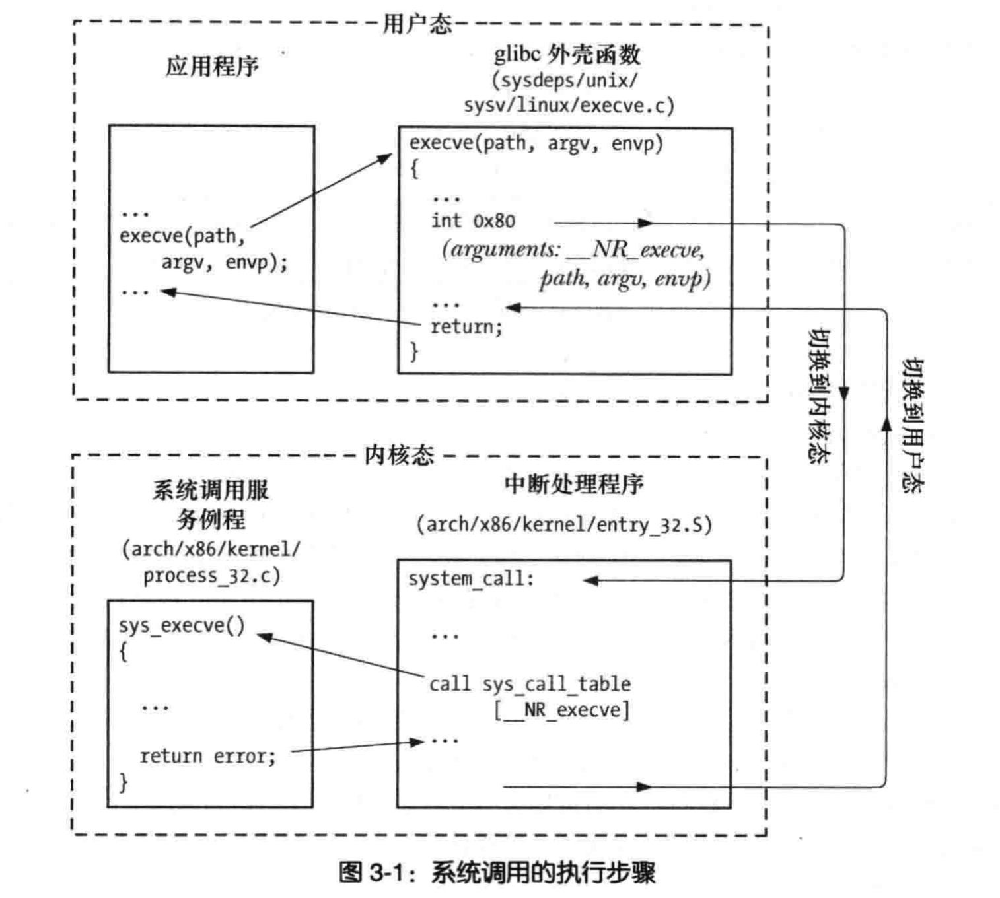
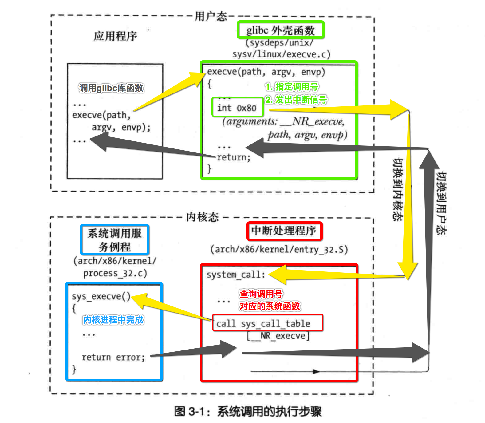

[TOC]


## 1、C : 标准库 printf()

### 1. C代码

```c
#include <stdio.h>
int main()
{
  printf("Hello, world!\n");
}
```

```
->  gcc main.c -lc
->  ./a.out
Hello, world!
->
```

- `-lc` 链接 libc 动态库, 也可以不加, 大多数编译器会默认加上
- linux/unix 环境下, 大多数是 glibc 实现
- windows 环境下, 又是另外的实现

### 2. 调用流程


所有调用 **linux内核函数** 的细节，都被 **glibc库** 封装起来了。


## 2、x86 linux 汇编: glibc printf()

### 1. x86 linux 汇编

```asm
.section .data
info:
  .string "hello world\0"
  info_len=.-info
format:
  .string "info = %s\n"
  format_len=.-format

.section .text
.globl _start
_start:
do_sys_write:
  # printf("info = %s\n", info); 调用printf()函数
  pushl $info
  pushl $format
  call printf
  # 恢复栈顶指针
  addl $info_len, %esp
  addl $format_len, %esp

do_exit:
  movl $0, %ebx
  movl $1, %eax
  int $0x80
```

### 2. Makefile

```makefile
all:
  as main.s -o main.o -gftabs
  ld main.o -dynamic-linker /lib/ld-linux.so.2 -lc -o a.out
.PHONY: clean
clean:
  rm *.o a.out
```

### 3. make

```
->  make clean
rm *.o a.out
->  make
as main.s -o main.o -gftabs
ld main.o -dynamic-linker /lib/ld-linux.so.2 -lc -o a.out
->  ./a.out
info = hello world
->
```

- 因为调用了 glibc 库 中的 printf 函数符号
- 所以需要在链接的时候，链接 glibc 动态库

### 4. 调用流程


与上面的例子几乎一致，只不过 **用户代码** 表现方式不同：

- 1、【C】实现用户代码
- 2、【x86 linux 汇编】实现用户代码


## 3、x86 linux 汇编: 系统调用号

### 1. x86 linux 汇编

```asm
.section .data
str:
  .ascii "Hello, world!\n"
  len=.-str # .当前指令内存地址 - str符号的内存地址 = 字符串的长度

.section .text
.global _start
.code32
_start:

do_sys_write:
	# 如下通过【系统调用号】直接调用linux内核函数 sys_write()
  movl  $4, %eax 		# 1. 设置【系统调用号=4】=> 告诉编译器调用内核函数 sys_write()
  movl  $1, %ebx 		# 2. 写入的【文件fd=1】=> stdout 标准输出
  movl  $str, %ecx 	# 3. 写入数据的【内存起始地址】
  movl  $len, %edx 	# 4. 写入数据的【总长度】
  int   $0x80 			# 5. 发出系统调用【中断信号】
  movl  %eax, %ebx 	# 6. 设置sys_write() 函数调用的返回值

do_exit:
	# 同上，调用linux内核函数 sys_exit()
  movl  $1, %eax 		# 1. 系统调用号=1 => sys_exit()
  int   $0x80
```

### 2. Makefile

```makefile
all:
  as main.s -o main.o -gftabs
  ld main.o -o a.out

.PHONY: clean
clean:
  rm *.o a.out
```

### 3. make

```shell
->  make
as main.s -o main.o -gftabs
ld main.o -o a.out
->  ./a.out
Hello, world!
->
```

- 上面的例子中并 **没有调用 glibc 库**

- 而是直接告诉 **linux内核** 的 **调用号** 完成调用
- 所以不需要 **链接 glibc 库**

### 4. 调用流程


### 5. glibc 库中的 printf() 做的事情

- 1) 将==系统调用号==写入对应的==寄存器==
- 2) 将==参数值==设置到对应的==寄存器==
- 3) int 发出 中断 信号


## 4、==系统调用== 流程

### 1. 调用 glibc 库中 execv() 的过程

> 截图自《unix环境高级编程》



### 2. 我个人标注后的过程图示



### 3. 第一步：用户空间 — 应用程序

- 1、调用 glibc 库, 提供的各种函数
- 2、比如：printf()、scanf()、execve() ... 

### 4. 第二步：用户空间 — C标准库中的 printf()

- 1、不同的【操作系统】下都有自己的【标准C库】的具体实现
  - 1）linux：按照标准C库的xxx.h具体实现（glibc）
  - 2）windows：按照标准C库的xxx.h具体实现（wlibc）
  - 3）不同的【CPU架构】，需要重新编译生成C库实现

- 2、指定要调用的【系统函数】对应的【编号】
- 3、发出中断信号

### 5. 第三步：内核空间 — 中断处理程序

- 1、接收并处理【中断信号】
- 2、取出【寄存器】中写入的【系统调用号】
- 3、从【系统调用编号表】查询对应的【内核函数】
- 4、调用找到的【内核函数】

### 6. 第四步：内核空间 — linux/unix 内核函数

- 1、在【内核进程】上执行内核提供的函数API
- 2、**内核函数** 被调用, 此时处于 **内核态**

### 7. 第五步：原路返回

执行完毕后，依次按照上面调用顺序（相反），将返回值返回


## 5、C 标准库 可以有 不同实现


- **stdio、stdlib、string** 这些都是 **C标准库**
- C标准库 只是指定了 所有的 `.h 头文件`，并没有 `.c 实现文件`
- **.c 实现文件** 在不同的操作系统下各自 **不同的实现**
  - 因为 不同的【CPU架构】，【寄存器】不一样的
  - 因为 不同的【操作系统】，【内核函数API】也是不一样的
- 所以在不同的【CPU架构】与不同的【操作系统】，都必须【重新实现】libc库


## 6、获取 glibc 库 版本信息

```c
#include <stdio.h>

// 避免调用gnu_get_libc_version()报警告，
// 告诉编译器有这么一个函数，只不过是外部定义的符号
extern const char* gnu_get_libc_version();

int main()
{
// glibc库的主版本号
#ifdef __GLIBC__
  printf("__GLIBC__ = %d\n", __GLIBC__);
#endif

// glibc库的副版本号
#ifdef __GLIBC_MINOR__
  printf("__GLIBC_MINOR__ = %d\n", __GLIBC_MINOR__);
#endif

// 直接获取glibc完整版本号
  char* glibc_ver = (char*)gnu_get_libc_version();
  printf("glibc_ver = %s\n", glibc_ver);
}
```

```
->  gcc main.c -lc
->  ./a.out
__GLIBC__ = 2
__GLIBC_MINOR__ = 23
glibc_ver = 2.23
->
```


## 7、系统调用 出错时 的处理

### 1. 判断 ==返回值==

```c
#include <stdlib.h>
#include <stdio.h>
#include <string.h>
#include <fcntl.h>
#include <unistd.h>
#include <sys/ioctl.h>

int main(int argv, char* argr[])
{
  //1. 打开一个不存在的文件
  int fd = open("不存在的文件", O_RDWR);

  //2. 读取文件
  char buff[1024];
  int len = read(fd, buff, sizeof(buff));

  //3. 同构read()返回值判断系统调用是否失败
  // - On success, the number of bytes read is returned
  // - On error, -1 is returned
  if (-1 == len)
    printf("read error\n");
  else
    printf("read success\n");
}
```

```
->  gcc main.c -lc
->  ./a.out
read error
->
```

- 正常情况下，判断返回值来决定系统调用是否失败是没有问题的
- 但是当因为**其他的中断信号打断**而造成的函数返回时是有问题的，因为并不是读取失败

### 2. 判断 ==全局变量 errno==

**man 2 read**查看read()出错时候的说明

```
On error, -1 is returned, and errno is set appropriately.  In this case, it is left unspecified  whether  the  file position (if any) changes.
```

出错时会设置**errno**这个全局变量。

#### 1. 调用成功情况


```c
#include <stdio.h>
#include <fcntl.h>
#include <unistd.h>

// 引用glbc库中error.h中定义的全局变量符号
extern int errno;

int main(int argv, char* argr[])
{
  //1. 打开一个文件，如下读取肯定成功的，因为文件存在
  int fd = open("aaa.txt", O_CREAT | O_RDWR, 0644);

  //2. 读取文件
  char buff[1024];
  int len = read(fd, buff, sizeof(buff));

  //3. 读取外部符号的内存值
  printf("errno = %d\n", errno);
}
```

macos下输出

```
->  gcc main.c -lc
->  ./a.out
errno = 22
->
```

linux下输出

```
->  gcc main.c -lc
->  ./a.out
errno = 0
->
```

虽然都是调用成功，但是设置的值是**不一样**的。所以不能判断**errno是否等于0**，来判断**调用是否成功**。

#### 2. 调用失败情况

```c
#include <stdio.h>
#include <fcntl.h>
#include <unistd.h>

// 引用glbc库中error.h中定义的全局变量符号
extern int errno;

int main(int argv, char* argr[])
{
  //1. 打开一个不存在的文件
  int fd = open("不存在的文件", O_RDWR);

  //2. 读取文件
  char buff[1024];
  int len = read(fd, buff, sizeof(buff));

  //3. 读取外部符号的内存值
  printf("errno = %d\n", errno);
}
```

macos下输出

```
->  gcc main.c -lc
->  ./a.out
errno = 9
->
```

linux下输出

```
->  gcc main.c -lc
->  ./a.out
errno = 9
->
```

出错的情况errno被设置的值是一样的。

### 3. include errno.h

```c
#include <stdlib.h>
#include <stdio.h>
#include <string.h>
#include <fcntl.h>
#include <unistd.h>
#include <sys/ioctl.h>
#include <errno.h> //导入errno变量定义的头文件，不用再extern了

int main(int argv, char* argr[])
{	
  //1. 打开一个不存在的文件
  int fd = open("不存在的文件", O_RDWR);

  //2. 
  char buff[1024];
  int len = read(fd, buff, sizeof(buff));

  //3.
  printf("errno = %d\n", errno);
}
```

### 4. errno 其中一种情况 EINTR 

```
ERRORS
       ...............
       EINTR  The call was interrupted by a signal before any data was read; see signal(7).
       ...............
```

如果errno等于**EINTR**，说明read()是被**7号信号**打断而造成的，则可以继续重新调用函数。

### 5. 处理 errno 等于 EINTR

```c
#include <stdlib.h>
#include <stdio.h>
#include <string.h>
#include <fcntl.h>
#include <unistd.h>
#include <sys/ioctl.h>
#include <errno.h> //导入errno变量定义的头文件，不用再extern了

/**
 *  封装read()处理调用失败的情况
 *    @param filepath 要读取的文件路径
 *    @param buff 将文件读取到哪一块内存中
 *    @param buff_size 读取到的内存块的总大小
 *  @return 1)>0，读取文件的总长度 2)-1，读取失败
 */
int my_read(char* filepath, char* buff, size_t buff_size)
{
  int fd = -1;
  int len = -1;

  //1. 打开文件
  fd = open(filepath, O_RDWR);

  //2. 定义跳转符号，用于重新跳转到此继续调用read()读取文件
read_again:
  
  // 因为可能重新调用read()，所以对缓存数据每次都要清空
  memset(buff, 0, 1024);
  len = read(fd, buff, buff_size);

  /**
   *  3. 除了考虑read()返回值，还要考虑被信号打断的问题
   * -1) EINTR，信号打断，重复读取
   * -2) EAGAIN、EWOULDBLOCK，因为文件被设置为【非阻塞】方式，所以当前可能读取不到，只能过一会再读取
   */
  if (-1 != len)
  {
    printf("read suscess\n");
    return len;
  }

  if (errno == EINTR)
    goto read_again; // 直接重新调用read()读取
  else if (errno == EAGAIN || errno == EWOULDBLOCK)
  {
    sleep(1); // 休眠一段时间后
    goto read_again; // 再重新调用read()读取
  }
  else
    goto read_failed; // 其他errno值就真的是调用失败

read_failed:
  printf("read failed\n");
  return -1;
}

int main(int argv, char* argr[])
{
  char buff[1024];
  char* filepath = "./aaa.txt";
  int len = my_read(filepath, buff, 1024);
  printf("len = %d, buff = %s\n", len, buff);
}
```

```
->  cat aaa.txt
1111111
2222222
33333333
->
->  gcc main.c -lc
->  ./a.out
read suscess
len = 25, buff = 1111111
2222222
33333333

->
```

一次性读取完文件中所有的数据。

### 6. perror()

```c
#include <stdlib.h>
#include <stdio.h>
#include <string.h>
#include <fcntl.h>
#include <unistd.h>
#include <sys/ioctl.h>
#include <errno.h>

int main(int argv, char* argr[])
{	
  //1. 打开一个不存在的文件
  int fd = open("不存在的文件", O_RDWR);

  //2. 
  char buff[1024];
  int len = read(fd, buff, sizeof(buff));

  //3.
  perror("发生错误: ");
}
```

输出

```
-> ./a.out
发生错误: : Bad file descriptor
```

### 7. strerror()

```c
#include <stdlib.h>
#include <stdio.h>
#include <string.h>
#include <fcntl.h>
#include <unistd.h>
#include <sys/ioctl.h>
#include <errno.h>

int main(int argv, char* argr[])
{	
  //1. 打开一个不存在的文件
  int fd = open("不存在的文件", O_RDWR);

  //2. 
  char buff[1024];
  int len = read(fd, buff, sizeof(buff));

  //3. read()发生错误时，返回值为错误号
  char* err = strerror(len);
  printf("错误信息 = %s\n", err);
}
```

运行输出

```
-> ./a.out
错误信息 = Unknown error: -1
```

