[TOC]


## 1、调用 printf() 过程

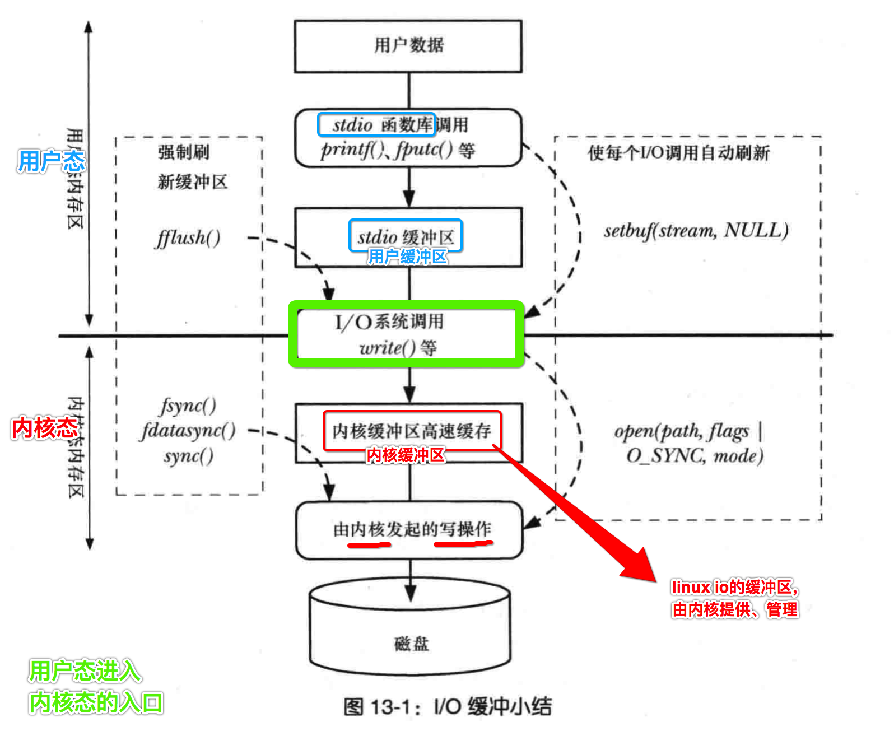

- 通常我们写的C代码(用户态) 调用 **C标准库 提供的一些 I/O 函数**
  - printf
  - scanf
  - 等等
- 而 **C标准库** 提供的这些 I/O 函数, 都是有 **stdio 缓冲区** 的, 并且位于 **用户态**
- 紧接着 向下调用 **Linux 系统** 提供的 **系统函数**
  - open
  - write
  - read
  - close
  - 等等
- **系统函数** 被调用时, 此时会进入 操作系统的 **内核态** , 并且 **内核态** 也有自己的 **内核缓冲区**
- **系统函数** 继续向下调用, 在 **内核** 调度下, 驱使 **硬件** 完成一系列的 文件 I/O 操作
- **内核** 处理完成后, 按照 调用路径 **原路返回** 到最终的 **用户态** 代码调用处


## 2、文件描述符

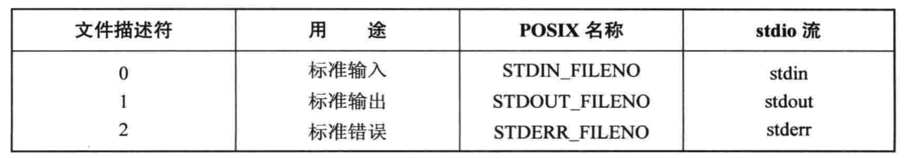

- stdio => `FILE*` 
- linux io => `int fd`


## 3、默认给每个进程, 打开 ==3个== 文件

### 1. stdio

```c
#include <stdio.h>

extern FILE *stdin;
extern FILE *stdout;
extern FILE *stderr;
```

### 2. linux io

```c
#include <unistd.h>

#define STDIN_FILENO	0	/* standard input file descriptor */
#define	STDOUT_FILENO	1	/* standard output file descriptor */
#define	STDERR_FILENO	2	/* standard error file descriptor */
```


## 4、 `FILE*` <===> int fd

#### 1. int fd => `FILE*`

```c
#include <stdio.h>

FILE*
fdopen(int fd, const char *mode);
```

#### 2. `FILE*` => int fd

```c
#include <stdio.h>

int 
fileno(FILE *stream);
```


## 5、stdio 与 linux io 函数对比

### 1. stdio 函数

#### 1. fopen() 打开文件

```c
/**
 *	@return FILE* 结构体对象地址
 */
FILE *fopen(
  const char *path,	// 文件路径
  const char *mode	// 打开文件使用的权限字符串。如：r/rb/rb+ , w/wb/wb+
);
```

fopen()函数的**mode**参数的选项值

| 模式 | 描述                                                         |
| ---- | ------------------------------------------------------------ |
| r    | 以**只读**方式打开文件。文件的指针将会放在文件的开头。这是默认模式。 |
| rb   | 以**二进制**格式打开一个文件用于**只读**。文件指针将会放在文件的开头。这是默认模式。 |
| r+   | 打开一个文件用于**读写**。文件指针将会放在文件的开头。       |
| rb+  | 以**二进制**格式打开一个文件用于**读写**。文件指针将会放在文件的开头。 |
| w    | 打开一个文件只用于**写入**。如果该文件已存在则将其**覆盖**。如果该文件**不存在**，则**创建新文件**。 |
| wb   | 以**二进制**格式打开一个文件只用于**写入**。如果该文件已存在则将其**覆盖**。如果该文件**不存在**，则**创建新文件**。 |
| w+   | 打开一个文件用于**读写**。如果该文件已存在则将其**覆盖**。如果该文件**不存在，创建新文件**。 |
| wb+  | 以**二进制**格式打开一个文件用于**读写**。如果该文件已存在则将其**覆盖**。如果该文件**不存在，创建新文件**。 |
| a    | 打开一个文件用于**追加**。如果该文件已存在，文件指针将会放在文件的结尾。也就是说，新的内容将会被写入到已有内容之后。如果该文件不存在，创建新文件进行写入。 |
| ab   | 以**二进制**格式打开一个文件用于**追加**。如果该文件已存在，文件指针将会放在文件的结尾。也就是说，新的内容将会被写入到已有内容之后。如果该文件不存在，创建新文件进行写入。 |
| a+   | 打开一个文件用于**读写**。如果该文件**已存在**，文件指针将会放在文件的**结尾**。文件打开时会是追加模式。如果该**文件不存在，创建新文件**用于读写。 |
| ab+  | 以**二进制**格式打开一个文件用于**追加**。如果该文件已存在，文件指针将会放在文件的结尾。如果该**文件不存在，创建新文件**用于读写。 |

- r => **只能读**，文件必须要存在
- w => **只能写**，并且是**覆盖式**写文件，不存在则创建文件，存在则**清零**
- `+` => 读写
- a => 追加
- b => 二进制

#### 2. fread() 读取文件

```c
/**
 *	@return 		读取到的字节数 
 */
size_t
fread(
  void *restrict ptr, 		// 保存临时读取到数据的 buff[] 缓冲区 内存起始地址
  size_t size,						// 每一次读取的大小
  size_t nitems,					// 读取多少次
  FILE *restrict stream		// 指定读取的文件
);

```

#### 3. fwrite() 写入文件

```c
/**
 *	@return 		读取内容的字节数
 */
size_t
fwrite(
  const void *restrict ptr,	// 要写入到文件的数据所在的 内存块 起始地址
  size_t size,							// 每一次写入的大小
  size_t nitems,						// 写入多少次
  FILE *restrict stream			// 指定写入的文件
);
```

- 特点一、open()接收文件路径，fread()与fwrite()都是接收`FILE*`结构体实例
- 特点二、在文件的读取和写入，都有缓冲的参数
  - size：每一次读取/写入多少字节
  - ntimes：总共写入多少次

### 2. linux io 函数

#### 1. open() 打开文件

```c
/**
 *	@return 		返回一个int值，表示打开文件的file id(fd)
 */
int open(
  const char *pathname,	// 要打开的文件路径
  int flags,						// 打开文件的模式。如：O_RDWR|O_CREAT 
  mode_t mode						// 使用文件的权限。比如：0777。注意：受umask的影响
);
```

对 **open()** 函数的 **flags** 参数所有可选值

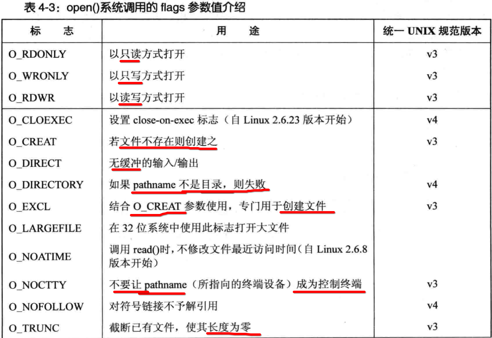

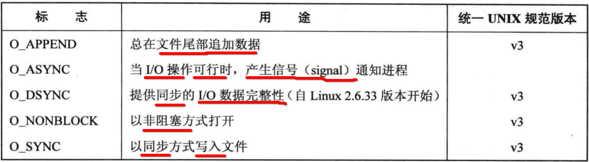

对于【终端】文件，只能使用如下两个标志，其他的都是 **无效** 标志

```c
O_NOCTTY        停止这个终端作为控制终端
O_NONBLOCK      使 open()、read()、write() 不被阻塞
```

#### 2. read() 读取文件

```c
/**
 *	@return 		读取到的字节数 
 */
ssize_t
read(
  int fildes,		// 文件fd 
  void *buf,		// 读取到数据的buff[]缓冲区内存起始地址
  size_t nbyte	// buff[]数组的长度
);
```

并不像 fread() 标准C IO 中提供：

- 一次 **读取多少个字节**
- 读取 **多少次**

而是 直接 一次性 **读取** 总字节数。

#### 3. write() 写入文件

```c
/**
 *	@return 		写入的字节数 
 */
ssize_t
write(
  int fildes,				// 文件fd 
  const void *buf,	// 即将写入文件的内存数据所在内存起始地址
  size_t nbyte			// 指定写入多少个字节数
);
```

- 使用 **int fildes** 替代 **FILE*** 结构体对象指向文件


- 没有了 **写多少次**、**读多少次** 的概念
- 就是直接指定 **一次性** 写入的字节数


## 6、io 缓冲区

### 1.  stdio

#### 1. stdio 函数, 首先只是将数据写入到 ==用户态 内存缓冲区==

```c
#include <stdlib.h>
#include <stdio.h>

int main()
{
  // 待写入的内存数据
  char buff[] = "hello";
  
  // 将如上内存数据，写入到 stdout 文件
  // 注意: 没有 \n 换行符号
  printf("%s", buff);

  // 卡主当前主线程，不再往下执行
  while(1){}
}
```

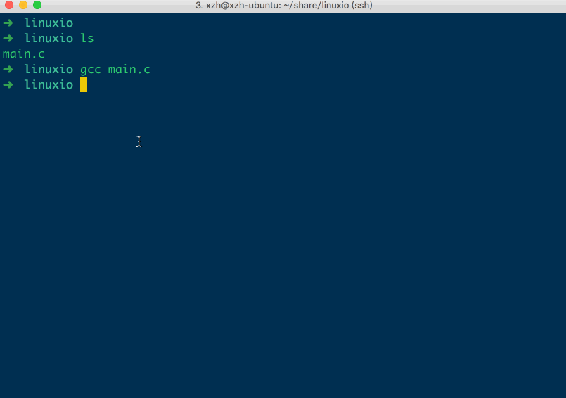

并没有看到打印 **hello**

#### 2. 换行符 `\n` 刷新缓冲区

```c
#include <stdlib.h>
#include <stdio.h>

int main()
{
  char buff[] = "hello";

  // 唯一区别，加上了\n换行符
  // => 换行符会触发刷新stdio的用户级缓冲区
  // => 将缓冲区数据写入到linux内核缓冲区
  // => 从而linux内核将数据写入到磁盘文件中
  printf("%s\n", buff);

  while(1){}
}
```

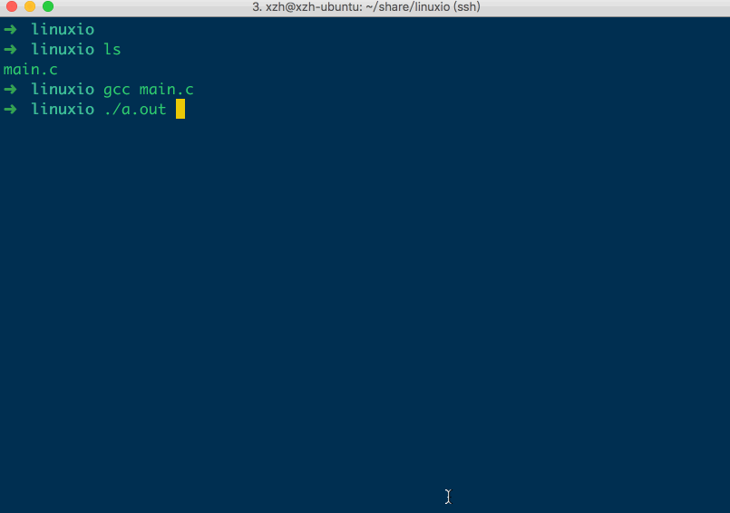

#### 3. 手动 刷新缓冲区

手动刷新缓冲区之后，才会将缓冲区内容写入到文件中。

```c
#include <stdlib.h>
#include <stdio.h>

int main()
{
  char buff[] = "hello"; // 待写入的内存数据

  // 没有使用\n刷新缓冲区
  printf("%s", buff); 

  /**
   * 强制刷新stdout文件的缓冲区数据，写入到stdout文件中
   */
  fflush(stdout);

  while(1){}
}
```

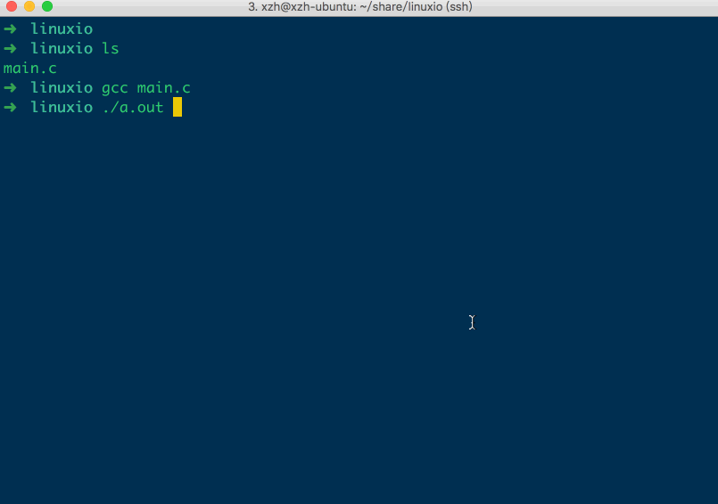

#### 4. 缓冲区满, 也会自动写入文件

```c
#include <stdlib.h>
#include <stdio.h>
#include <unistd.h>

int main()
{
  char buff[] = "hellohellohellohellohellohellohellohellohellohellohellohellohellohellohellohellohellohellohellohellohellohellohellohellohellohellohellohellohellohellohellohellohellohellohellohellohellohellohello";

  while(1)
  {
    /** 
     * 不断的向【缓冲区】写入数据，
     * 但是没有使用\n刷新缓冲区，
     * 一直等待缓冲区数据存满
     */
    printf("%s", buff);
    sleep(1);
  }
}
```

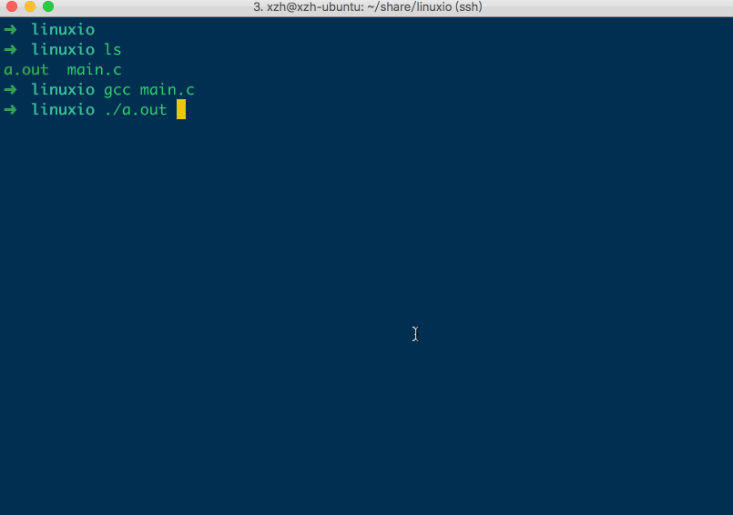

只有当缓冲区的内容放不下的时候，也会将缓冲区的内容写入到stdout文件中，从而输出到屏幕。

### 2. linux io

#### 1. 没有 ==用户态== 内存缓冲区

```c
#include <stdlib.h>
#include <stdio.h>
#include <string.h>
#include <unistd.h>

int main()
{
  char buff[] = "hello";

  write(
    STDOUT_FILENO, // stdout 标准输出
    buff,
    strlen(buff)
  );

  while(1)
  {}
}
```


- 没有使用 `\n` 和 **flush()** 也输出了 hello

#### 2. 但是有 ==内核态== 内存缓冲区


#### 3. open() 使用 `O_SYNC` , 指定文件 ==同步写入==

```c
#include <stdio.h>
#include <stdlib.h>
#include <unistd.h>
#include <sys/stat.h>
#include <fcntl.h>

int main()
{
	int fd;
	fd = open(
    "./txt", 
    O_CREAT|O_RDWR|O_SYNC, // O_SYNC => 同步写入缓冲区数据到文件
    0644
  ); 
  
	write(fd, "123", 3); // 没有缓冲，直接写入到磁盘文件
	while(1){}
}
```

此种方式会 **降低** 文件 io 的效率。

#### 4. open() 使用 `O_DIRECT` , 指定文件 ==同步写入==

调用open() 时传递 **O_DIRECT** 值，发起的io会 **绕过** 内核高速缓冲区，但是有很多的限制

```c
int fd = open(filepath, O_CREAT | O_DIRECT);
```

#### 5. sync、fsync、fdatasync ==强制== 同步写入

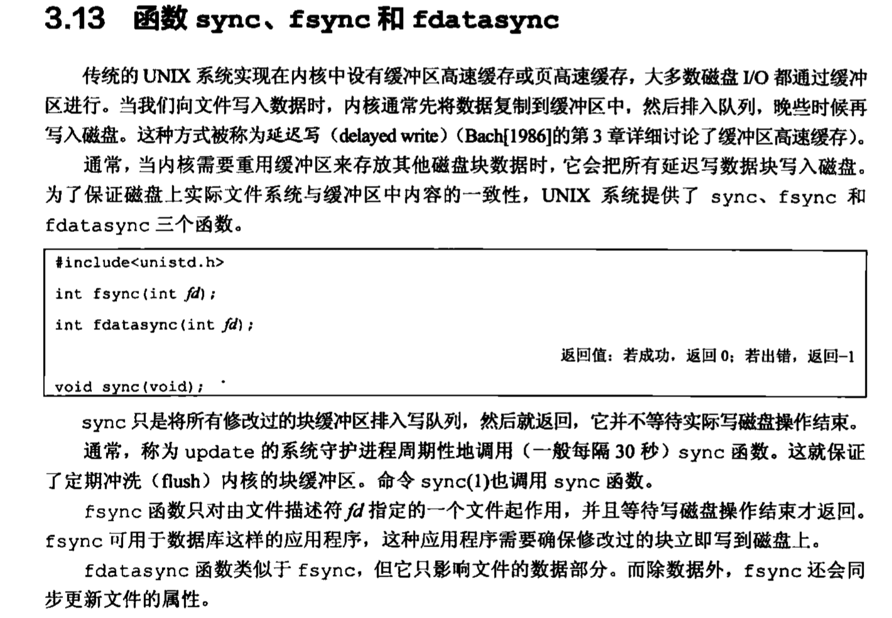

### 3. stdio 性能比 linux io 更好 

#### 1. 目录结构

```
➜  linuxio tree
.
├── fputc.c
├── Makefile
└── write.c

0 directories, 3 files
➜  linuxio
```

#### 2. fputc.c => stdio 

```c
#include <stdio.h>

int main()
{
  int i = 0;

  // 打开文件
  FILE * pFile = fopen ("./file.txt" , "w");

  // 总共写入文件1000000次，每一次写入1个字节
  for(i=0;i<1000000;++i)
    fputc('a', pFile); // 调用 stdio 库函数
}
```

#### 3. write.c => linux io

```c
#include <stdio.h>
#include <unistd.h>
#include <sys/types.h>
#include <sys/stat.h>
#include <fcntl.h>

int main()
{
  char buf[] = {'a'};
  int i = 0;

  // 打开文件
  int fd = open("./file.txt", O_CREAT | O_RDWR | O_TRUNC, 0644);

  // 总共写入文件1000000次，每一次写入1个字节
  for(i=0;i<1000000;++i)
    write(fd, buf, 1); // 调用 linux io 库函数
}
```

#### 4. 编译执行 fputc.c

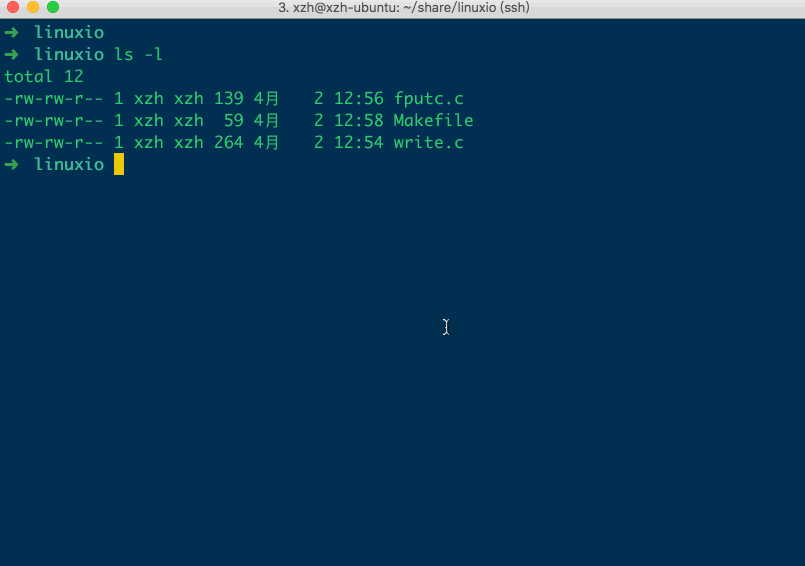

#### 5. 编译执行 write.c 

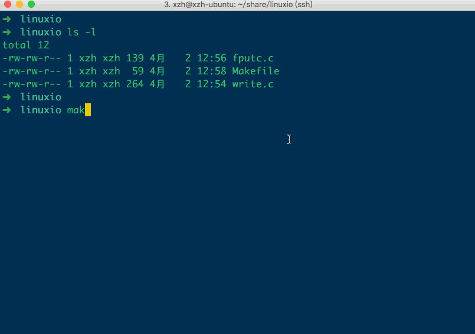

- 明显要比 **fputc.c** 执行速度 慢很多
- 因为 **linux io** 函数没有 **用户空间** 的内存缓冲区
- 而 **stdio** 自己在用户空间内封装了一个内存缓存，来 **减少** 直接调用 **linux内核** 的次数，所以效率会比较高


## 7、linux io 中的 文件 fd

### 1. fd : 进程 PCB 指向的 `file_struct 数组` 中的下标值

```c
#include <stdio.h>
#include <sys/types.h>
#include <sys/stat.h>
#include <fcntl.h>

int main()
{
  int fd1 = open("./abc1.txt", O_CREAT, 0777);
  int fd2 = open("./abc2.txt", O_CREAT, 0777);
  int fd3 = open("./abc3.txt", O_CREAT, 0777);

  printf("fd1 = %d\n", fd1);
  printf("fd2 = %d\n", fd2);
  printf("fd3 = %d\n", fd3);
}
```

```
➜  linuxio ls
main.c
➜  linuxio gcc main.c
➜  linuxio ./a.out
fd1 = 3
fd2 = 4
fd3 = 5
➜  linuxio
➜  linuxio ls
abc1.txt  abc2.txt  abc3.txt  a.out  main.c
➜  linuxio
```

- 每一个 进程PCB 有一个`file_struct` 链表
- 单链表中，每一项指向一个当前进程已经打开的文件

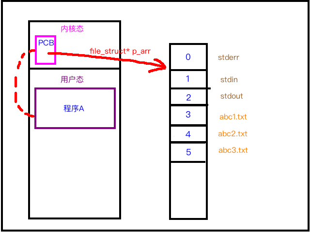

### 2. 不同 fd,  可以引用 同一个 ==物理== 文件

```c
#include <stdio.h>
#include <sys/types.h>
#include <sys/stat.h>
#include <fcntl.h>

int main()
{
  int fd1 = open("./abc1.txt", O_RDONLY);
  int fd2 = open("./abc1.txt", O_RDONLY);
  int fd3 = open("./abc1.txt", O_RDONLY);

  printf("fd1 = %d\n", fd1);
  printf("fd2 = %d\n", fd2);
  printf("fd3 = %d\n", fd3);
}
```

```
➜  linuxio ls
abc1.txt  main.c
➜  linuxio
➜  linuxio gcc main.c
➜  linuxio ./a.out
fd1 = 3
fd2 = 4
fd3 = 5
➜  linuxio
```

- 1、三个fd值虽然是**不同**的
- 2、但其实是指向**同一个物理文件**

### 3. fd 可 ==循环回收== 使用

```c
#include <stdio.h>
#include <sys/types.h>
#include <sys/stat.h>
#include <fcntl.h>
#include <unistd.h>

int main()
{
	int fd1 = open("./abc.txt", O_RDONLY); // 分配 fd=3
	printf("fd1 = %d\n", fd1);
	close(fd1); // 回收 fd=3

	int fd2 = open("./abc.txt", O_RDONLY); // 分配 fd=3
	printf("fd2 = %d\n", fd2);
	close(fd2); // 回收 fd=3


	int fd3 = open("./abc.txt", O_RDONLY); // 分配 fd=3
	printf("fd3 = %d\n", fd3);
	close(fd3); // 回收 fd=3
}
```

```
➜  demo1 ls -l
total 4
-rw-rw-r-- 1 xzh xzh   0 4月   2 14:42 abc.txt
-rw-rw-r-- 1 xzh xzh 366 4月   2 14:41 main.c
➜  demo1
➜  demo1 gcc main.c
➜  demo1 ./a.out
fd1 = 3
fd2 = 3
fd3 = 3
➜  demo1
```

每一次文件关闭后，其对应的文件fd会被释放占用。


## 8、fd、打开文件表、inode

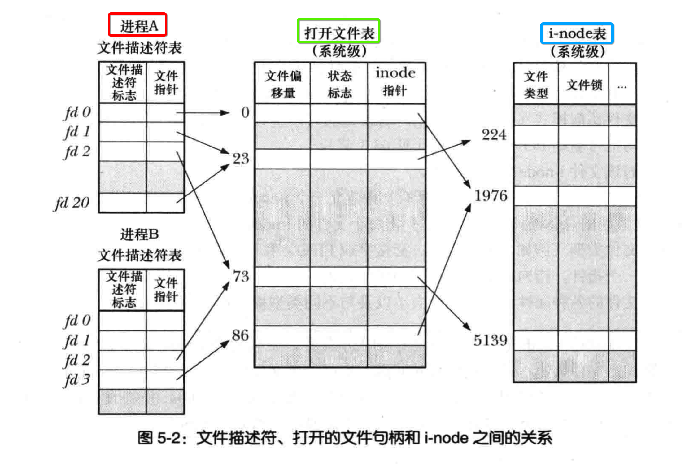