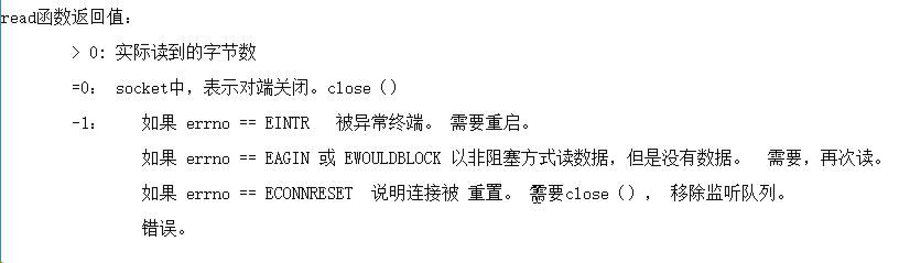
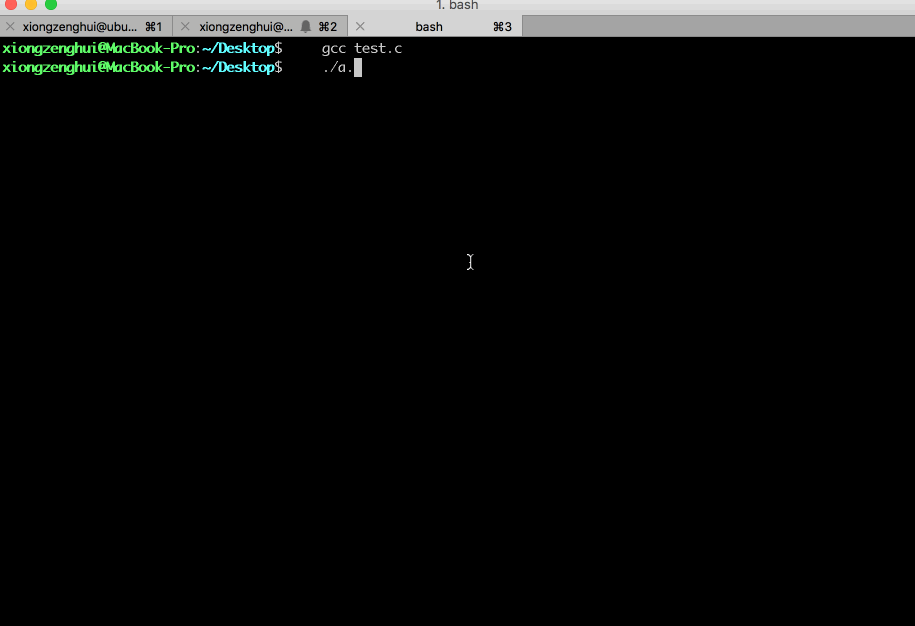

[TOC]


## 1、open() 指定文件权限, 受当前 ==umask== 影响

### 1. 目录结构

```
➜  demo1 tree
.
├── main.c
└── Makefile

0 directories, 2 files
➜  demo1
```

### 2. umask(0002)

#### 1. main.c

```c
#include <stdio.h>
#include <string.h>
#include <sys/types.h>
#include <sys/stat.h>
#include <fcntl.h>
#include <unistd.h>

int main()
{
  char buf[] = {"hello"};
  
  // 设置当前进程的 umask = 0002 (八进制数，第一个 0 表示 8进制)
  umask(0002);
  
  // 创建文件指定的权限为0666
  int fd = open("abc.txt", O_CREAT | O_RDWR, 0666);
  
  write(fd, buf, strlen(buf));
  close(fd);
}
```

#### 2. Makefile

```makefile
all:
  gcc main.c
  ./a.out
  ls -l

clean:
  -rm -rf a.out
  -rm -rf abc.txt
```

#### 3. make

```
➜  demo1 ls -l
total 8
-rw-rw-r-- 1 xzh xzh 271 4月   2 15:23 main.c
-rw-rw-r-- 1 xzh xzh  63 4月   2 15:04 Makefile
➜  demo1 make
gcc main.c
./a.out
ls -l
total 24
-rw-rw-r-- 1 xzh xzh    5 4月   2 15:23 abc.txt
-rwxrwxr-x 1 xzh xzh 8864 4月   2 15:23 a.out
-rw-rw-r-- 1 xzh xzh  271 4月   2 15:23 main.c
-rw-rw-r-- 1 xzh xzh   63 4月   2 15:04 Makefile
➜  demo1
```

#### 4. 最终文件的权限值计算

```
0666 & ~(0002) = 0664
```

### 3. umask(0022)

#### 1. main.c

```c
#include <stdio.h>
#include <string.h>
#include <sys/types.h>
#include <sys/stat.h>
#include <fcntl.h>
#include <unistd.h>

int main()
{
  char buf[] = {"hello"};
  umask(0022);
  int fd = open("abc.txt", O_CREAT | O_RDWR, 0666);
  write(fd, buf, strlen(buf));
  close(fd);
}
```

#### 2. make

```
➜  demo1 ls -l
total 8
-rw-rw-r-- 1 xzh xzh 271 4月   2 15:23 main.c
-rw-rw-r-- 1 xzh xzh  63 4月   2 15:04 Makefile
➜  demo1 make
gcc main.c
./a.out
ls -l
total 24
-rw-rw-r-- 1 xzh xzh    5 4月   2 15:24 abc.txt
-rwxrwxr-x 1 xzh xzh 8864 4月   2 15:24 a.out
-rw-rw-r-- 1 xzh xzh  271 4月   2 15:23 main.c
-rw-rw-r-- 1 xzh xzh   63 4月   2 15:04 Makefile
➜  demo1
```

#### 3. 最终文件的权限值计算

```
0666 &~(0022) = 0644
```

### 4. umask(0066)

#### 1. main.c

```c
#include <stdio.h>
#include <string.h>
#include <sys/types.h>
#include <sys/stat.h>
#include <fcntl.h>
#include <unistd.h>

int main()
{
  char buf[] = {"hello"};
  umask(0666);
  int fd = open("abc.txt", O_CREAT | O_RDWR, 0666);
  write(fd, buf, strlen(buf));
  close(fd);
}
```

#### 2. make

```
➜  demo1 ls -l
total 8
-rw-rw-r-- 1 xzh xzh 271 4月   2 15:26 main.c
-rw-rw-r-- 1 xzh xzh  73 4月   2 15:27 Makefile
➜  demo1 make
gcc main.c
./a.out
ls -l
total 24
---------- 1 xzh xzh    5 4月   2 15:27 abc.txt
-rwxrwxr-x 1 xzh xzh 8864 4月   2 15:27 a.out
-rw-rw-r-- 1 xzh xzh  271 4月   2 15:26 main.c
-rw-rw-r-- 1 xzh xzh   73 4月   2 15:27 Makefile
➜  demo1
```

#### 3. 最终文件的权限值计算

```
0666 &~(0666) = 0000
```

### 5. umask(0000)

#### 1. make

```
➜  demo1 make
gcc main.c
./a.out
ls -l
total 24
-rw-rw-rw- 1 xzh xzh    5 4月   2 15:28 abc.txt
-rwxrwxr-x 1 xzh xzh 8864 4月   2 15:28 a.out
-rw-rw-r-- 1 xzh xzh  272 4月   2 15:28 main.c
-rw-rw-r-- 1 xzh xzh   73 4月   2 15:27 Makefile
➜  demo1
```

#### 2. 最终文件的权限值计算

```
0666 &~(0000) = 0666
```

### 6. 文件权限 计算规则

- 假设 open() 时, 指定文件权限值为 **0666** , 换算为 二进制 **0110,0110,0110**
- 假设 umask(**0011**) , 那么 umask 值为 **0011** , 换算为 二进制 **0000,0001,0001**
- **取反 umask** , `~0000,0001,0001` ==> **1111,1110,1110**
- 然后再 **与 open 权限制** , `1111,1110,1110 & 0110,0110,0110` ==> **0110,0110,0110**
- **0110,0110,0110** 换算为 **8进制** 为 **0666**


## 2、open() 常见错误

### 1. 打开的文件 ==不存在==

```c
int fd = open("test", O_RDONLY | O_CREAT);
if(fd < 0){
  printf("errno = %d\n", errno);
//  perror("open test error");
  printf("open test error: %s\n" , strerror(errno));
//  printf("open test error\n");
  exit(1);
}
```

### 2. 打开的文件 ==没有对应权限==

```c
int fd = open("test", O_WRONLY); // O_RDWR 也是错误的
if(fd < 0){
  printf("errno = %d\n", errno);
  perror("open test error");
  //printf("open test error\n");
  exit(1);
}
```

### 3. 以 ==写== 方式打开一个 ==目录==

```c
int fd = open("testdir", O_RDWR);		// O_WRONLY 也是错的
if(fd < 0){
  perror("open testdir error");
  exit(1);
}
```

### 4. ==重复== 使用 ==同一个 fd==

```c
#include <stdlib.h>
#include <stdio.h>
#include <sys/types.h>
#include <sys/stat.h>
#include <fcntl.h>
#include <unistd.h>
#include <string.h>
#include <errno.h>

int main()
{
  int len;
  char buf[1024] = {"hello\nworld\nworinima"};
  int fd = open("abc.txt",  O_CREAT | O_RDWR, 0644);

  // 先写入 => 文件指针已经移动到末尾
  len = write(fd, buf, strlen(buf));

  // 再读取 => 文件指针已经指向文件末尾，所以无法再读取到数据
  memset(buf, 0, 1024);
  len = read(fd, buf, 1024);
  printf("buf = %s", buf);
}
```

```
➜  demo3 ls
main.c
➜  demo3 gcc main.c
➜  demo3 ./a.out
➜  demo3
➜  demo3 ls
abc.txt  a.out  main.c
➜  demo3 cat abc.txt
hello
world
➜  demo3
```


## 3、read() ==返回值==



- 1) `read() 返回值 > 0` => 实际读取到的 **字节数**
- 2) `read() 返回值 == 0` => 读取的文件已经 **关闭**
- 3) `read() 返回值 < 0` => 函数执行 **出错** =>通过去读 **errno 全局变量**, 查看具体的错误类型


## 4、`O_EXCL` ==独占式== 打开文件

```c
#include <stdio.h>
#include <stdlib.h>
#include <string.h>
#include <fcntl.h>
#include <unistd.h>

int main(int argc, const char * argv[])
{
	int fd = open("./abc.txt", O_CREAT | O_RDWR | O_EXCL, 0766);
	printf("fd = %d\n", fd);

	int fd2 = open("./abc.txt", O_CREAT | O_RDWR | O_EXCL, 0766);
	printf("fd2 = %d\n", fd2);

	int fd3 = open("./abc.txt", O_CREAT | O_RDWR | O_EXCL, 0766);
	printf("fd3 = %d\n", fd3);
}
```

```
 ~/iCollections/Temps/main  rm abc.txt
 ~/iCollections/Temps/main  make
gcc main.c
./a.out
fd = 3
fd2 = -1
fd3 = -1
```

- 1) 只有 **第一次** 的 open() 能够打开 abc.txt 文件
- 2) **后续2次** open() 都是 **打开失败**，返回 **错误码 -1**


## 5、判断 文件是否 ==读取完毕==

```c
int fd = open("testdir", O_RDWR);

char buff[1024] = {0};
if (0 == read(fd, buff, 1024))
{
  // 读写完毕
}
```


## 6、文件读写示例

```c
#include <stdlib.h>
#include <stdio.h>
#include <sys/types.h>
#include <sys/stat.h>
#include <fcntl.h>
#include <unistd.h>
#include <string.h>

int main(int argc, const char * argv[])
{
	//1. 保存读入的数据
	char buff[1024] = {0};

	//2. 从标准输入stdin文件中，读取数据到buff缓冲区
	int len = read(
    STDIN_FILENO, // 读取的文件fd => stdin 标准输入
    buff,         // 读取数据临时保存到的内存缓冲区起始地址
    sizeof(buff)  // 缓冲区的长度
  );
				
	//3. 打印读入的数据字节数
	printf("len = %d\n", len);

	//4. 将buff中存放的字符，写入到stdout文件中，就会输出到屏幕了
	len = write(
    STDOUT_FILENO,  // stdout 标准输出
    buff,           // 要写入数据所在内存卡的地址
    len             // 总共写入的字节数
  );
				
	//5. 打印写入的数据字节数
	printf("len = %d\n", len);
}
```



- 如上程序执行后，程序会一直 **阻塞**，等待用户完成输入
- 会 **卡住** 主进程执行，这就叫 **阻塞式** 读写


## 7、==覆盖== 方式, 打开文件

### 1. main.c

```c
#include <stdio.h>
#include <stdlib.h>
#include <string.h>
#include <fcntl.h>
#include <unistd.h>

int main(int argc, const char * argv[])
{ 
	//1. `O_CREAT` 会 `覆盖` 上一次写入的内容
	int fd = open("./abc.txt", O_CREAT | O_RDWR, 0766);
	printf("fd = %d\n", fd);

	//2. 准备要写入的数据
	char buff[128] = "HelloWorld";
	
	//3. 将内存数据写入到文件
	write(fd, buff, strlen(buff));

	//4. 关闭文件
	close(fd);
}
```

### 2. 之前 abc.txt 内容

```
 ~/iCollections/Temps/main  cat abc.txt
wo ri ni ma ..........
 ~/iCollections/Temps/main 
```

### 3. 编译链接运行 main.c

```
 ~/iCollections/Temps/main  make
gcc main.c
./a.out
fd = 3
 ~/iCollections/Temps/main 
```

### 4. 之后的 abc.txt

```
 ~/iCollections/Temps/main  cat abc.txt
HelloWorlda ..........
```

前面的内容已经被 **覆盖** 掉了。


## 8、==追加==  方式, 打开文件

### 1. main.c

```c
#include <stdio.h>
#include <stdlib.h>
#include <string.h>
#include <fcntl.h>
#include <unistd.h>

int main(int argc, const char * argv[])
{ 
  //1. O_APPEND 内容追加式打开文件 
  int mode = O_RDWR | O_CREAT | O_APPEND;

  //2. 
  int fd = open("/Users/xiongzenghui/Desktop/abc.txt", mode, 0766);

  //3. 准备要写入的数据
  char buff[128] = "HelloWorld";

  //4. 将内存数据写入到文件
  write(fd, buff, strlen(buff));

  //5. 关闭文件
  close(fd);
}
```

```
➜  demo1 make
gcc main.c
./a.out
fd = 3
ls -l
total 24
-rwxrw-r-- 1 xzh xzh   10 4月   2 15:37 abc.txt
-rwxrwxr-x 1 xzh xzh 8872 4月   2 15:37 a.out
-rw-rw-r-- 1 xzh xzh  435 4月   2 15:37 main.c
-rw-rw-r-- 1 xzh xzh   73 4月   2 15:27 Makefile
➜  demo1
➜  demo1 cat abc.txt
➜  demo1
➜  demo1 ./a.out
fd = 3
➜  demo1 cat abc.txt
➜  demo1
```


## 9、==截断== 文件

### 1. open() 指定 `O_TRUNC`

```c
#include <stdio.h>
#include <unistd.h>
#include <fcntl.h>
#include <stdlib.h>

int main()
{
  system("ls -l | grep file.txt");

	int fd;
	fd = open("./file.txt", O_RDWR | O_TRUNC, 0644);
	close(fd);
	
  system("ls -l | grep file.txt");
}
```

```
➜  ipc echo "1223423j4i23j4i2ji4j2i3j4\n" > file.txt
```

```
➜  ipc gcc main.c
➜  ipc ./a.out
-rw-rw-r-- 1 xzh xzh   27 4月   7 21:23 file.txt
-rw-rw-r-- 1 xzh xzh    0 4月   7 21:24 file.txt
➜  ipc
```

file.txt 文件的大小从 **27** 变为 **0**.

### 2. ftruncate()  

```c
#include <stdio.h>
#include <unistd.h>
#include <fcntl.h>
#include <stdlib.h>

int main()
{
	system("ls -l | grep file.txt");

  int fd;
	fd = open("./file.txt", O_RDWR, 0644);

	ftruncate(fd, 1);

	close(fd);
	system("ls -l | grep file.txt");
}
```

```
➜  ipc echo "1223423j4i23j4i2ji4j2i3j4\n" > file.txt
```

```
➜  ipc gcc main.c
➜  ipc ./a.out
-rw-rw-r-- 1 xzh xzh   27 4月   7 21:25 file.txt
-rw-rw-r-- 1 xzh xzh    1 4月   7 21:25 file.txt
➜  ipc cat file.txt
1
➜  ipc
```


## 10、==临时== 文件

```c
#include <stdio.h>
#include <stdlib.h>
#include <unistd.h>

int main()
{
  int fd;
  char tempfile[] = "./worinimaXXXXXX";

  // 创建临时文件
  fd = mkstemp(tempfile);

  // 删除临时文件
  unlink(tempfile);
}
```