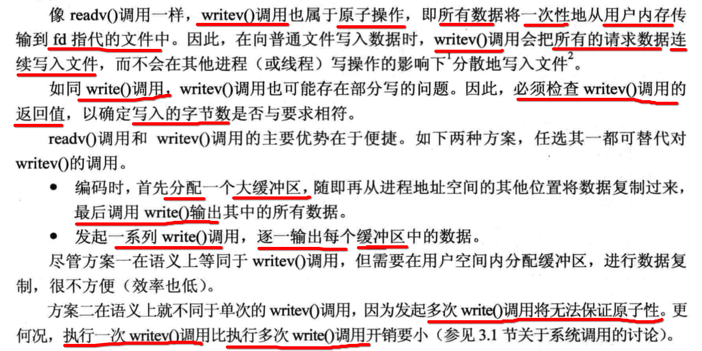

[TOC]


## 1、writev() 同时==写入== 多个 ==非连续== 内存块

### 1. 不同的 字符串

```c
#include <stdlib.h>
#include <stdio.h>
#include <string.h>
#include <unistd.h>
#include <sys/stat.h>
#include <fcntl.h>
#include <sys/uio.h>

int main()
{
  char *str0 = "hello ";
  char *str1 = "world\n";
  ssize_t nwritten;

  // 设置写入2个内存块
  /**
  struct iovec {
    void  *iov_base;  Starting address
    size_t iov_len;   Number of bytes to transfer
  };
  */
  struct iovec iov[2];

  // 设置写入内存块1
  iov[0].iov_base = str0;
  iov[0].iov_len = strlen(str0);

  // 设置写入内存块2
  iov[1].iov_base = str1;
  iov[1].iov_len = strlen(str1);

  // 同时写入 内存块1和内存块2
  nwritten = writev(STDOUT_FILENO, iov, 2);
  printf("nwritten = %d\n", nwritten);
}
```

```
->  gcc main.c
->  ./a.out
hello world
nwritten = 12
->
```

### 2. 不同的 数据类型 内存

```c
#include <stdlib.h>
#include <stdio.h>
#include <string.h>
#include <unistd.h>
#include <sys/stat.h>
#include <fcntl.h>
#include <sys/uio.h>

struct person
{
  int age;
  char name[20];
};

int main()
{
  int fd;
  ssize_t written = 0;
  ssize_t totoal = 0;
  char* name = "helloworld";
  int age = 21;
  struct person pers[2] = {
    {19, "xiong"},
    {20, "wang"}
  };

  // 设置写入4个内存块
  struct iovec iov[4];

  // 写入的内存块1
  iov[0].iov_base = &pers[0];
  iov[0].iov_len = sizeof(struct person);

  // 写入的内存块2
  iov[1].iov_base = &pers[1];
  iov[1].iov_len = sizeof(struct person);

  // 写入的内存块3
  iov[2].iov_base = name;
  iov[2].iov_len = strlen(name);

  // 写入的内存块4
  iov[3].iov_base = &age;
  iov[3].iov_len = sizeof(int);

  printf("sizeof(struct person) = %d\n", sizeof(struct person));
  printf("iov[0].iov_len = %d\n", iov[0].iov_len);
  printf("iov[1].iov_len = %d\n", iov[1].iov_len);
  printf("iov[2].iov_len = %d\n", iov[2].iov_len);
  printf("iov[3].iov_len = %d\n", iov[3].iov_len);

  // 将如上4个不连续的内存块内的数据，写入到./txt文件中
  fd = open("./txt", O_CREAT|O_RDWR, 0644);
  written = writev(fd, iov, 4);
  printf("written = %d\n", written);
}
```

```
->  gcc writev.c
->  ./a.out
sizeof(struct person) = 24
iov[0].iov_len = 24
iov[1].iov_len = 24
iov[2].iov_len = 10
iov[3].iov_len = 4
written = 62
->
```

- 总共写入62字节


## 2、readv() 同时 ==读取== 多个 ==非连续== 内存块

```c
#include <stdlib.h>
#include <stdio.h>
#include <string.h>
#include <unistd.h>
#include <sys/stat.h>
#include <fcntl.h>
#include <sys/uio.h>

struct person
{
  int age;
  char name[20];
};

int main()
{
  int fd;
  ssize_t read_bytes = 0;
  ssize_t totoal = 0;
  char name[100];
  int age;

  memset(name, 0, 100);
  struct person pers[2] = {
    {0, "None"},
    {0, "None"}
  };

  // 设置要读取4个内存块
  struct iovec iov[4];

  // 设置要读取的第1个内存块
  iov[0].iov_base = &pers[0];
  iov[0].iov_len = sizeof(struct person);

  // 设置要读取的第2个内存块
  iov[1].iov_base = &pers[1];
  iov[1].iov_len = sizeof(struct person);

  // 设置要读取的第3个内存块
  iov[2].iov_base = name;
  iov[2].iov_len = strlen("helloworld");

  // 设置要读取的第4个内存块
  iov[3].iov_base = &age;
  iov[3].iov_len = sizeof(int);

  // 从./txt文件中读取数据，保存到上面的iov指定的内存块中
  fd = open("./txt", O_CREAT|O_RDWR, 0644);
  read_bytes = readv(fd, iov, 4);
  printf("read_bytes = %d\n", read_bytes);

  printf("age = %d, name = %s\n", pers[0].age, pers[0].name);
  printf("age = %d, name = %s\n", pers[1].age, pers[1].name);
  printf("age = %d\n", age);
  printf("name = %s\n", name);
}
```

```
->  gcc readv.c
->  ./a.out
read_bytes = 62
age = 19, name = xiong
age = 20, name = wang
age = 21
name = helloworld
```

- 总共读入62字节
- 需要验证与读取的字节数是否相等


## 3、writev() 对比 write() 的优点



总结：writev()/readv() 完成对 **一块大内存** 一次性读取到 **不同的小内存块** 中。


## 4、readv()/writev() ==偏移量== 读写

```c
#include <sys/uio.h>

ssize_t 
preadv(
  int fd, 
  const struct iovec *iov, 
  int iovcnt,
  off_t offset
);

ssize_t 
pwritev(
  int fd, 
  const struct iovec *iov, 
  int iovcnt,
  off_t offset
);
```

