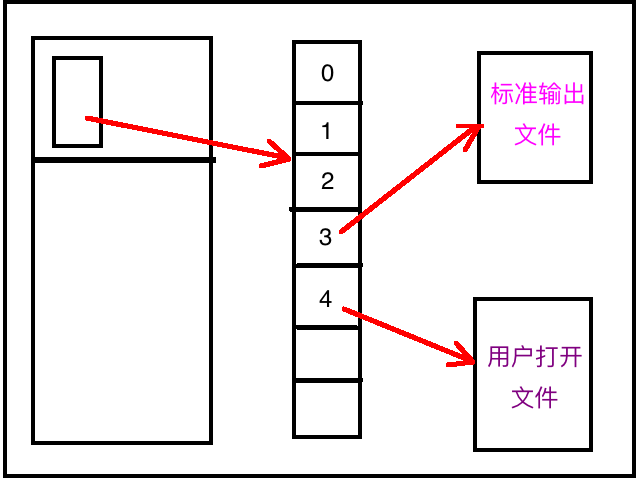
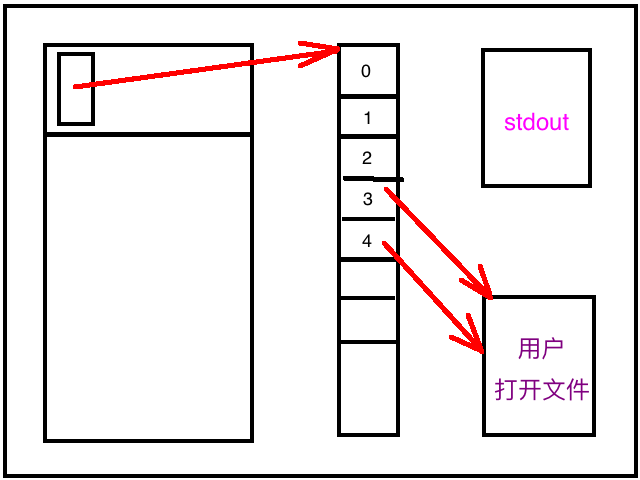

[TOC]


## 1、dup() 只是 ==增加== 一个文件的 ==指向==

```c
#include <stdlib.h>
#include <stdio.h>
#include <string.h>
#include <fcntl.h>
#include <unistd.h>

int main(int argv, char* argr[])
{
  //1.
  int fd1 = open("./foo.txt", O_CREAT | O_RDWR, 0777);
  printf("df1 = %d\n", fd1);

  //2.
  int fd2 = dup(fd1);
  printf("df2 = %d\n", fd2);

  //3.
  char buff1[] = "第一句话";
  write(fd1, buff1, strlen(buff1));
  close(fd1);

  //4.
  char buff2[] = "第二句话";
  write(fd2, buff2, strlen(buff2));
  close(fd2);
}
```

```
➜  ipc gcc main.c
➜  ipc ./a.out
df1 = 3
df2 = 4
➜  ipc ls
a.out  foo.txt  main.c
➜  ipc cat foo.txt
➜  ipc
```

可以看到对 fd1、fd2 的写入，其实都是对 **abc一个文件** 的写入。


## 2、`fcntl(fd, F_DUPFD, 0)` 等价于 dup()

```c
#include <stdio.h>
#include <stdlib.h>
#include <string.h>
#include <unistd.h>
#include <fcntl.h>

int main()
{
  // 1. 打开文件
  int fd1 = open("./foo.txt", O_CREAT | O_RDWR, 0777);
  if (fd1 == -1) {
    perror("open error");
    exit(1);
  }
  printf("fd1 = %d\n",fd1);

  // 2. dup(fd1) 自动增加1返回新的fd
  int fd2 = fcntl(fd1, F_DUPFD, 0);
  if (fd2 < 0) {
    perror("fcntl error");
    exit(1);
  }
  printf("fd2 = %d\n",fd2);

  // 3. dup(fd1) 指定新生成的fd >= 18
  int fd3 = fcntl(fd1, F_DUPFD, 18);
  if (fd3 < 0) {
    perror("fcntl error");
    exit(1);
  }
  printf("fd3 = %d\n",fd3);

  //
  char buf[10] = "hello\n";
  write(fd2, buf, strlen(buf));
  write(fd3, buf, strlen(buf));
}
```

```
➜  ipc gcc main.c
➜  ipc ./a.out
fd1 = 3
fd2 = 4
fd3 = 18
➜  ipc
➜  ipc ls
a.out  foo.txt  main.c
➜  ipc cat foo.txt
hello
hello
➜  ipc
```


## 3、dup2 文件 fd ==重定向==

### 1. 没有 dup2(4, 3) 之前



### 2. dup2(4, 3) 之后

dup2(fd1, fd2) => **fd2** 指向 **fd1指向的文件**



### 注意

- fd 的指向修改，仅仅只是针对 **当前进程**
- 而 **不会** 影响其他的进程


## 4、dup2(fd1, fd2) 自己打开的文件

### 1. main.c

```c
#include <stdlib.h>
#include <stdio.h>
#include <string.h>
#include <fcntl.h>
#include <unistd.h>

int main(int argv, char* argr[])
{
  // 1. 打开文件1 => fd1
  int fd1 = open("./foo1.txt", O_CREAT | O_RDWR, 0777);
  printf("df1 = %d\n", fd1);

  // 2. 打开文件2 => fd2
  int fd2 = open("./foo2.txt", O_CREAT | O_RDWR, 0777);
  printf("df2 = %d\n", fd2);

  // 3. dup2(fd1, fd2)
  int fd3 = dup2(fd1, fd2);
  printf("fd3 = %d\n", fd3);

  // 4. 写入fd1
  char buff1[] = "第一句话";
  write(fd1, buff1, strlen(buff1));

  // 5. 写入fd2
  char buff2[] = "第二句话";
  write(fd2, buff2, strlen(buff2));

  // 6.
  close(fd1);
  close(fd2);
}
```

### 2. 编译链接运行 main.c

```
 ~/iCollections/Temps/main  make
gcc main.c
./a.out
df1 = 3
df2 = 4
fd3 = 3
```

### 3. 查看生产的两个 foo 文件

```
 ~/iCollections/Temps/main  ls foo*
foo1.txt foo2.txt
```

### 4. foo1.txt

```
 ~/iCollections/Temps/main  cat foo1.txt
第一句话第二句话%
~/iCollections/Temps/main 
```

- 两次文件写入，都是写入到了 **foo1.txt** 文件中

### 5. foo2.txt

```
 ~/iCollections/Temps/main  cat foo2.txt
 ~/iCollections/Temps/main 
```

- 是空的

### 6. 总结

`dup2(fd1, fd2)` 的作用：让 `fd2(后)` 指向 `fd1(前)指向的磁盘文件`.


## 5、dup2(fd, ==stdout==)

```c
#include <stdlib.h>
#include <stdio.h>
#include <string.h>
#include <fcntl.h>
#include <unistd.h>

int main(int argv, char* argr[])
{
  // 1. 打开 foo.txt 磁盘文件
  int fd1 = open("./foo.txt", O_CREAT | O_RDWR, 0777);
  printf("df1 = %d\n", fd1);

  // 2. 让 `STDOUT_FILENO` 指向 `fd1 指向的 foo.txt 文件`
  int fd2 = dup2(fd1, STDOUT_FILENO);
  
  // 3. 执行 stdout 输出，实际是向 foo.txt 文件写入
  printf("df2 = %d\n", fd2);  // 默认是向 stdout 写入
  system("ls -l | wc -l");    // 默认是向 stdout 写入

  // 4. 
  close(fd1);
}
```

```
 ~/iCollections/Temps/main  make
gcc main.c
./a.out
df1 = 3
 ~/iCollections/Temps/main  cat foo.txt
df2 = 1
      76
 ~/iCollections/Temps/main 
```


## 6、dup2(==stdin==, fd)

### 1. main.c

```c
#include <stdlib.h>
#include <stdio.h>
#include <string.h>
#include <fcntl.h>
#include <unistd.h>

int main(int argv, char* argr[])
{
  // 1. 打开 foo.txt 磁盘文件
  int fd1 = open("./foo.txt", O_RDONLY, 0777);
  printf("fd1 = %d\n", fd1);

  // 2. 让 `STDIN_FILENO` 指向 `fd1 指向的 foo.txt 文件`
  int fd2 = dup2(fd1, STDIN_FILENO);

  // 3. scanf() 默认从 stdin 读取内容，但实际从 foo.txt 读取内容
  char buf[1024] = {0};
  scanf("username=%s\n", buf);

  // 4.
  printf("buf = %s\n", buf);
}
```

### 2. foo.txt 文件

```
 ~/iCollections/Temps/main  cat foo.txt
username=xiaoming

 ~/iCollections/Temps/main 
```

### 3. 编译链接运行 main.c

```
 ~/iCollections/Temps/main  make
gcc main.c
./a.out
fd1 = 3
buf = xiaoming
 ~/iCollections/Temps/main 
```


## 7、将 `ps -ax` 的 ==输出==, ==重定向== 写入到 ==其他文件==

```c
#include <stdlib.h>
#include <stdio.h>
#include <string.h>
#include <fcntl.h>
#include <unistd.h>

int main(int argv, char* argr[])
{
  // 1、
  int fd = open("./foo.txt", O_RDWR, 0777);

  // 2、STDOUT_FILENO 指向上面open()打开的./foo.txt文件
  dup2(fd, STDOUT_FILENO);

  // 3、执行ps程序
  // => 默认情况下ps程序会将执行结果数据，全部输出到stdout文件中
  // => 但是上面2.已经将stdout指向为./foo.txt文件
  // => 所以实际上ps的执行结果数据，会写入到./foo.txt文件
  execlp(
    "ps",
    "占住 args[0] 无用参数",
    "ax", 
    NULL
  );
}
```

```
->  ls
a.out  main.c
->
->  gcc main.c
->  ./a.out
->
->  ls
a.out  foo.txt	main.c
->
->  cat foo.txt
   PID TTY      STAT   TIME COMMAND
     1 ?        Ss     0:05 /sbin/init
     2 ?        S      0:00 [kthreadd]
     3 ?        S      0:00 [ksoftirqd/0]
     5 ?        S<     0:00 [kworker/0:0H]
     7 ?        S      0:03 [rcu_sched]
     8 ?        S      0:03 [rcuos/0]
     9 ?        S      0:00 [rcuos/1]
    10 ?        S      0:00 [rcuos/2]
................略...............
```


## 8、实现 ==cat== 重定向

```c
#include <stdio.h>
#include <string.h>
#include <stdlib.h>
#include <fcntl.h>
#include <unistd.h>

void my_err(int ret, char *str)
{
  if (ret == -1) {
    perror(str);
    exit(1);
  }
}

int main(int argc, char * argv[])
{
  char buf[1024];
  int ret;
  if (argc == 4) 
  {
    if (strcmp(argv[2], ">") == 0) 
    {
      // 1、打开文件
      int fd2 = open(argv[3], O_WRONLY | O_CREAT | O_TRUNC, 0664);

      // 2、dup2() 让 STDOUT_FILENO 指向 fd2 指向的文件
      dup2(fd2, STDOUT_FILENO);  //0:stdin, 1:stdout, 2:stderr  
    }
  }

  // 3、读取数据源文件，写入到 stdout，实际上是写入上面的 fd2指向的文件中
  int fd = open(argv[1], O_RDONLY);
  while ((ret = read(fd, buf, sizeof(buf)))) 
  {
    write(STDOUT_FILENO, buf, ret);
  }
}
```