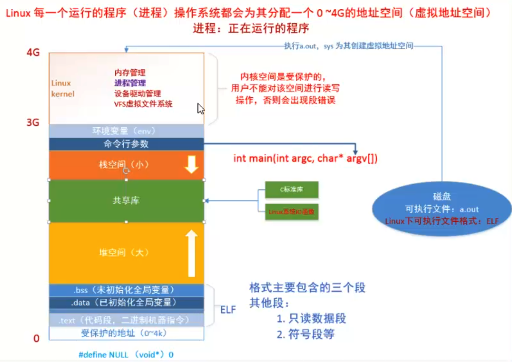
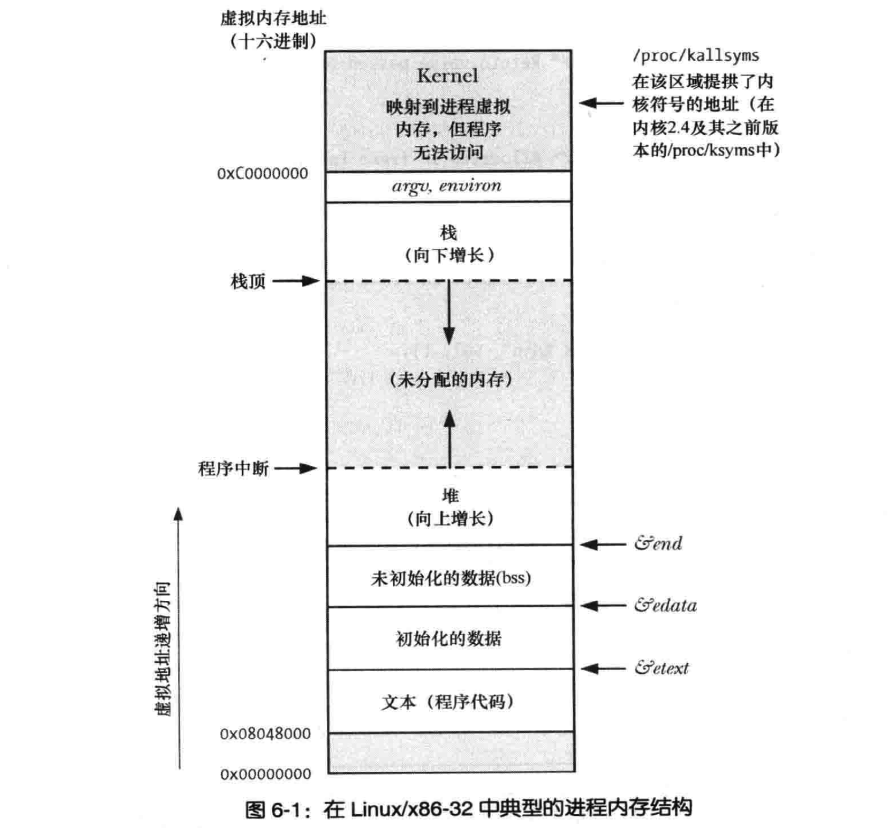
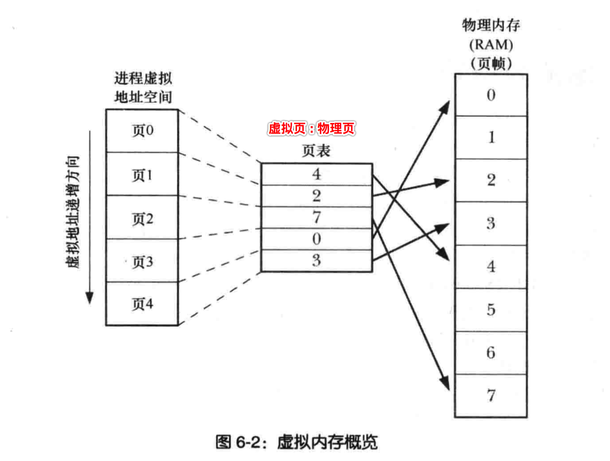

[TOC]

## 1、每一个进程的虚拟内存空间，都是互相独立的

- 1、32位操作系统，进程虚拟空间大小 = 2^32 字节（4GB 字节）
- 2、64位操作系统，进程虚拟空间大小 = 2^64 字节

如果以 **32 位（4G）**的进程虚拟地址空间为例，结构如下：

- 0 ~ 3G：（**低**地址空间）**用户态** 虚拟内存空间
- 3G ~ 4G：（**高**地址空间）**内核态** 虚拟内存空间

截图一个书上的图示，会更加清晰：

- 4G虚拟内存的含义是，可用的内存最大为4G，并不是说立刻就占用了4G的物理内存空间
- **.text**段从**低地址**开始（排除 **0 ~ 4K** 受保护**最低地址**）

## 2、`虚拟`内存地址 => mmu => `物理`内存地址 

