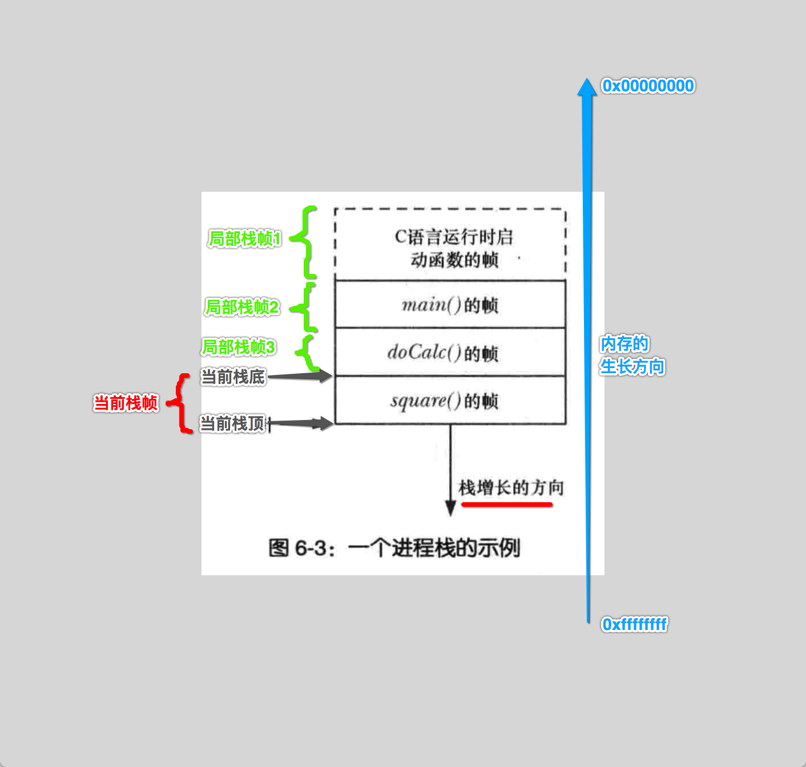
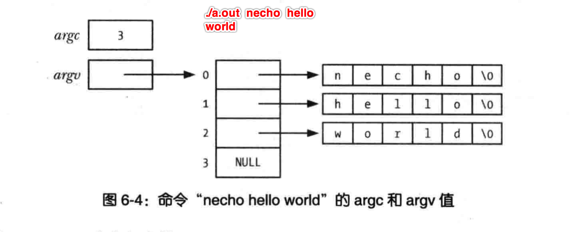

[TOC]


## 1、函数的 ==调用栈帧== (调用栈)

```c
int main()
{
  doCalc();
  square();
}
```

如上代码在运行时进程空间内的栈与栈帧结构图示



- 1、**栈** 的生长方向与 **物理地址** 的生长方向 **相反**
- 2、但是 栈 也 **不能无限向下扩展**
- 3、栈的 下面 紧接着这的空间，用作 **共享内存映射** 的
- **栈帧**会在函数执行完毕时，自动被清除掉栈帧内所有的局部内存


## 2、`int main(int argv, char* argr[])` 命令行参数



```c
#include <stdio.h>

int main(int argv, char* argr[])
{
  int i;
  for (i=0; i<argv; ++i)
    printf("argr[%d] = %s\n", i, argr[i]);
}
```

```
➜  main gcc main.c
➜  main ./a.out 1 2 3 324 2i3j 4oi2j3io
argr[0] = ./a.out
argr[1] = 1
argr[2] = 2
argr[3] = 3
argr[4] = 324
argr[5] = 2i3j
argr[6] = 4oi2j3io
➜  main
```


## 3、main() 栈帧 结构 

```c
#include <stdio.h>

int main(int argv, char* argr[])
{
  int i;
  for (i=0; i<argv; ++i)
    printf("argr[%d] = %s\n", i, argr[i]);
}
```

```shell
#########################################
###    程序执行时，默认的栈段初始化结构  		##
#########################################
#----------------------------------------
# env[M] <------ (N+1)*4+(M+1)*4        |
#............                           |
# env[1] <------ (N+1)*4+8(%esp)        |
# env[0] <------ (N+1)*4+4(%esp)        |
#----------------------------------------
# argv[N] <------ (N+1)*4(%esp)         |  栈的【数据结构】生长方向【向下】为【正】，
# .............                         |	 与【内存】的生长方向【相反】，
# argv[1] <------  8(%esp)              |	 不断的【压栈】，内存地址的【值】越来越【小】
# argv[0] <------  4(%esp)              |
#----------------------------------------
# argc    <------  (%esp)              \|/
#---------------------------------------|
```

- 1、栈的 **最底部**，存放的是 **环境变量** 数组（元素为 **内存地址**）
- **2、往上一部分** 存放的是**./a.out 1 2 3 4 56 hello** 执行程序时传入的 **命令行参数** 数组（元素为 **内存地址**）
- 3、**栈顶** 存放的是命令行参数 **总个数值 argv**