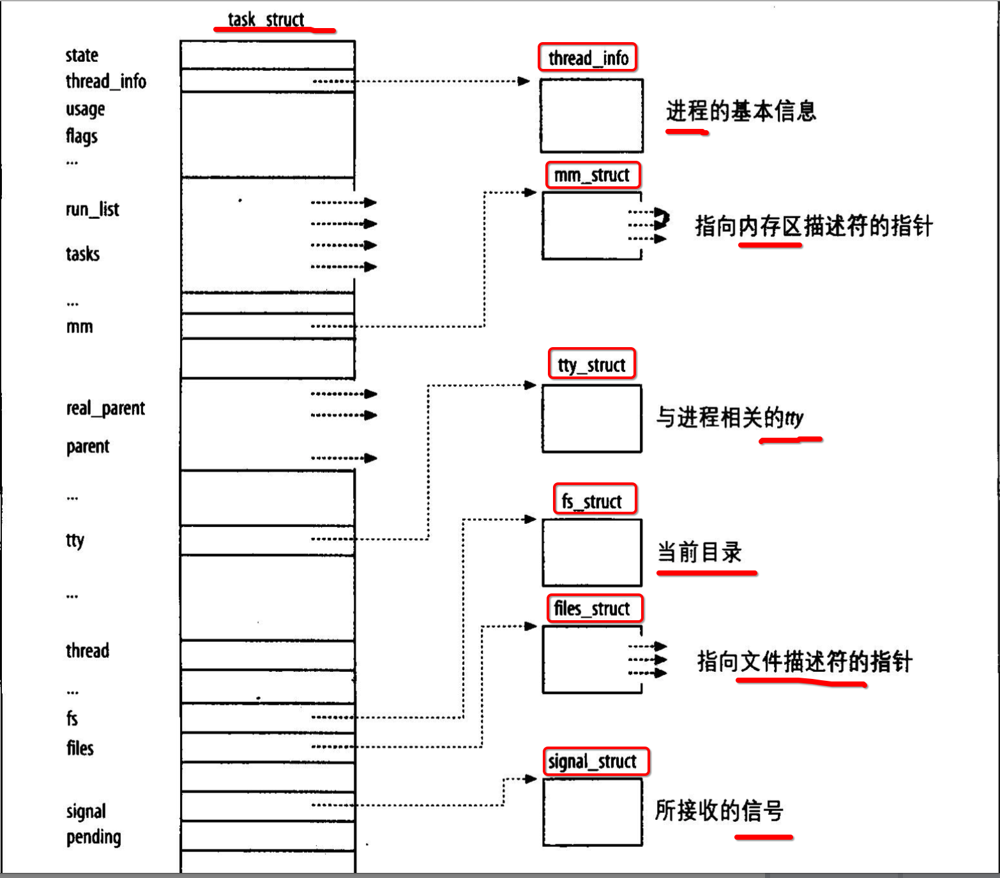
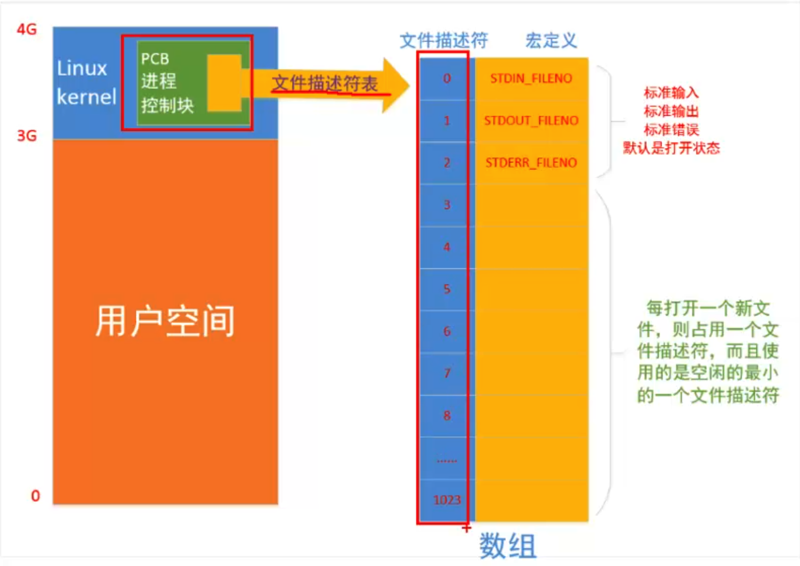

[TOC]


## 1、`task_struct` 描述一个进程

首先查看定义`task_struct`结构体的文件

```
->  grep -r "task_struct {" /usr/src/
/usr/src/linux-headers-4.4.0-21/include/linux/sched.h:struct task_struct {
```

然后打开找到的定义结构体的文件`sched.h`

```
vim /usr/src/linux-headers-4.4.0-21/include/linux/sched.h
```

底行模式输入`:set nu`显示行号。

然后查找 `task_struct {` 的所在行

```
/task_struct {
```

输入`$`定位到`/task_struct {`最右侧的`{`左大括号，然后底行模式输入`%`，定位到对应的`}`。

这个结构的定义起始行是1380，结束行是1826，一个结构体就有500+行。


## 2、`task_struct` 主要描述什么？



- 1、进程的基本信息
  - 1) 进程id => **pid_t**
  - 2) 进程的状态（就绪、运行、挂起、停止等状态）
  - 3) 进程的优先级
  - 4) **umask** => 所以对于每一个不同的进程，umask可以是不同的
- 2、分配到的地址空间
- 3、联系的tty终端
- 4、当前的工作目录
- 5、打开了哪些文件
- 6、接收哪一些信号


## 3、进程的状态

| 状态                   | 中文解释             | 具体状态                                                     |
| :--------------------- | :------------------- | :----------------------------------------------------------- |
| `TASK_RUNNING`         | 可运行态             | 进程要么在CPU执行，要么正等待CPU分配时间执行                 |
| `TASK_INTERRUPTIBLE`   | 可中断的 等待 状态   | 进程当前处于`挂起（睡眠）`。`(1)`可以产生一个硬件中断，来通知进程释放正在等待的资源。`(2)`或者接受到信号而被唤醒。唤醒后进程的状态重新变为`TASK_RUNNING` |
| `TASK_UNINTERRUPTIBLE` | 不可中断的 等待 状态 | 与`TASK_INTERRUPTIBLE`不同的是，这个进程会`一直等待`资源，如果没有资源则`一直等待阻塞`不往下执行。比如：扫描硬件驱动程序时，则不会因外界中断而被打断执行，否则无法得知硬件设备是否能正常工作 |
| `TASK_STOPPED`         | 暂停状态             | 当进程接收到`SIGSTOP、SIGTSTP、SIGTTIN、SIGTTOU`都会进入暂停状态 |
| `__TASK_TRACED`        | 跟踪状态             | 进程被 `debugger` 程序进程暂停。当一个进程被另外一个进程`监控 ptrace()`时，任何信号都可以让被监控的进程进入`__TASK_TRACED`状态 |
| `EXIT_ZOMBIE`          | 僵尸状态             | 进程已经`执行结束`，但是没有被`父进程`执行`wait()`或`waitpid()`对其进程回收分配的`pcb`资源，导致占用的资源没有被释放 |
| `EXIT_DEAD`            | 僵尸`撤销`状态       | 进程执行结束，且已经被父进程执行了`wait()/waitpid()`回收了`pcb`。但是为了防止其他的线程，仍然在`父进程`上继续执行`wait()/waitpid()` |


## 4、`file_struct` 记录 当前进程 ==所有== 打开的 ==文件fd数组==



并不是直接根据`文件名`操作文件，而是给每一个文件分配一个唯一的`int值`作为其代号。

而且每一个进程，默认都会打开三个文件：

- (1) `STDIN_FILENO = 0` 标准输入文件
- (2) `STDOUT_FILENO = 1` 标准输出文件
- (3) `STDERR_FILENO = 2` 错误输出文件