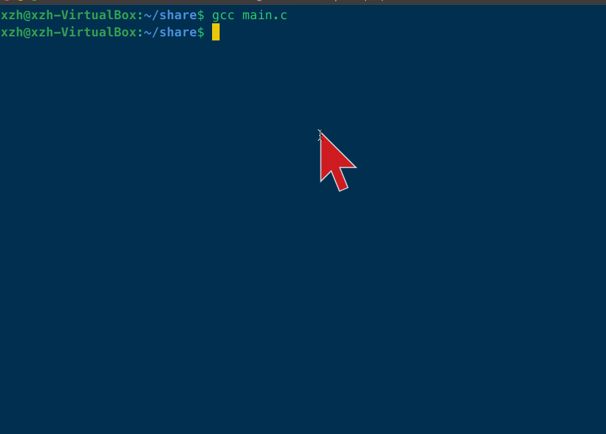
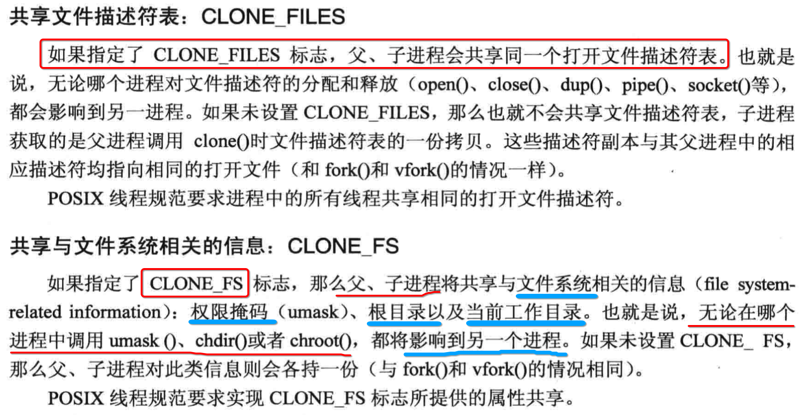
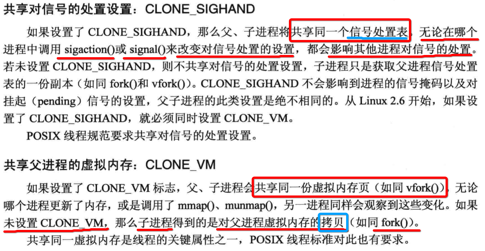
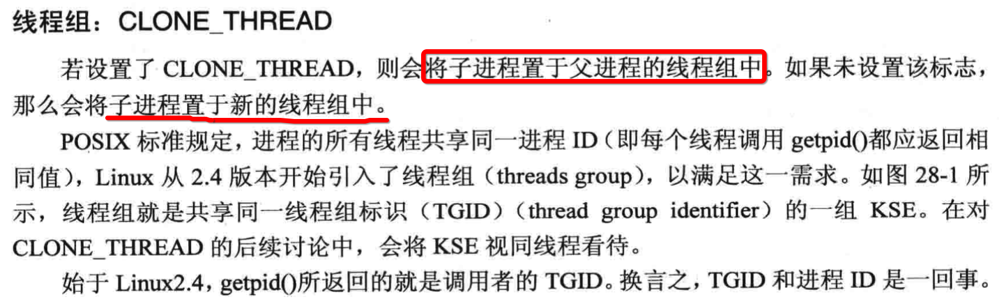
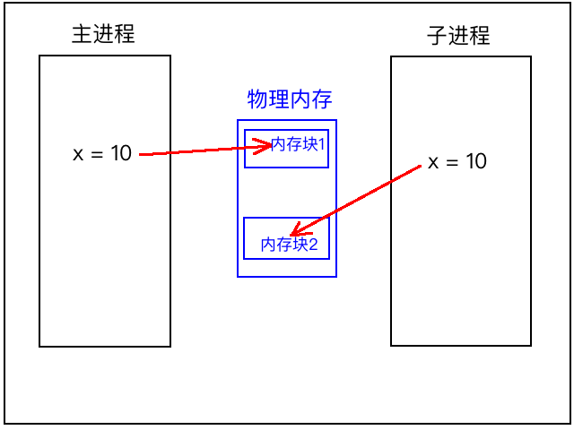

[TOC]


## 1、fork() 创建 子进程

### 1. 函数 api

```c
#include <unistd.h>

/**
 * - 返回值一、returns a value of `0` to the `child process`
 * - 返回值二、returns the `process ID of the child process` to the `parent process`
 * - 返回值三、a value of `-1` is returned to the `parent process`, `no child process is created`，and the global variable errno is set to indicate the error
*/
pid_t fork(void);
```

### 2. 创建具有 ==父子== 关系的 进程

- (1) 子进程的数据全部从主进程上 **复制**
- (2) fork() 函数 **调用一次**，但是会 **回调2次**

### 3. fork() ==返回值== 存在 ==三种== 情况

- 1) `返回值 > 0` => 流程处于 `主进程` => 返回值为 `子进程 pid`
- 2) `返回值 == 0` => 流程处于 `子进程`
- 3) `返回值 < 0` => 创建子进程 `失败`


## 2、fork() 会 ==回调2次==

### 1. 需要区分 ==当前进程== 或 ==子进程== 回调

- (1) 第一次是在`主进程`上，告诉`主进程`创建出来的`子进程的pid`
- (2) 第二次是在`子进程`上，开始执行`子进程`路径

### 2. if - elseif - else

```c
#include <stdio.h>
#include <stdlib.h>
#include <unistd.h>
#include <sys/types.h>

int main()
{
  // 1. 
  pid_t pid = fork();
  
  /**
    下面的代码，【当前进程】与【子进程】同时执行,
    所以需要进行区分
   */

  // 2. 区分是【主进程】or【子进程】回调
  if (pid == 0)
  {
    printf("%s\n", "子进程回调");
  }
  else if (pid > 0)
  {
    printf("%s\n", "主进程回调");  
  }
  else
  {
    perror("fork创建进程失败: ");
  }
    
  // 3. 父子进程都会执行的代码
  printf("-------- finish ----------\n");
}
```

```
➜  ipc gcc main.c
➜  ipc ./a.out
主进程回调
-------- finish ----------
子进程回调
-------- finish ----------
➜  ipc
```

### 3. switch - case

```c
#include <stdio.h>
#include <stdlib.h>
#include <unistd.h>
#include <sys/types.h>

int main() 
{
  // 1. 
  pid_t pid = fork();

  // 2. 区分是【主进程】的回调 or 【子进程】的回调
  switch(pid)
  {
    case 0:
      printf("%s\n", "子进程回调");
      break;
    case -1:
      perror("fork创建进程失败: ");
      break; 
    default:
      printf("%s\n", "主进程回调");  
      break;
  }
    
  //3. 父子进程都会执行的代码
  printf("-------- finish ----------\n");
}
```

```
➜  ipc gcc main.c
➜  ipc ./a.out
主进程回调
-------- finish ----------
子进程回调
-------- finish ----------
➜  ipc
```


## 3、fork() 循环 创建 ==n个进程==

### 1.  ==错误== 写法

```c
#include <stdio.h>
#include <stdlib.h>
#include <unistd.h>
#include <sys/types.h>

int main(int argc, const char * argv[])
{
  // 循环创建5个子进程
  for (int i = 0; i < 5; ++i)
  {
    // 创建子进程，如下代码【父进程】与【子进程】都会回调
    pid_t pid = fork();

    // 区别fork()的三种回调情况
    switch(pid)
    {
      case 0: { // pid=0 ==> 子进程回调
        printf("子进程：%d\n", getpid());
      }
        break;
      case -1: { // pid=-1 ==> fork()函数执行错误
        perror("fork() error：");
      }
        break;
      default: { // pid>0 ==> 父进程回调
        continue; // 开始下一次for()
      }
        break;
    }
  }
}
```



程序 **无限创建** 子进程。

### 2. 原因

- 1、创建出来的 **子进程** 又会继续 **执行 for 循环**
- 2、同样也去创建子进程自己的子进程了

### 3. 正确写法1, 但是 ==没有回收子进程==

```c
#include <stdio.h>
#include <stdlib.h>
#include <unistd.h>
#include <sys/types.h>
#include <sys/wait.h>

int main(int argc, const char * argv[])
{
  int ret;
  char buff[1024] = {0};
  pid_t pid;

  // 1. 循环创建n个子进程
  int i;
  for (i=0; i<5; i++)
  {
    // 创建子进程，如下代码【父进程】与【子进程】都会回调
    pid = fork();

    // 区分【主进程回调、子进程回调、fork()出错】三种情况
    if (0 == pid)
    {
      /**
       【重点1】在【子进程】结束 for(;;)
       */
      break;
    }
    else if (-1 == pid) 
    {
      perror("fork() error：");
    }
    else 
    {
      /**
       【重点2】在【父进程】继续执行 for(;;)
       */
      continue;
    }
  }

  // 2. 【子进程】回调时，循环因子i一定是【小于】总循环次数5
  if (i < 5)
  {
    printf("child [%d] working...\n", getpid());
  }

  // 3.【主进程】回调时，循环因子i一定是【等于】总循环次数5
  if (i == 5)
  {
    printf("parent [%d] working...\n", getpid());
    while(1){} // 卡住主进程
  }
}
```

```
➜  ipc gcc fork.c
➜  ipc ./a.out
parent [4367] working...
child [4372] working...
child [4371] working...
child [4370] working...
child [4369] working...
child [4368] working...
^C
➜  ipc
```

### 4. 正确写法2, 仍然 ==没有回收子进程==

```c
#include <stdio.h>
#include <stdlib.h>
#include <unistd.h>
#include <sys/types.h>
#include <sys/wait.h>

int main(int argc, const char * argv[])
{
  int ret;
  char buff[1024] = {0};
  pid_t pid;

  // 1. 循环创建n个子进程
  int i;
  for (i=0; i<5; i++)
  {
    pid = fork();
    switch(pid)
    {
      case 0: { 
        /**
         【重点1】在【子进程】回调，结束 for 循环
         */
        goto child_process_created;
      }
      case -1: { 
        perror("fork() error：");
      }
        break;
      default: { 
        /**
         【重点2】在【父进程】继续执行 for(;;)
         */
        continue;
      }
        break;
    }
  }

  // 2.【主进程】回调时，循环因子i一定是【等于】总循环次数5
  if (i == 5)
  {
    printf("parent [%d] working...\n", getpid());
    while(1){}
  }

  /**
   *  3. 能执行到此，说明是【子进程】回调
   */
child_process_created:
  if (i < 5)
  {
    printf("子进程[%d] working...\n", getpid());
  }
}
```


```
➜  ipc gcc fork.c
➜  ipc ./a.out
parent [4418] working...
子进程[4423] working...
子进程[4422] working...
子进程[4421] working...
子进程[4420] working...
子进程[4419] working...
^C
➜  ipc
```

### 5. 关键

- 1、**子进程** 回调时, **break** 结束 for(;;) 循环
- 2、**父进程** 回调时, **继续执行** for(;;) 循环

### 6. 如上代码仍然还是有问题

- 1、创建的 **所有子进程**，都没有对其 **回收释放**
- 2、**主进程** 还没有等到 **子进程** 执行完毕，就已经死掉了
- 3、所以 a.out 所在的进程结束时，仍然还有 **子进程 输出信息**

### 7. 不断的回收创建的子进程

[点击我](/Users/xiongzenghui/Desktop/daydayup/linux_02/03/04/README.md)


## 4、 fork() 底层调用 ==clone()==

### 1. clone() 

```c
/* Prototype for the glibc wrapper function */

#include <sched.h>

int 
clone(
  int (*fn)(void *), 
  void *child_stack,
  int flags, 
  void *arg, .../* pid_t *ptid, struct user_desc *tls, pid_t *ctid */ 
);

/* Prototype for the raw system call */
long 
clone(
  unsigned long flags, 
  void *child_stack,
  void *ptid, 
  void *ctid,
  struct pt_regs *regs
);
```

### 2. clone()  flags形参选项







### 3. clone() 创建子进程, ==共享 父进程 fd 数组==

- 父进程 **open("/dev/null", O_RDWR);** 打开黑洞文件
- 父进程使用 clonse() 创建子进程，指定子进程函数体，并将打开的 **黑洞文件 fd** 传递过去
- 子进程对传过来的fd执行close()关闭
- 父进程再向黑洞文件中写入数据
- 因为子进程已经close()关闭了黑洞文件，所以父进程此时写入会报错

```c
#define _GNU_SOURCE
#include <stdio.h>
#include <stdlib.h>
#include <sys/types.h>
#include <sys/wait.h>
#include <sys/stat.h>
#include <unistd.h>
#include <fcntl.h>
#include <signal.h>
#include <errno.h>
#include <sched.h>

static int
child_func(void* arg)
{	
  // 取出父进程传入的参数
  int fd = *((int*)arg);

  // 关闭传入的文件fd
  if (close(fd))
  {
    printf("close(%d) success\n", fd);
    exit(1);
  }
  return 0;
}

int main()
{
  char* sp;
  char* stack;
  int fd, ret, flags, len;
  const int STACK_SIZE = 8 * 1024; // 指定创建的栈大小

  //1. 打开黑洞文件
  fd = open("/dev/null", O_RDWR);

  //2. 让子进程共享父进程的文件描述符列表
  flags = CLONE_FILES;

  //3. 在堆区分配一块内存，作为栈数据结构使用的空间
  stack = (char*)malloc(sizeof(char) * STACK_SIZE);// 堆区分配内存, 内存地址是从小到大
  
  //4. 栈从大到下, 方向与堆区申请内存地址方向相反，所以栈顶在【最大】的地方
  sp = stack + STACK_SIZE; 

  //5. 注册捕捉子进程状态改变信号，并执行默认处理
  signal(SIGCHLD, SIG_IGN);

  //6. clone() 创建子进程
  ret = clone(
    child_func,     // 调用child_func()作为子进程的入口函数 
    sp,             // 构建的栈结构起始内存地址
    flags|SIGCHLD,  // 设置让子进程共享父进程的文件描述符列表
    (void*)&fd      // 将打开的【黑洞文件fd】通过【地址传递】的方式作为child_func()的参数
  );
  if (-1 == ret)
  {
    perror("clone() error: ");
    exit(-1);
  }

  //7.【父进程】等待子进程执行完毕并回收掉子进程，然后再往下走
  waitpid(
    -1, 
    (void*)0, 
    WUNTRACED
  ); // waitpid()返回时，子进程已经执行结束

  //8.【父进程】向黑洞文件写入数据
  len = write(fd, "abc", 3);
  if (-1 == len && errno == EBADF) // 写入失败#文件已经被关闭
    printf("fd=%d has closed\n", fd);
  else if (-1 == len) // 其他的各种写入失败
    printf("fd=%d write failed\n", fd);
  else // 写入成功
    printf("fd=%d write successed\n", fd);
}
```

```
➜  ipc gcc main.c
➜  ipc ./a.out
fd=3 has closed
➜  ipc
```


## 5、pid、ppid、pgid

| 函数名    | 返回值的含义             |
| --------- | ------------------------ |
| getpid()  | 获取 **当前** 进程 的 id |
| getppid() | 获取 **父** 进程 的 id   |
| getpgid() | 获取 **进程组** 的 id    |


```c
#include <stdio.h>
#include <stdlib.h>
#include <unistd.h>
#include <sys/types.h>

int main(int argc, const char * argv[]) 
{

  //1. 循环创建子进程
  int i;
  for (i = 0; i < 5; ++i)
  {
    //1.1 创建子进程
    int pid = fork();
    
    //1.2
    if (pid == 0) //1.3 回调子进程
    {
      break;
    }
    else if (pid < 0)
    {
      perror("fork() error：");
    }
  }

  //2. 
  if (i < 5)
  {
    printf("【子进程】pid = %d, ppid = %d, pgig = %d\n", getpid(), getppid(), getpgid(getpid()));
  } 
  else 
  {
    printf("【主进程】pid = %d, ppid = %d, pgig = %d\n", getpid(), getppid(), getpgid(getpid()));
  }
}
```

```
【子进程】pid = 2617, ppid = 2616, pgig = 2616
【子进程】pid = 2618, ppid = 2616, pgig = 2616
【子进程】pid = 2619, ppid = 2616, pgig = 2616
【子进程】pid = 2620, ppid = 2616, pgig = 2616
【主进程】pid = 2616, ppid = 1739, pgig = 2616
【子进程】pid = 2621, ppid = 1, pgig = 2616
```

可以看到:

- 1、主进程 的 `pid == 2616`
- 2、主进程 的 `pgid == 2616` （进程组id就是当前进程id）

- 3、其他 5个子进程
  - 1) ppid == 2616
  - 2) pgid == 2616

也就说从主进程创建出来的 **所有子进程**，都从属于 **父进程号的组内**。


## 6、==局部变量== 进程之间 ==独立==

```c
#include <stdio.h>
#include <stdlib.h>
#include <unistd.h>
#include <sys/types.h>

int main(void) 
{
  // 1. 栈上临时变量，并且是在 fork() 执行前定义分配内存
  int x = 10;

  // 2. 创建子进程
  pid_t pid = fork();

  // 3. 
  if (pid > 0)  // pid > 0，处于主进程
  {
    // 主进程修改x
    x += 2;
    printf("【主进程】x = %d\n", x);
  }   

  // 4. 
  if (pid == 0) // pid == 0，处于子进程
  {
    // 子进程也修改x
    x += 3;
    printf("【子进程】x = %d\n", x);
  }

  // 5. pid < 0，fork()创建子进程失败
  if (pid < 0)
  {
    perror("fork");
  }
}
```

```
➜  ipc ./a.out
【主进程】x = 12
【子进程】x = 13
➜  ipc
```

- 1、执行 fork() 之后，`子进程` 空间内的 `变量x = 10`
- 2、`子进程` 回调时，执行 `10 + 3` => 13
- 3、`父进程` 回调时，执行 `10 + 2` => 12


## 7、==全局变量== 进程之间 ==独立==

- 1、每一个进程运行后，分配到的都是【不同】的进程虚拟空间
- 2、【不同】的进程虚拟空间，不能直接数据共享

```c
#include <stdio.h>
#include <stdlib.h>
#include <unistd.h>
#include <sys/types.h>

// 全局变量
int x = 10;

int main(int argc, const char * argv[]) 
{
  // 1. 创建子进程
  pid_t pid = fork();

  // 2.  
  if (pid > 0)  // pid > 0，处于【主进程】
  {
    // 【主进程】修改 x = x + 2
    x += 2;
    printf("【主进程】x = %d\n", x);
  }   

  // 3. 
  if (pid == 0) // pid == 0，处于【子进程】
  {
    // 【子进程】也修改 x = x + 3
    x += 3;
    printf("【子进程】x = %d\n", x);
  }

  // 4. pid < 0，fork()创建子进程【失败】
  if (pid < 0)
  {
    perror("fork");
  }
}
```

```
➜  ipc ./a.out
【主进程】x = 12
【子进程】x = 13
➜  ipc
```

每一个进程的堆栈都是独立的0到4G内存中，最终映射到不同的**物理内存块**中



如果子进程只是`读取`主进程的数据进行逻辑处理，并没有对主进程的段数据进行`写`，那么linux系统不会给子进程`创建`出一个4G虚拟内存，而是让子进程共享主进程的`物理内存`。

而如果linux检测子进程代码中有对主进程之前的数据存在`写`操作，立马给子进程创建4G的虚拟内存，并将主进程的4G数据复制进去。


## 8、杀死 ==进程组== 内的 所有进程

### 1. shell 命令

```
->	kill -9 -2616
```

- 在进程组号`2616 `前面加上一个`-`，表示杀死 **进程组内** 的全部进程
- 还可以通过捕捉 **signal 信号**，来对所有的子进程进行回收

### 2. kill() 函数

```c
#include <sys/types.h>
#include <signal.h>

int kill(pid_t pid, int sig);
```

