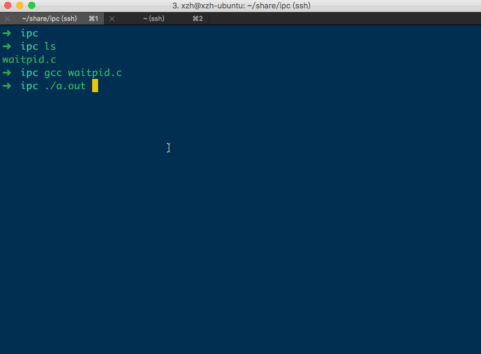
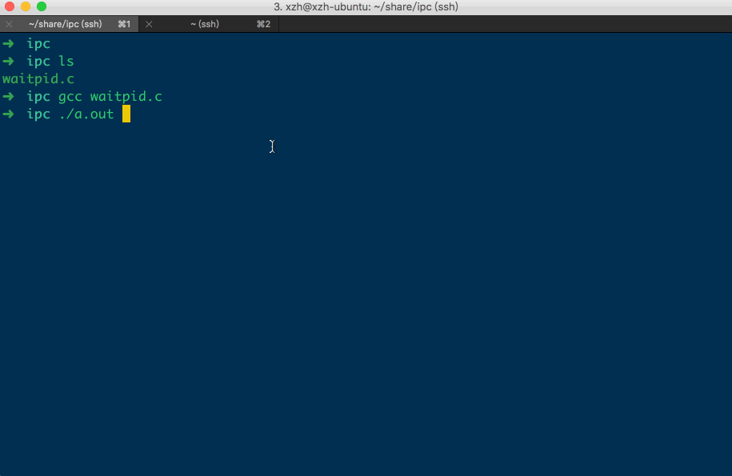
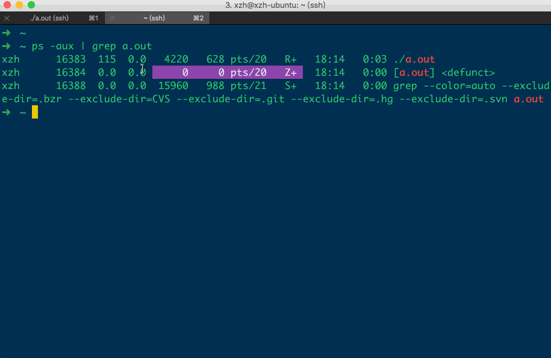
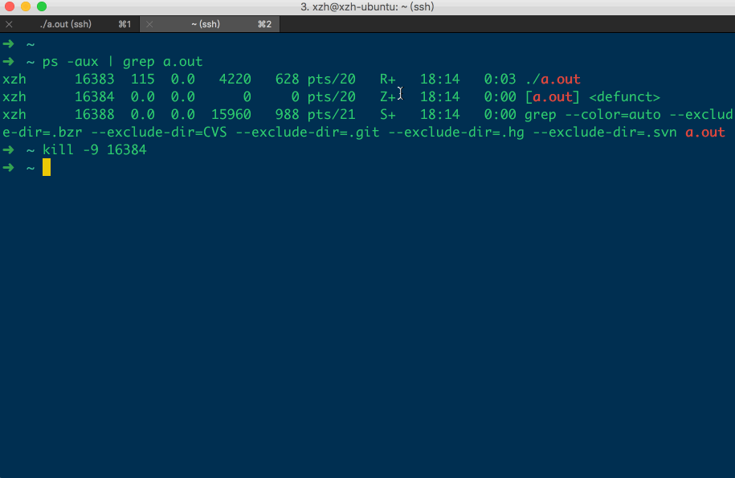

[TOC]


## 1、【孤儿】进程

### 1. 定义

- 当前进程的 **父进程已死**，但是自己还活着
- 这种情况下，当前进程的父进程，会由操作系统替换为 **init 进程**
- 此后由 **init进程** 完成 wait() 回收

### 2. 示例

```c
#include <stdlib.h>
#include <stdio.h>
#include <unistd.h>

int main()
{
  pid_t pid;
  pid = fork();

  switch(pid)
  {
    case 0: {
      /**
       * 子进程回调，死循环卡住子进程一直运行
       */
      for(;;)
      {
        printf("子进程id = %d, 父进程id = %d\n", getpid(), getppid());
        sleep(1);
      }
    }
      break;
    case -1:
      perror("fork() error:");
      break;
    default: {
      /**
       * 主进程回调，休眠2秒后，结束运行
       */
      sleep(2); // 等待子进程进入for(;;)先打印出当前进程的id
      exit(1);	// 结束掉主进程
    }
  }
}
```



- 1、当 **子进程** 的父亲进程死亡之后，该 **子进程** 的 **父进程** 会由内核调整为 **init** 进程
- 2、当孤儿进程被停止后，由 **init** 进程 回收 PCB资源

### 3. 结论

【孤儿】进程，能够【正常回收PCB资源】


## 2、【僵尸】进程

### 1. 定义

- 1、僵尸进程:
  - 1) 以及处于 **停止（结束）** 运行的进程
  - 2) 但是在结束的时候 **没有执行 wait()、waitpid()** 回收占用的 PCB 等内核资源
  - 3) 其占用的 PCB 内核资源，一直保留在系统内核空间中不会被释放

- 2、僵尸进程是已经 **停止** 运行的，是 **不能被 kill** 命令杀掉的
- 3、因为 **kill** 命令， 只能用来杀掉 **正在运行** 的进程
- 4、可以通过 **kill 僵尸进程的父进程** 

### 2. 示例 

```c
#define _GNU_SOURCE
#include <stdio.h>
#include <string.h>
#include <unistd.h>

int main()
{
  int fd;
    
  // 创建子进程
  fd = fork();
    
    
  if (0 == fd)
  {
    /**
     * 子进程回调
     */
    printf("子进程id = %d, 父进程id = %d\n", getpid(), getppid());
    sleep(1);

    /**
     * 子进程先退出，不对其 wait()/waitpid() 则变为 `僵尸进程`
     */
  }
  else
  {
    /**
     * 父进程回调，死循环卡住
     */
    for(;;) {}
  }
}
```



**Z+** 的子进程就是 **僵尸进程**。

### 3. 错误: `kill -9 僵尸进程`



### 4. 正确: 杀死僵尸进程的步骤

- 1、kill -9 `僵尸进程's 父进程` => **僵尸**进程 变为 **孤儿**进程
- 2、**孤儿进程** 会被内核调整为 **init 进程** 的子进程
- 3、最终由 **init 进程** 对其完成 wait() 回收




### 5. 捕捉 ==SIGCHILD== 信号, 回收 僵尸进程 

```c
#include <stdio.h>
#include <errno.h>
#include <stdlib.h>
#include <unistd.h>
#include <signal.h>
#include <sys/types.h>
#include <sys/wait.h>

// SIGCHILD 信号处理函数
static void sig_child(int signo)
{
  pid_t pid;
  int stat;

  // 回收所有的进程（包括：僵尸进程）
  while ((pid = waitpid(-1, &stat, WNOHANG)) >0)
    printf("child %d terminated.\n", pid);
}

int main()
{
  pid_t pid;

  // 捕捉子进程状态改变的信号
  signal(SIGCHLD,sig_child);

  // 创建子进程
  pid = fork();
  if (pid < 0)
  {
    perror("fork error:");
    exit(1);
  }
  else if (pid == 0)
  {
    printf("I am child process,pid id %d.I am exiting.\n",getpid());
    exit(0); // 直接 退出子进程, 但不 wait 回收 子进程
  }
    
  // 父进程先执行打印
  printf("I am father process.I will sleep two seconds\n");

  // 父进程等待子进程先退出，不对其wait()/waitpid()则变为僵尸进程
  sleep(2);

  // 输出进程信息
  system("ps -aux | grep a.out");
  printf("father process is exiting.\n");
}
```

```
➜  ipc gcc waitpid.c
➜  ipc ./a.out
I am father process.I will sleep two seconds
I am child process,pid id 16547.I am exiting.
child 16547 terminated.
xzh      16546  0.0  0.0   4352   724 pts/2    S+   18:23   0:00 ./a.out
xzh      16548  0.0  0.0   4504   700 pts/2    S+   18:23   0:00 sh -c ps -aux | grep a.out
xzh      16550  0.0  0.0  15960   972 pts/2    S+   18:23   0:00 grep a.out
father process is exiting.
➜  ipc
```

并没有 **Z+** 僵尸进程。