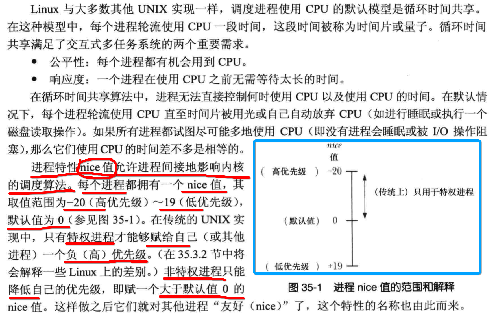
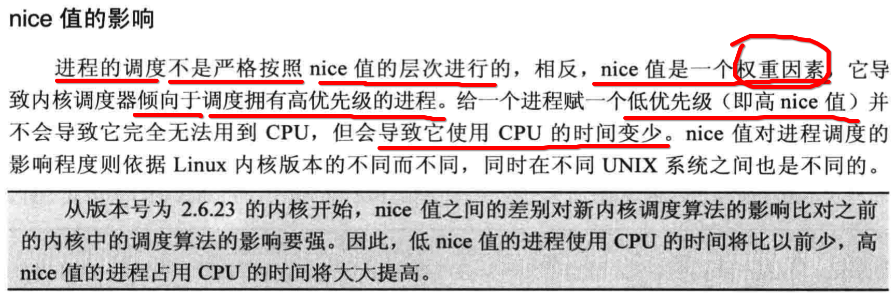
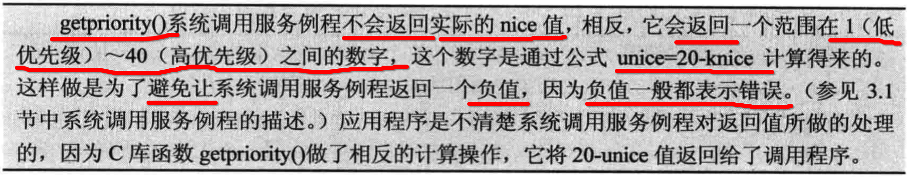
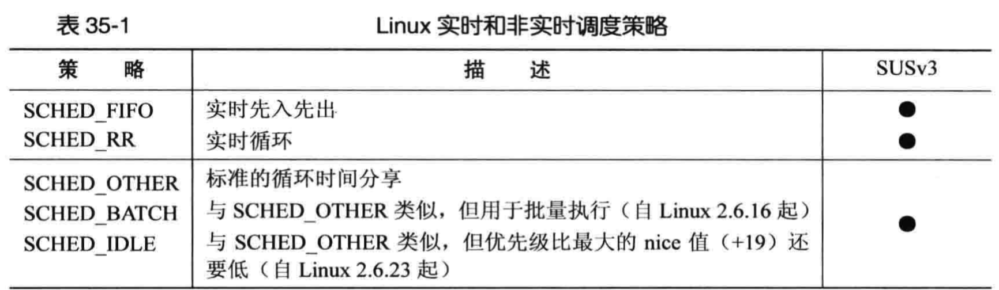
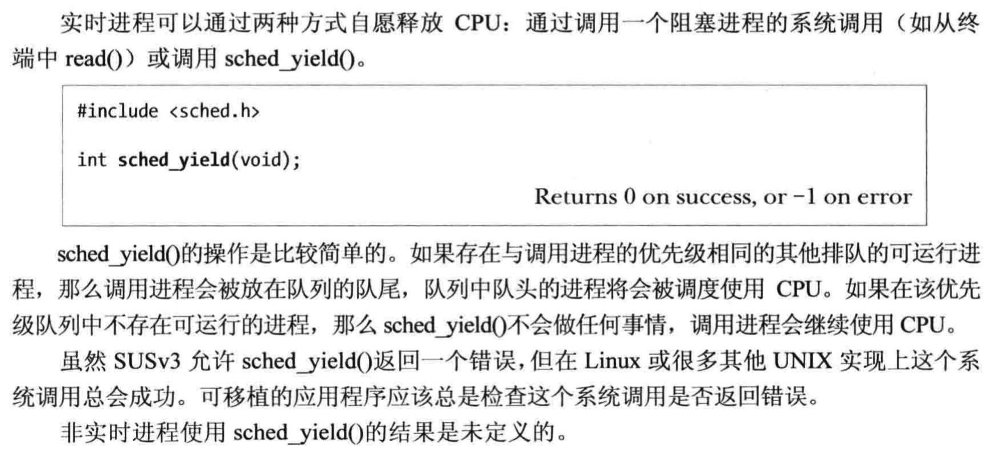

[TOC]


## 1、进程的 nice 值

### 1. nice  值



### 2. nice 值的影响



### 3. ==读写== 进程 nice 值

```c
#include <sys/time.h>
#include <sys/resource.h>

int 
getpriority(
  int which, 
  id_t who
);

int 
setpriority(
  int which, 
  id_t who, 
  int prio
);
```




## 2、 ==修改== 进程 调度策略、优先级

```c
#include <sched.h>

int 
sched_setscheduler(
  pid_t pid, 
  /** 
   * @pram policy
   * 1) SCHED_RR 
   * 2) SCHED_FIFO 
   * 3) SCHED_BATCH 
   * 4) SCHED_IDLE 
   */
  int policy, 
  const struct sched_param *param
);

int 
sched_setparam(
  pid_t pid, 
  const struct sched_param *param
);
```



```c
int 
sched_getscheduler(pid_t pid);

int 
sched_getparam(
  pid_t pid, 
  struct sched_param *param
);
```

```c
struct sched_param {
   ...
   int sched_priority;
   ...
};
```


## 3、进程  时时 释放 CPU




## 4、获取 SCHED_RR 时时循环进程的时间片

```c
#include <sched.h>

int 
sched_rr_get_interval(
  pid_t pid, 
  struct timespec * tp
);

struct timespec {
   time_t tv_sec;    /* seconds */
   long   tv_nsec;   /* nanoseconds */
};
```


## 5、RLIMIT 进程 各种资源的 ==最大限制==

### 1. 函数原型

```c
#include <sys/time.h>
#include <sys/resource.h>

// 获取
int 
getrlimit(
  int resource, 
  struct rlimit *rlim
);

// 设置
int 
setrlimit(
  int resource, 
  const struct rlimit *rlim
);

// 辅助结构体
struct rlimit {
   rlim_t rlim_cur;  /* Soft limit */
   rlim_t rlim_max;  /* Hard limit (ceiling for rlim_cur) */
};
```

### 2. 可以读写的KEY

 

### 3. 读取进程的各种资源限制值

```c
#define _GNU_SOURCE
#include <stdlib.h>
#include <stdio.h>
#include <string.h>
#include <unistd.h>
#include <sys/time.h>
#include <sys/resource.h>

static int
print_resource(int resource)
{
	struct rlimit rl;

	//1.
	if (-1 == getrlimit(resource, &rl))
		return -1;

	//2.
	printf("soft limit:\n");
	if (rl.rlim_cur == RLIM_INFINITY)
		printf("=> infinity\n");
#ifdef RLIM_SAVED_CUR
	else if (rl.rlim_cur == RLIM_SAVED_CUR)
		printf("=> unimplemenation\n");
#endif
	else
		printf("=> %lld\n", (long long)rl.rlim_cur);

	//3.
	printf("hard limit:\n");
	if (rl.rlim_max == RLIM_INFINITY)
		printf("=> infinity\n");
#ifdef RLIM_SAVED_CUR
	else if (rl.rlim_max == RLIM_SAVED_CUR)
		printf("=> unimplemenation\n");
#endif
	else
		printf("=> %lld\n", (long long)rl.rlim_max);

	return 0;
}

int main()
{
//	print_resource(RLIMIT_AS);
//	print_resource(RLIMIT_FSIZE);
//	print_resource(RLIMIT_NICE);
//	print_resource(RLIMIT_STACK);
	print_resource(RLIMIT_DATA);
}
```

```
->  gcc main.c
->  ./a.out
soft limit:
=> infinity
hard limit:
=> infinity
->

```