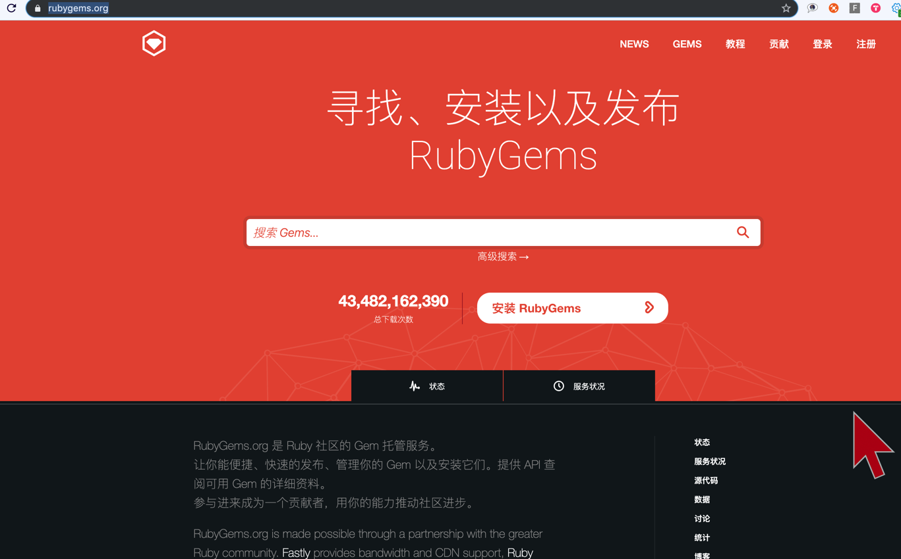

[TOC]

## 01. ruby

- ruby 是一个 **可执行文件** , 用于 **解释并执行** xx.rb 源文件的代码
- 因为 ruby 是使用 c 实现的，所以依赖了多的 C 库, 可以在 ruby 安装目录下发现很多的 动态库

## 02. rvm

- 用于管理一台机器上，同时存在 **多个不同版本** 的 ruby 可执行文件
- 比如可能你的机器上会同时存在
  - 1) 系统默认安装的 ruby (版本通常是 1.9.X)
  - 2) 可能你通过 brew 自己安装的 ruby
  - 3) 可能你通过 rbenv/evm 自己安装的 ruby
- 总之 rvm 就是用来 **切换** 到某一个你想使用的 **版本** 的 ruby

## 03. rubygems

- rubygems 其实就是 https://rubygems.org/ 站点，就是 ruby 官方自己的服务器

  

- 所有能通过 **gem install xxx** 方式安装的 ruby 软件包, 都会发布到这个服务器

- 有点类似于其他操作系统中的 **安装包管理器** 工具, 对应的 **后台服务器**

  - Ubuntu 的 **apt-get**
  - RedHat 的 **rpm**
  - Centos 的 **yum**
  - Python 的 **pip**

- 所以当你执行 **gem install xxx** 和 **bundle install** 在默认情况下, 都是从 **rubygems.org** 

  - 1) 查找 **xx.gemspec**
  - 2) 继而从 **xx.gemspec** 找到 **下载地址** 
  - 3) 进行下载、安装
  - 4) 以及递归下载、安装 **依赖** 其他的 gem 应用

## 04. gem install

- `gem install <gem名字>`  安装 **单个** ruby 软件包
- macosx 默认都自带 ruby、gem

## 05. bundle install

- 那么 `bundle install` 相反, 就是 **批量** 安装多个 ruby 软件包
- 在配置文件 **Gemfilel** 里说明你的应用 **依赖哪些第三方包** , 类似于 **Podfile**
- 然后执行 **bundle install** , 类似于执行 **pod install**

## 06. homebew

- 是 **Mac OSX** 上的 **软件包** 管理工具
- 能在 **Mac** 中方便的 **安装、卸载** 软件
- 可以说 **Homebrew** 就是 **mac** 下的 **apt-get、yum** 

## 07. Rake

- **Rake** 类似于 **gnu make** 构建工具，只不过是 **ruby** 版本
- **Rakefile** 类似于 **Makefile** 规则文件

## 08. Rails

- 全名 ruby on rails
- 一个 ruby 开发 web 应用程序的 **开源框架**

