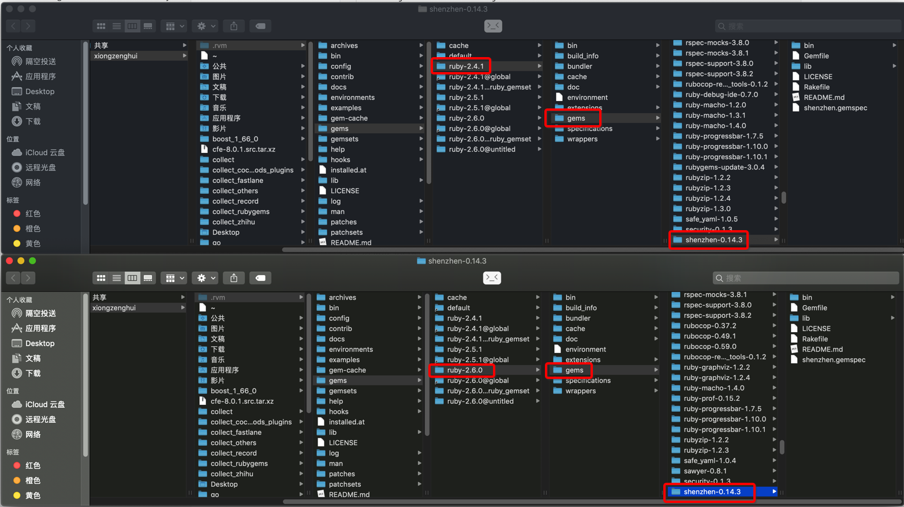

[TOC]


## 01. 我明明 gem install xx 安装了某个 ruby 软件包

```
╰─○ gem install shenzhen
Fetching json-1.8.6.gem
Fetching plist-3.1.0.gem
Fetching shenzhen-0.14.3.gem
Fetching net-ssh-5.2.0.gem
Fetching commander-4.4.7.gem
Fetching aws-sdk-1.67.0.gem
Fetching aws-sdk-v1-1.67.0.gem
Fetching net-sftp-2.1.2.gem
Successfully installed plist-3.1.0
Successfully installed net-ssh-5.2.0
Successfully installed net-sftp-2.1.2
Building native extensions. This could take a while...
Successfully installed json-1.8.6

................

Done installing documentation for plist, net-ssh, net-sftp, json, aws-sdk-v1, aws-sdk, commander, shenzhen after 7 seconds
8 gems installed
```

确定确实已经安装了 shenzhen (举例) 这个软件包了。


## 02. 但是 require 'shenzhen' 就是报错找不到

```ruby
require 'shenzhen'
puts 'hello'
```

执行上面的 ruby 文件就报错

```
╰─○ ruby main.rb
/Users/xiongzenghui/.rvm/rubies/ruby-2.4.1/lib/ruby/site_ruby/2.4.0/rubygems/core_ext/kernel_require.rb:54:in `require': cannot load such file -- shenzhen (LoadError)
	from /Users/xiongzenghui/.rvm/rubies/ruby-2.4.1/lib/ruby/site_ruby/2.4.0/rubygems/core_ext/kernel_require.rb:54:in `require'
	from main.rb:1:in `<main>'
```

提示无法找到 shenzhen.rb 这个文件, 但上面明明已经安装了, 这到底是为什么了？


## 03. 分析为啥找不到

上面报错中查找 shenzhen 的路径

```
/Users/xiongzenghui/.rvm/rubies/ruby-2.4.1/lib/ruby/site_ruby/2.4.0/rubygems/
```

那么肯定就是这个路径下没有 shenzhen 这个 lib.

这个路径下 **肯定没有** shenzhen 这个 lib：

- 因为这个路径是 **2.4.1** 这个版本对应的 **ruby 安装目录**
- 这个路径下只会存放与 ruby 相关的 **系统文件**
- 而 shenzhen 明显是 我们自己安装的 **第三方** 软件
- 所以根本就不应该往这个路径下查找


## 04. gem env 打印不同的 ruby, ==搜索 gem 包== 的路径

### 1. 如果我用 ruby-2.4.1 时, gem env

```
╰─○ ruby -v
ruby 2.4.1p111 (2017-03-22 revision 58053) [x86_64-darwin18]
```

```
╰─○ gem env
RubyGems Environment:
  - RUBYGEMS VERSION: 3.0.4
  - RUBY VERSION: 2.4.1 (2017-03-22 patchlevel 111) [x86_64-darwin18]
  - INSTALLATION DIRECTORY: /Users/xiongzenghui/.rvm/gems/ruby-2.4.1
  - USER INSTALLATION DIRECTORY: /Users/xiongzenghui/.gem/ruby/2.4.0
  - RUBY EXECUTABLE: /Users/xiongzenghui/.rvm/rubies/ruby-2.4.1/bin/ruby
  - GIT EXECUTABLE: /usr/bin/git
  - EXECUTABLE DIRECTORY: /Users/xiongzenghui/.rvm/gems/ruby-2.4.1/bin
  - SPEC CACHE DIRECTORY: /Users/xiongzenghui/.gem/specs
  - SYSTEM CONFIGURATION DIRECTORY: /Users/xiongzenghui/.rvm/rubies/ruby-2.4.1/etc
  - RUBYGEMS PLATFORMS:
    - ruby
    - x86_64-darwin-18
  - GEM PATHS:
     - /Users/xiongzenghui/.rvm/gems/ruby-2.4.1
     - /Users/xiongzenghui/.rvm/rubies/ruby-2.4.1/lib/ruby/gems/2.4.0
  - GEM CONFIGURATION:
     - :update_sources => true
     - :verbose => true
     - :backtrace => false
     - :bulk_threshold => 1000
     - :sources => ["https://rubygems.org/"]
  - REMOTE SOURCES:
     - https://rubygems.org/
  - SHELL PATH:
     - ...................
     - ...................
```

其中搜索第三方软件包的路径为

```
  - GEM PATHS:
     - /Users/xiongzenghui/.rvm/gems/ruby-2.4.1
```

### 2.  如果我用 ruby-2.4.1 时, gem env

```
╰─○ ruby -v
ruby 2.6.0p0 (2018-12-25 revision 66547) [x86_64-darwin18]
```

```
╰─○ gem env
RubyGems Environment:
  - RUBYGEMS VERSION: 3.0.1
  - RUBY VERSION: 2.6.0 (2018-12-25 patchlevel 0) [x86_64-darwin18]
  - INSTALLATION DIRECTORY: /Users/xiongzenghui/.rvm/gems/ruby-2.6.0
  - USER INSTALLATION DIRECTORY: /Users/xiongzenghui/.gem/ruby/2.6.0
  - RUBY EXECUTABLE: /Users/xiongzenghui/.rvm/rubies/ruby-2.6.0/bin/ruby
  - GIT EXECUTABLE: /usr/bin/git
  - EXECUTABLE DIRECTORY: /Users/xiongzenghui/.rvm/gems/ruby-2.6.0/bin
  - SPEC CACHE DIRECTORY: /Users/xiongzenghui/.gem/specs
  - SYSTEM CONFIGURATION DIRECTORY: /Users/xiongzenghui/.rvm/rubies/ruby-2.6.0/etc
  - RUBYGEMS PLATFORMS:
    - ruby
    - x86_64-darwin-18
  - GEM PATHS:
     - /Users/xiongzenghui/.rvm/gems/ruby-2.6.0
     - /Users/xiongzenghui/.rvm/rubies/ruby-2.6.0/lib/ruby/gems/2.6.0
  - GEM CONFIGURATION:
     - :update_sources => true
     - :verbose => true
     - :backtrace => false
     - :bulk_threshold => 1000
     - :sources => ["https://rubygems.org/"]
  - REMOTE SOURCES:
     - https://rubygems.org/
  - SHELL PATH:
  	...........................
```

其中搜索第三方软件包的路径为

```
  - GEM PATHS:
     - /Users/xiongzenghui/.rvm/gems/ruby-2.6.0
```

### 3. 结论

- 1) 如果你使用 2.4.1 版本的 ruby, 那么搜索 gem 软件包的路径

  ```
  /Users/xiongzenghui/.rvm/gems/ruby-2.4.1
  ```

- 2) 如果你使用 2.6.0 版本的 ruby, 那么搜索 gem 软件包的路径

  ```
  /Users/xiongzenghui/.rvm/gems/ruby-2.6.0
  ```


## 05. gem install 安装第三方软件与 ==当前使用 ruby 相关==

### 1. 如果我用 ruby-2.4.1 时, 安装 shenzhen 的路径

```
╰─○ ruby -v
ruby 2.4.1p111 (2017-03-22 revision 58053) [x86_64-darwin18]
```

gem install shenzhen

```
─○ gem install shenzhen
Fetching shenzhen-0.14.3.gem
Successfully installed shenzhen-0.14.3
Parsing documentation for shenzhen-0.14.3
Installing ri documentation for shenzhen-0.14.3
Done installing documentation for shenzhen after 0 seconds
1 gem installed
```

- 安装的是 shenzhen-0.14.3 

存储 shenzhen 的路径

```
/Users/xiongzenghui/.rvm/gems/ruby-2.4.1/gems/shenzhen-0.14.3
```

### 2. 如果我用 ruby-2.6.0 时, 安装 shenzhen 的路径

```
╰─○ ruby -v
ruby 2.6.0p0 (2018-12-25 revision 66547) [x86_64-darwin18]
```

gem install shenzhen

```
╰─○ gem install shenzhen
Fetching shenzhen-0.14.3.gem
Successfully installed shenzhen-0.14.3
Parsing documentation for shenzhen-0.14.3
Installing ri documentation for shenzhen-0.14.3
Done installing documentation for shenzhen after 0 seconds
1 gem installed
```

- 同样也是安装的是 shenzhen-0.14.3 

存储 shenzhen 的路径

```
/Users/xiongzenghui/.rvm/gems/ruby-2.6.0/gems/shenzhen-0.14.3
```

### 3. 对比2个路径



### 4. 经验

当你出现各种 require 找不到文件时, 你应该首先使用 `ruby -v` 和 `gem env` 查看自己的 ruby 是不是选择错了。


## 06. 在你机器上各种不同 ruby 环境差异

### 1. mac 系统自带的 ruby

#### 1. ruby 路径

```
╰─○ /usr/bin/ruby -v
ruby 2.3.7p456 (2018-03-28 revision 63024) [universal.x86_64-darwin18]
```

#### 2. GEM PATHS

```
╰─○ ll /usr/lib/ruby/gems/2.3.0/gems
total 0
drwxr-xr-x   4 root  wheel   128B  2 23  2019 CFPropertyList-2.2.8
drwxr-xr-x  11 root  wheel   352B  2 23  2019 libxml-ruby-2.9.0
drwxr-xr-x  19 root  wheel   608B  2 23  2019 nokogiri-1.5.6
drwxr-xr-x  15 root  wheel   480B  2 23  2019 sqlite3-1.3.11
```


### 2. brew install ruby 自己安装的 ruby

#### 1. ruby 路径

```
╰─○ /usr/local/Cellar/ruby/2.6.2/bin/ruby -v
ruby 2.6.2p47 (2019-03-13 revision 67232) [x86_64-darwin18]
```

#### 2. GEM PATHS

```
╰─○ ll /usr/local/Cellar/ruby/2.6.2/lib/ruby/gems/2.6.0/gems
total 0
drwxr-xr-x   3 xiongzenghui  staff    96B  3 13  2019 bundler-1.17.2
drwxr-xr-x   3 xiongzenghui  staff    96B  3 13  2019 bundler-1.17.3
drwxr-xr-x  16 xiongzenghui  staff   512B  3 13  2019 did_you_mean-1.3.0
drwxr-xr-x   3 xiongzenghui  staff    96B  3 13  2019 irb-1.0.0
drwxr-xr-x  10 xiongzenghui  staff   320B  3 13  2019 minitest-5.11.3
drwxr-xr-x  11 xiongzenghui  staff   352B  3 13  2019 net-telnet-0.2.0
drwxr-xr-x  13 xiongzenghui  staff   416B  3 13  2019 power_assert-1.1.3
drwxr-xr-x  14 xiongzenghui  staff   448B  3 13  2019 rake-12.3.2
drwxr-xr-x   3 xiongzenghui  staff    96B  3 13  2019 rdoc-6.1.0
drwxr-xr-x  12 xiongzenghui  staff   384B  3 13  2019 test-unit-3.2.9
drwxr-xr-x  11 xiongzenghui  staff   352B  3 13  2019 xmlrpc-0.3.0
```

### 3. rvm install 自己安装的 ruby

#### 1. ruby 路径

```
╰─○ which ruby
/Users/xiongzenghui/.rvm/rubies/ruby-2.6.0/bin/ruby
```

#### 2. GEM PATHS

```
╰─○ ll /Users/xiongzenghui/.rvm/gems/ruby-2.6.0/gems
total 0
drwxr-xr-x   7 xiongzenghui  staff   224B  3 15  2019 CFPropertyList-3.0.0
drwxr-xr-x   7 xiongzenghui  staff   224B  8 30 16:41 CFPropertyList-3.0.1
drwxr-xr-x   5 xiongzenghui  staff   160B  4 24  2019 Venom-2.5.0
drwxr-xr-x   6 xiongzenghui  staff   192B  4 12  2019 activesupport-4.2.11
drwxr-xr-x   6 xiongzenghui  staff   192B  3 15  2019 activesupport-4.2.11.1
drwxr-xr-x   6 xiongzenghui  staff   192B  4 18  2019 activesupport-5.2.2
drwxr-xr-x   6 xiongzenghui  staff   192B  6 27 12:15 activesupport-5.2.3
drwxr-xr-x  11 xiongzenghui  staff   352B  5 31 12:36 addressable-2.5.1
drwxr-xr-x  11 xiongzenghui  staff   352B  3 15  2019 addressable-2.6.0
......................
......................
```

### 4. 结论

- 每一个不同的 **ruby** 可执行文件, 都唯一对应自己的 **GEM PATHS** 搜索路径

- 说明你 **当前使用的 ruby** 肯定不是之前执行 **gem install xx** 时使用的 ruby
  - 1) 你执行 ruby 代码时选择的 ruby
  - 2) 你 gem install 安装软件时选择的 ruby
  - 这l两个情况的 ruby 必须是一致的
- 当出现你明明已经安装了某个 gem, 但是 require 报错找不到, 你应该检查2个方面
  - 1) ruby **路径**
  - 2) ruby **版本**


## 07. 回到最开始报错原因

- 因为我最开始使用 ruby-2.6.0 安装的 shenzhen
- 但是我切换到 ruby-2.4.1 执行的 main.rb 文件
- 所以报错找不到 shenzhen


## 08. 强制设置 require 路径

### 1. 使用一个并不在 GEM PATHS 路径下的 gem 软件包为例

我把 gems 目录下的拷贝到了桌面

```
╭─xiongzenghui at xiongzenghui的MacBook Pro in ~/Desktop/shenzhen-0.14.3 using ‹ruby-2.6.0›
╰─○ pwd
/Users/xiongzenghui/Desktop/shenzhen-0.14.3
```

打印下这个 gem 软件包的所有文件：

```
╭─xiongzenghui at xiongzenghui的MacBook Pro in ~/Desktop/shenzhen-0.14.3 using ‹ruby-2.6.0›
╰─○ tree
.
├── Gemfile
├── LICENSE
├── README.md
├── Rakefile
├── bin
│   └── ipa
├── lib
│   ├── shenzhen
│   │   ├── agvtool.rb
│   │   ├── commands
│   │   │   ├── build.rb
│   │   │   ├── distribute.rb
│   │   │   └── info.rb
│   │   ├── commands.rb
│   │   ├── plistbuddy.rb
│   │   ├── plugins
│   │   │   ├── crashlytics.rb
│   │   │   ├── deploygate.rb
│   │   │   ├── fir.rb
│   │   │   ├── ftp.rb
│   │   │   ├── hockeyapp.rb
│   │   │   ├── itunesconnect.rb
│   │   │   ├── pgyer.rb
│   │   │   ├── rivierabuild.rb
│   │   │   ├── s3.rb
│   │   │   └── testfairy.rb
│   │   ├── version.rb
│   │   └── xcodebuild.rb
│   └── shenzhen.rb
└── shenzhen.gemspec

5 directories, 25 files
```

### 2. require '绝对路径'

```ruby
# /Users/xiongzenghui/Desktop/main.rb
require '/Users/xiongzenghui/Desktop/shenzhen-0.14.3/lib/shenzhen'
puts 'hello'
```

```
╭─xiongzenghui at xiongzenghui的MacBook Pro in ~/Desktop using ‹ruby-2.6.0›
╰─○ ruby main.rb
hello
```

这次就没有报错找不到 shenzhen 了。

### 3. require '相对路径'

```ruby
require_relative 'shenzhen-0.14.3/lib/shenzhen'
puts 'hello'
```

```
╭─xiongzenghui at xiongzenghui的MacBook Pro in ~/Desktop using ‹ruby-2.6.0›
╰─○ ruby main.rb
hello
```

同样没有报错找不到 shenzhen 了。

### 4. 修改 `LOAD_PATH` 环境变量

```ruby
# 1、将【当前目录】所在的路口，添加到require()搜索rb的环境变量中
# - (1) 必须让 Ruby 知道在【当前目录】下搜索被引用的ruby文件
# - (2) << 是【追加】引用路径
# - (3) < 则是【覆盖】前面添加的引用路径
# - (4) $LOAD_PATH << '.' 表示【追加】【当前目录】作为引用ruby文件的搜索路径
# - (5) $: << '.' # 与上等价
$LOAD_PATH << '/Users/xiongzenghui/Desktop/shenzhen-0.14.3'

# 2、从 $LOAD_PATH 环境变量列表中，查找 shenzhen.rb
require 'shenzhen'
puts 'hello'
```

```
╭─xiongzenghui at xiongzenghui的MacBook Pro in ~/Desktop using ‹ruby-2.6.0›
╰─○ ruby main.rb
hello
```

这种写法比较灵活。

### 5. 你可能会经常看到很多 xx.gemspec 文件的开头会有这样几句代码

```ruby
lib = File.expand_path('../lib', __FILE__)
$LOAD_PATH.unshift(lib) unless $LOAD_PATH.include?(lib)

............
```

### 6. 需要注意

这样就能随意 **require 'xxx'** 从而引用到 `/PATH/TO/GEM_NAME/lib/xxx.rb` .

但是这种方式仍然会遇到找不到 A 他依赖的 **B、C、D** 包，除非你全部都指定其路径.

还是确保使用一致的 ruby 来解决问题最简单、最高效.

