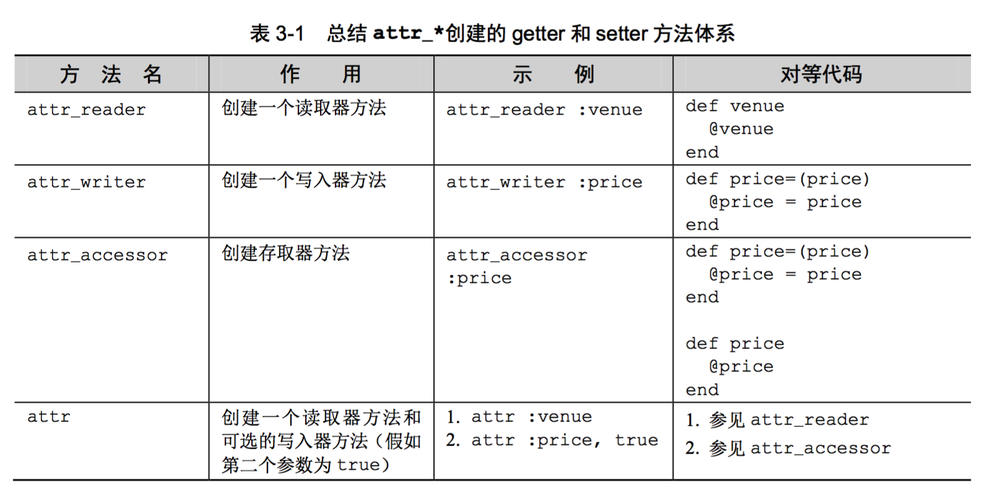

[TOC]


## 1. 定义类、创建对象、调用对象方法

```ruby
class Book
  # 1、类实例属性
  attr_reader :author, :title

  # 2、实例的init方法
  def initialize(author, title)
    # 访问实例成员使用 @ 开头
    @author = author
    @title = title
  end

  # 3、== 运算符重载
  def ==(other)
    self.class === other and
    other.author == @author and
    other.title == @title
  end

  # 4、eql?() 直接调用 def ==(other) ...  end 函数
  alias eql? ==

  # 5、重写 hash()
  def hash
    @author.hash ^ @title.hash
  end

  # 6、实例方法
  def show()
    puts "title = #{@title}"
    puts "author = #{@author}"
  end
end

book1 = Book.new('matz', 'Ruby in a Nutshell')
book2 = Book.new 'matz', 'Ruby in a Nutshell'

puts book1.title()
puts book2.author()

puts book1.hash()
puts book2.hash

book1.show()
book2.show()

puts book1 == book2
```

```
➜  main make
ruby main.rb
Ruby in a Nutshell
matz
-4130276120326809454
-4130276120326809454
title = Ruby in a Nutshell
author = matz
title = Ruby in a Nutshell
author = matz
true
➜  main
```


## 2. Object#to_s()

```ruby
class Box
  # 
  # constructor method
  def initialize(w,h)
    @width, @height = w, h
  end

  # define to_s method
  def to_s
    "(w:#@width,h:#@height)"  # string formatting of the object.
  end
end

# create an object
box = Box.new(10, 20)

# to_s method will be called in reference of string automatically.
puts "String representation of box is : #{box}"
```

```
 ~/main  ruby main.rb
String representation of box is : (w:10,h:20)
```


## 3. 不同作用域内的 self

### 1. 文件作用域中的 self => 指向顶层main对象

```ruby
#! /usr/bin/ruby

puts "self = #{self}, self.class = #{self.class}"

def func()
  puts "self = #{self}, self.class = #{self.class}"
end
func
```

```
➜  main make
ruby main.rb
self = main, self.class = Object
self = main, self.class = Object
➜  main
```

- 每一个ruby文件，默认会打包为一个**对象main**
- 对象main与c/c++/java里面的**main()**没有半毛钱关系
- main仅仅只是一个**ruby对象的名字**而已
- 对象main的**所属类**是**Object**

### 2. 类中的 self => 所属类

```ruby
class Person 
  puts "self = #{self}, self.class = #{self.class}"
end
```

```
->  ruby main.rb
self = Person, self.class = Class
->
```

### 3. 类方法中的 self => 所属类

```ruby
class Person 
  def Person.run()
    puts "self = #{self}, self.class = #{self.class}"
  end
end

Person.run
```

```
->  ruby main.rb
self = Person, self.class = Class
->
```

### 4. 实例方法中的 self => 当前对象

```ruby
class Person 
  def run()
    puts "self = #{self}, self.class = #{self.class}"
  end
end

Person.new.run
# Person.new().run()
```

```
->  ruby main.rb
self = #<Person:0x007ff8b921a778>, self.class = Person
->
```

### 5. module 中的 self => 所属类（module）

```ruby
module Mymodule
  puts "self = #{self}, self.class = #{self.class}"
end
```

```
->  ruby main.rb
self = Mymodule, self.class = Module
->
```

- 此种情况与Class中的情况是差不多的
- 因为Class继承子Module


## 4. 实例变量 getter、setter

### 1. 手动实现 getter、setter 方法

```ruby
class Box
  # name#setter
  def name=(name)
    @name = name
  end

  # name#getter
  def name()
    @name
  end
end

b = Box.new()
b.name = "haha"
puts b.name
```

```
➜  main make
ruby main.rb
haha
➜  main
```

### 2. `attr_*` 方法, 自动生成 getter、setter 方法



```ruby
class Box
  # 1、ivar + setter + getter
  attr_accessor :width
  attr_accessor :height

  # 2、ivar + 只有setter
  attr_writer :sex

  # 3、ivar + 只有getter
  attr_reader :name

  # 4、构造器方法
  def initialize(w,h)
    # 使用 @ 来操作对象的成员变量
    @width, @height = w, h
    @name = "haha"
  end
end

# 创建对象
box = Box.new(10, 20)

# 使用设置器方法
box.width = 30
box.height = 50
box.sex = "男"

# 使用访问器方法
x = box.width()
y = box.height()

puts "盒子宽度 : #{x}"
puts "盒子高度 : #{y}"
puts "name     : #{box.name}"
```

运行结果

```
->  ruby demo.rb
盒子宽度 : 30
盒子高度 : 50
name     : haha
```

### 3. 三种方式访问 实例变量

```ruby
class Book
  # 
  # 定义 ivar、setter方法、getter方法
  attr_accessor :author, :title

  def initialize(author, title)
    # 直接访问 ivar
    @author = author
    @title = title
  end

  def show()
    puts author				# 省略【消息接收者 self】
    puts self.author	# 显示指定【消息接收者 self】
    puts @author			# 直接读写成员变量 ivar

    puts title
    puts self.title
    puts @title
  end
end

obj = Book::new('xiongzenghui', 'teach leader')
obj.show()
```

```
 ~/Desktop/main  ruby main.rb
xiongzenghui
xiongzenghui
xiongzenghui
teach leader
teach leader
teach leader
```


## 5. initialize() 对象方法

### 1. 简单示例

```ruby
class Box
  def initialize(_age, _name, _addr)
    print "=========> initialize()", "\n"
    # 所有的对象成员变量，规定以 @ 为前缀
    @age = _age
    @name = _name
    @addr = _addr
    print "initialize() <==========", "\n"
  end

  def show()
    puts "age = #{@age}, name = #{@name}, addr = #{@addr}"
  end
end

print "1111111111111111111111111", "\n"
box = Box.new(19, "dog" , "hunan") # new()会调用Box的init方法
print "2222222222222222222222222", "\n"

box.show()
```

```
->  ruby demo.rb
1111111111111111111111111
=========> initialize()
initialize() <==========
2222222222222222222222222
age = 19, name = dog, addr = hunan
->
```

- 创建对象的**Box.new**函数，会默认调用Box**对象的initialize**函数完成初始化

### 2. allocate() 创建对象, 不会调用 initialize()

```ruby
# 1、定义类
class Box
  attr_accessor :width, :height

  # 构造器方法
  def initialize(w,h)
    print "===========initialize begin=============", "\n"
    @width, @height = w, h
    print "===========initialize end=============", "\n"
  end

  # 实例方法
  def getArea
    @width * @height
  end
end
 
# 2、使用 new 创建对象
print "call Box.new", "\n"
box1 = Box.new(10, 20)
a = box1.getArea()
puts "Area of the box is : #{a}"
 
# 3、使用 allocate 创建另外一个对象
print "call Box.allocate", "\n"
box2 = Box.allocate # 不会调用Box的init方法
a = box2.getArea()
puts "Area of the box is : #{a}"
```

```
->  ruby demo.rb
call Box.new
===========initialize begin=============
===========initialize end=============
Area of the box is : 200
call Box.allocate
demo.rb:17: warning: instance variable @width not initialized
demo.rb:17: warning: instance variable @height not initialized
demo.rb:17:in `getArea': undefined method `*' for nil:NilClass (NoMethodError)
  from demo.rb:30:in `<main>'
->
```

- **allocate**创建对象时，不会调用对象的**initialize()**初始化函数
- 所以**allocate**创建出来的对象是**未初始化**的
- 访问**未初始化**的成员就会运行报错结束

### 3. new() 创建对象, 会调用 initialize()

```ruby
require('pp')

class Novel
  attr_accessor :pages, :category, :level, :log 
  def initialize  
    # 1. 默认属性值初始化
    @pages = 10
    @category = 'None'
    @level = 1
    @log = false

    # 2. 回掉设置属性值
    if block_given?()
      yield(self) # 回传当前对象
    end
  end
end

if __FILE__ == $0
  # 1、
  novel1 = Novel.new()
  pp novel1

  # 2、
  novel2 = Novel.new() do |object|
    # 回调代码块中修改传入的Novel对象
    object.pages = 564
    object.category = "thriller"
  end

  # 3、
  pp novel2
end
```

```
->  ruby ruby.rb
#<Novel:0x007fa7ec1f6508 @category="None", @level=1, @log=false, @pages=10>
#<Novel:0x007fa7ec1f4258
 @category="thriller",
 @level=1,
 @log=false,
 @pages=564>
->
```

### 4. 不会自动调用 ==父类== initialize() 方法

```ruby
class Parent
  attr_accessor(:name)

  def initialize
    @name = 'haha'
  end
end

class Child < Parent
  attr_accessor(:age)

  def initialize
    @age = 19
  end
end

obj = Child.new
puts "obj.age = #{obj.age}"
puts "obj.name = #{obj.name}"
```

```
->  ruby main.rb
obj.age = 19
obj.name =
->
```

### 5. super() 显示调用 ==父类== initialize() 方法

```ruby
class Parent
  attr_accessor(:name)

  def initialize(_name)
    @name = _name
  end
end

class Child < Parent
  attr_accessor(:age)

  def initialize(_age, _name)
    # 1、init parent
    super(_name)

    # 2、init current child
    @age = _age
  end
end

obj = Child.new(19, :'xiong')
puts "obj.age = #{obj.age}"
puts "obj.name = #{obj.name}"
```

```
->  ruby main.rb
obj.age = 19
obj.name = xiong
->
```


## 6. 模拟 Pod::Spec.new

### 1. 读写 实例变量

```ruby
class User
  attr_accessor :a, :b, :c
end

def my_method1
  o = User.new
  o.a = 1
  o.b = 2
  o.c = 3
  o
end
```

### 2. 通过 new() 调用 initialize() block 中再读写 实例变量

```ruby
class User
  attr_accessor :a, :b, :c
end

User.new.tap do |o|
  o.a = 1
  o.b = 2
  o.c = 3
end
```

### 3. 比如一个 xx.podspec 

```ruby
Pod::Spec.new do |s|
  # 基本属性
  s.name             = 'ZHUDID'
  s.version          = '0.1.0'
  s.summary          = 'A short description of ZHUDID.'
  s.description      = 'some description'
  s.homepage         = 'https://xxx.com'
  s.license          = { :type => 'MIT' }
  s.author           = { 'xxx' => 'ios@xxx.com' }
  s.source           = { :git => 'https://git.xxx.com/xxx.git', :tag => s.version.to_s }
  s.ios.deployment_target = '9.0'

  # source
  s.source_files = 'ZHUDID/Classes/**/*.{h,m,c,mm,cpp}'
  s.public_header_files = 'Pod/Classes/*.{h}'

  # dependency other spec
  s.dependency 'YYModel'
  s.dependency 'SAMKeychain'
  s.dependency 'MSWeakTimer', '~> 1.1.0'
  s.dependency 'SystemServices'

  # system dylib
  s.libraries = 'resolv'
end
```

- 实际上就是在创建一个 `Pod::Spec` 对象
- 然后在 Pod::Spec 的 initialized() 方法回调 block 中, 继续设置 属性值

### 4. 模拟实现 Pod::Spec.new do … end

```ruby
class Box
  # 1. 对象成员属性定义：ivar + setter + getter 
  attr_accessor :age
  attr_accessor :name
  attr_accessor :addr
  attr_accessor :postcode
  attr_accessor :sex

  # 2. init函数中，对所有属性做默认值初始化
  def initialize(
    _age=19, 
    _name="默认值", 
    _addr="默认值", 
    _postcode="默认值", 
    _sex="人妖"
  )
    # 2.1 对象成员第一次默认值初始化
    @age = _age
    @name = _name
    @addr = _addr
    @postcode = _postcode
    @sex = _sex

    # 2.2 回调执行block块，让调用者修改默认值或新增对其他属性值的设置
    # - (1) yield回传self，即当前对象
    # - (2) 要求调用者必须传递一个block回调，否则运行报错
    yield self if block_given?()
  end

  # 3 对象成员函数
  def print_all()
    print "age = #{@age}\n"
    print "name = #{@name}\n"
    print "addr = #{@addr}\n"
    print "postcode = #{@postcode}\n"
    print "sex = #{@sex}\n"
  end
end
```

```ruby
############################################################################
# 1、使用默认值创建的对象1
# - (1) 调用new函数会默认调用initialize函数，
# - (2) initialize函数中使用了yiled，所以即使不使用回调block，也必须传递一个block块
# - (3) 使用 { ... } 或 do ... end 传递回调block
box1 = Box.new {}
# box1 = Box.new do end 效果同上
box1.print_all()
print "\n"
```

```ruby
# 2、使用回调block，修改默认值方式创建的对象2
# - (1) 创建Box类的对象，并传递 do ... end 或 { ... } 回调代码块
# - (2) 在回调block代码块中，针对性对某一些属性重新初始化
box2 = Box.new do |ins|
  ins.age 		= 101
  ins.name 		= "dog001"
  ins.addr 		= "湖南省"
  ins.postcode 	= "415700"
  ins.sex 		= "男"
end

box2.print_all()
print "\n"
```

```ruby
# 3. 使用回调block，修改默认值方式创建的对象3
box3 = Box.new { |ins|
  ins.age 		= 102
  ins.name 		= "monkey001"
  ins.addr 		= "北京市"
  ins.postcode 	= "5612389"
  ins.sex 		= "畜生"
}

box3.print_all()
```

```
➜  main ruby main.rb
age = 19
name = 默认值
addr = 默认值
postcode = 默认值
sex = 人妖

age = 101
name = dog001
addr = 湖南省
postcode = 415700
sex = 男

age = 102
name = monkey001
addr = 北京市
postcode = 5612389
sex = 畜生
➜  main
```

### 5. 模拟实现 podspec DSL

[点击我](../../07/03.md)


## 7. 实例方法 访问权限

### 1. 访问权限

- 1、public
  - public 方法可被任意对象调用
  - 默认情况下，方法都是 public 的
  - 除了 initialize 方法总是 private 的

- 2、private
  - private 方法不能从类外部访问或查看
  - 只有类方法可以访问私有成员

- 3、protected
  - protected 方法只能被类及其子类的对象调用
  - 访问也只能在类及其子类内部进行

### 2. 示例

```ruby
# 定义类
class Box
  # 构造器方法
  def initialize(w,h)
    @width, @height = w, h
  end

  def getArea
    getWidth() * getHeight
  end

  def getWidth
    @width
  end
  def getHeight
    @height
  end

  def printArea
    @area = getWidth() * getHeight
    puts "Big box area is : #@area"
  end

  ###### 让实例方法是 private ######
  private :getWidth, :getHeight

  ###### 让实例方法是 protected ######
  protected :printArea
end
 
# 创建对象
box = Box.new(10, 20)
 
# 调用实例方法
a = box.getArea()
puts "Area of the box is : #{a}"
 
# 尝试调用 protected 的实例方法
box.printArea()
```

```
->  ruby demo.rb
Area of the box is : 200
demo.rb:47:in `<main>': protected method `printArea' called for #<Box:0x007fbf79824728 @width=10, @height=20> (NoMethodError)
->
```

- 因为 printArea 成员方法的访问权限是 **protected**，
- 所以只能在 **子类** 中调用，
- 而 **不能在类的外面** 进行调用


## 8. private 实例方法，不能使用 self 作为 消息接收者

```ruby
class Person

  def private_func()
    puts 'private func()'
  end

  def public_func()
    # self.private_func() 不能使用 self 作为接收者
    private_func() # 必须使用隐藏的接收者
  end

  private :private_func

end

Person.new().public_func()
```

```
->  ruby main.rb
private func()
->
```


## 9. nil?()

### 1. 所有对象都有 nil?() 方法实现

```ruby
#! /usr/bin/ruby -w

class Person
	def run()
		puts '--- run ---'
	end
end

per = Person.new()
puts per.class.instance_methods() #获取对象所有实现的方法名
```

```
->  ruby main.rb | grep nil
nil?
->
```

### 2. nil?() 判断对象 是否 为空

```ruby
#! /usr/bin/ruby -w

class Person
  def run()
    puts '--- run ---'
  end
end

# 1. 默认值为nil
p1 = 

# 2. 
p1.run() if p1
p1.run() if !p1.nil?()
p1.run() unless p1.nil?()
```

```
->  ruby main.rb
->
```

都没有调用**Person#run()**函数。

### 3. nil 对象 的各种 to 方法

```ruby
->  irb
2.2.1 :001 > nil.to_s()
 => ""
2.2.1 :002 > nil.to_a()
 => []
2.2.1 :003 > nil.to_h()
 => {}
2.2.1 :004 > nil.to_i()
 => 0
2.2.1 :005 > nil.to_f()
 => 0.0
2.2.1 :006 >
```

**nil.to_s()** 返回的是一个 **空字符串**，可以用来 **转换nil对象** 。